# Chapter 7. Dimensionality Reduction and Data Decomposition

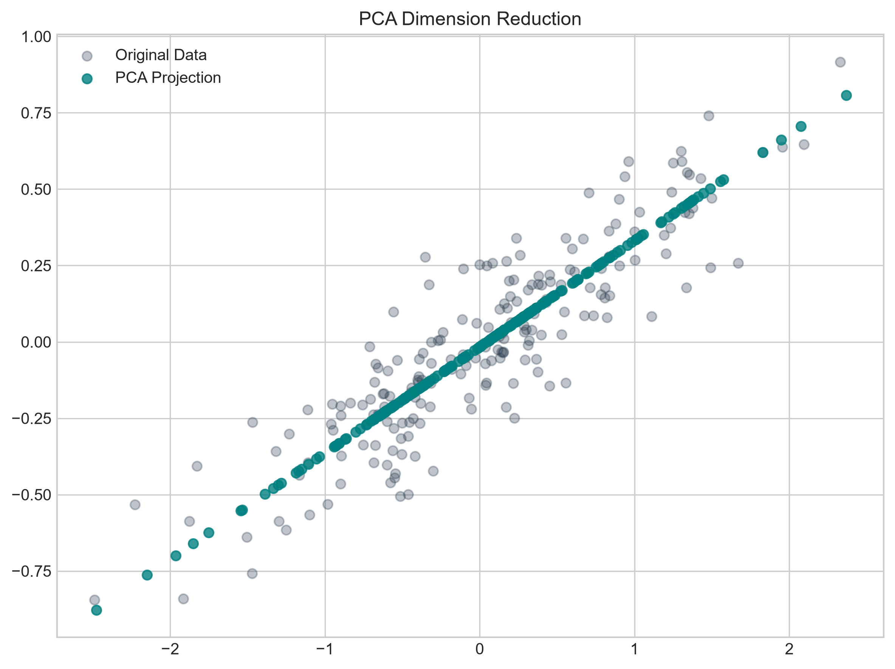

## Opening

A multiparametric MRI radiomics pipeline has 1,200 features and 180 patients. Dimensionality reduction is not optional aesthetics; it is survival against overfitting and irreproducible stroke biomarkers.

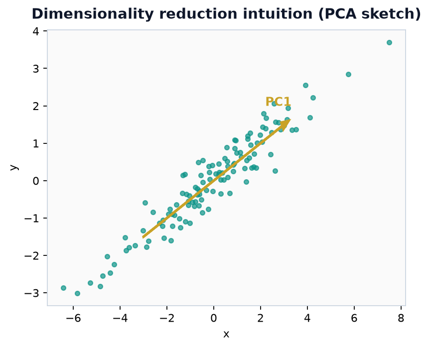

*Dimensionality reduction intuition along a dominant axis (original).*
## Learning Objectives

Explain the curse of dimensionality and how it motivates projection and decomposition in wide clinical and omics matrices.

Derive PCA from covariance eigenstructure, compute a small PCA by hand, and relate PCA to SVD and incremental PCA.

State the goals of LDA/Fisher discriminants versus unsupervised PCA for labeled neurologic phenotypes.

Contrast nonlinear embeddings LLE, t-SNE, and UMAP and list caveats for cluster interpretation.

Describe Fourier and wavelet decompositions and approximate aggregation for signals and time series.

Apply matrix factorizations: Cholesky, NMF, SVD; and topic models LSI and LDA on clinical text matrices.

Define tensors, mode-n unfolding, and CP, Tucker, and tensor-train decompositions at a conceptual level.

Decide when reduction helps versus when it erases rare but critical clinical signals.

## High Dimensions Are Not Just More Numbers

Modern neurologic datasets often describe each patient or sample with hundreds or millions of coordinates: CT perfusion maps vectorized into voxels, multiparametric MRI features, gene expression probes, proteomic peaks, continuous EEG channels, wearable accelerometry windows, or wide EHR panels joining every lab ordered during an admission. High dimensionality brings statistical and geometric pathologies collectively called the curse of dimensionality.

Distances concentrate: the difference between nearest and farthest neighbors shrinks relative to typical distances, weakening distance-based phenotyping. Sample complexity grows: covering a unit hypercube with ε-balls requires a number of samples exponential in dimension—fatal when n is a few hundred stroke patients and p is tens of thousands of omics features. Multicollinearity among labs and noise dimensions obscure signal.

Dimensionality reduction and matrix decomposition seek lower-dimensional structure—linear subspaces, nonnegative parts, independent sources, spectral components, or nonlinear manifolds—that preserve information needed for visualization, compression, denoising, or downstream learning. Reduction is not universally beneficial. Discarding dimensions can erase rare but critical signals, harm calibration, or violate interpretability constraints. This chapter develops PCA rigorously enough to compute by hand, surveys linear and nonlinear alternatives, signal decompositions, matrix and tensor factorizations, and topic models, with clinical–epidemiologic decision rules for when not to reduce.

## The Curse of Dimensionality

Consider points drawn uniformly in the d-dimensional unit hypercube. The volume of a thin shell near the boundary dominates as d grows; most mass sits near the surface, not the center. For Gaussian distributions, most probability mass concentrates in a thin annular region at a radius that grows like √d. Pairwise Euclidean distances between random points become relatively similar, so nearest-neighbor search for “similar stroke phenotypes” loses contrast when features are numerous, weakly scaled, and noisy.

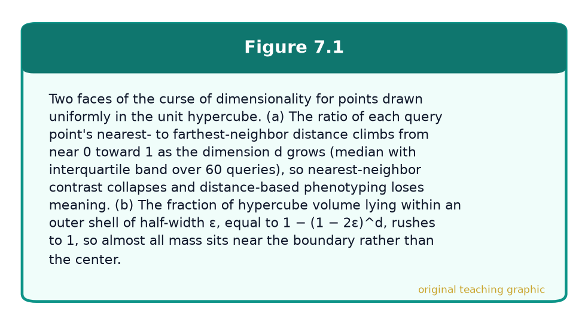

*Figure 7.1 — original teaching graphic.*

Statistically, estimating a full covariance matrix requires on the order of d² parameters; with n ≪ d, the sample covariance is singular and unstable—routine when a multi-lab panel plus comorbidity indicators exceeds the number of ICH admissions in a single-center year. Lipschitz concentration inequalities formalize that smooth functions of many independent variables concentrate tightly, which is both a blessing (stable averages) and a curse (little local structure for learning).

Geometry: nearest-neighbor contrast collapses as d grows with fixed n.

Statistics: covariance and density estimation need n that grow quickly with d.

Computation: distances and kernels cost O(n²d) or worse at scale.

Clinical reality: p ≫ n is normal in imaging-derived and omics stroke research.

## Linear Dimensionality Reduction: PCA, Incremental PCA, LDA, and Fisher

### Principal Component Analysis

Principal component analysis (PCA) finds orthogonal directions that capture maximal variance in a centered data matrix. Let X be an n × d matrix with rows as patients (or samples) and columns as features. Form the centered matrix X_c by subtracting the column means. The sample covariance may be written C = (1/n) X_cᵀ X_c (some texts use n−1). PCA solves for unit vectors u that maximize uᵀ C u, the variance of the projected scalar X_c u. The maximizer is the leading eigenvector of C; the maximal variance is the leading eigenvalue λ₁. Subsequent components maximize variance subject to orthogonality to previous directions.

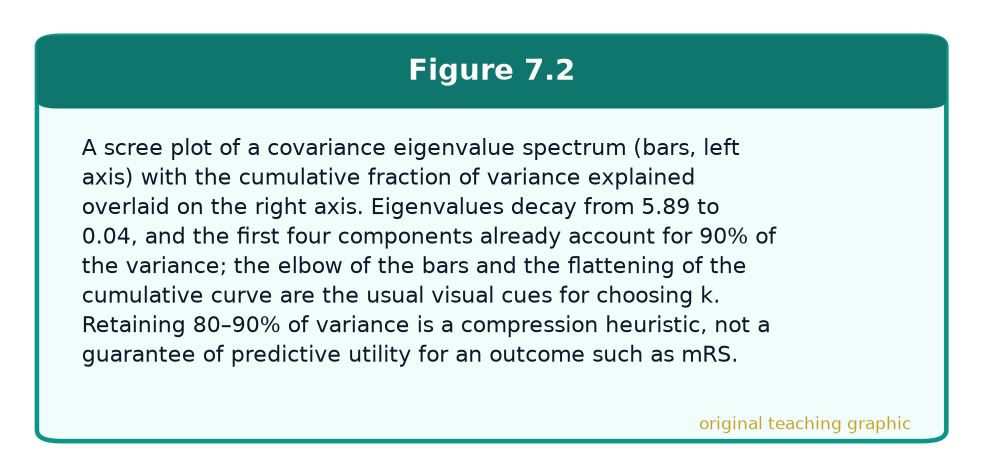

*Figure 7.2 — original teaching graphic.*

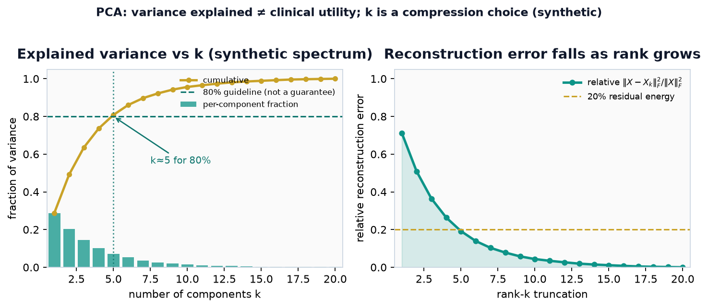

*Figure — PCA compression curves on a synthetic eigenvalue spectrum. Left: per-component and cumulative fraction of variance; the 80% guideline marks a common default k, not a clinical warranty. Right: relative Frobenius reconstruction error falls as rank grows (Eckart–Young residual energy). Variance retained is a reconstruction metric—it does not guarantee better prediction of mRS, infarct growth, or any downstream label.*

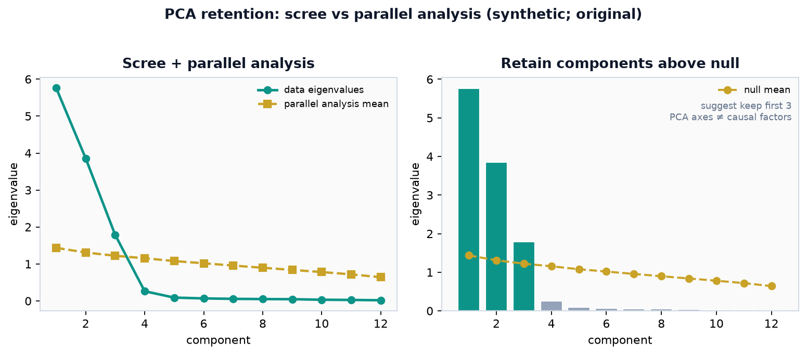

*Figure — Parallel analysis as a retention check. **Left:** data eigenvalues vs mean eigenvalues of column-shuffled null matrices. **Right:** retain components above the null mean (teal bars). Still a geometric heuristic—PCA axes are not causal factors and need not be the best inputs for a clinical predictor.*

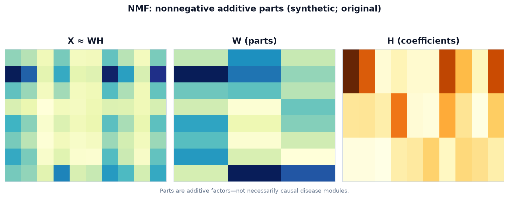

*Figure — Nonnegative matrix factorization. **Left:** reconstructed data. **Middle/Right:** parts W and coefficients H. Additive parts aid interpretability for count-like panels but are still latent factors—not proven causal disease modules.*

If C = V Λ Vᵀ with eigenvalues λ₁ ≥ λ₂ ≥ ⋯ ≥ λ_d ≥ 0 and orthonormal eigenvectors as columns of V, then the k-dimensional PCA scores are Z = X_c V_k where V_k holds the top k eigenvectors. The fraction of variance explained by component j is λ_j / ∑_i λ_i. Cumulative explained variance guides the choice of k—but “80% variance retained” is not a guarantee of predictive utility for mRS or infarct growth. PCA assumes that large-variance directions are interesting, which fails when the signal is low-variance or when units of measurement arbitrarily inflate variance—hence the common practice of standardizing features before PCA when panels mix mg/dL, mmHg, and seconds.

### Teaching table: choosing k in PCA (compression vs claim)

| Criterion | What it optimizes | Safe clinical reading | Common failure |
|---|---|---|---|
| Cumulative variance (e.g. 80–95%) | Reconstruction energy of X | Good for denoising / visualization budgets | Treats large-variance noise as “signal” |
| Reconstruction error vs k (elbow) | Frobenius residual of rank-k map | Useful when the goal is compression | Elbow is subjective; not a p-value |
| Cross-validated downstream loss | Task error (AUC, RMSE, net benefit) | Correct when PCA is a **pipeline step** | Tuning k on the test set = leakage |
| Fixed k from prior study | Reproducibility of a published pipeline | OK only if features and units match | Silent shift when labs or scanners change |
| Supervised alternative (LDA / PLS) | Label separation, not variance | Prefer when phenotype labels exist and n/class is adequate | Unstable with rare subtypes |

Rule of thumb: pick k for the **claim you will make**. If the claim is “compressed representation for a predictor,” validate the full pipeline—including the choice of k—inside patient-grouped cross-validation, never on the locked test set.

Interpretation: loadings (entries of eigenvectors) show how original features contribute to each component. A first PC of a metabolic panel might load on renal function tests together; a first PC of voxelwise DWI intensities might reflect overall lesion burden. Loadings are not causal path coefficients.

### Worked Example: PCA on Three Points in 2D

We compute PCA fully by hand on n = 3 points in d = 2. Think of each point as a miniature two-feature patient: (x₁, x₂) might represent standardized (onset-to-arrival, NIHSS) for illustration—the algebra is what matters.
x₁ = (1, 2), x₂ = (3, 3), x₃ = (5, 4).
Mean μ = ((1+3+5)/3, (2+3+4)/3) = (3, 3). Centered data:
x₁_c = (−2, −1), x₂_c = (0, 0), x₃_c = (2, 1).

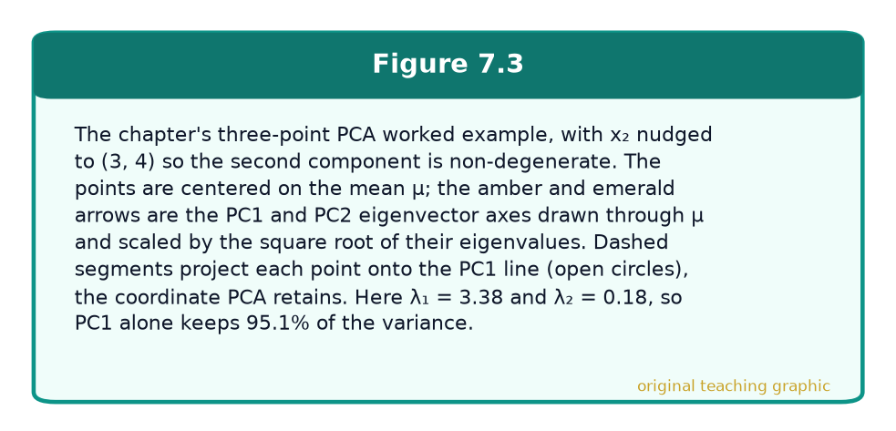

*Figure 7.3 — original teaching graphic.*

Form X_c with rows as centered points. Then X_cᵀ X_c = [[8, 4], [4, 2]]. Using C = (1/n) X_cᵀ X_c = [[8/3, 4/3], [4/3, 2/3]]. Eigenvalues solve det(C − λI) = 0. C − λI = [[8/3−λ, 4/3], [4/3, 2/3−λ]]. Determinant: (8/3−λ)(2/3−λ) − (4/3)² = λ² − (10/3)λ. Thus λ(λ − 10/3) = 0. Eigenvalues: λ₁ = 10/3 ≈ 3.333, λ₂ = 0. Two independent identities confirm the algebra before we go further: eigenvalues must sum to the trace, λ₁ + λ₂ = 10/3 = 8/3 + 2/3 ✓, and multiply to the determinant, λ₁ · λ₂ = 0 = det(C) ✓—zero here because C is singular. Data are exactly one-dimensional after centering: all centered points lie on the line spanned by (2, 1).

For λ₁ = 10/3, solve (C − λ₁ I)v = 0 to get v₁ = (2, 1)/√5 ≈ (0.894, 0.447). Orthogonal v₂ = (−1, 2)/√5. Projected scores on the first PC: z₁ = −√5 ≈ −2.236, z₂ = 0, z₃ = √5 ≈ 2.236. Variance of scores (population form) matches λ₁: (1/3)((−√5)² + 0 + (√5)²) = 10/3. Variance explained by PC1 is 100% because λ₂ = 0. Reconstructing with one component recovers the centered data exactly. This hand computation shows the full pipeline: center, form covariance, eigen-decompose, project, and interpret eigenvalues as explained variance.

### SVD Connection and Incremental PCA

The singular value decomposition writes X_c = U Σ Wᵀ. The right singular vectors (columns of W) are principal directions; they equal the eigenvectors of X_cᵀ X_c. Singular values relate to eigenvalues by λ_j = σ_j² / n (with the 1/n covariance convention). PCA scores are proportional to left singular vectors scaled by singular values. Computing PCA via SVD of X_c is numerically stabler than forming C explicitly—especially when d is large or features are collinear.

Truncated SVD keeps the top k components and yields the best rank-k approximation to X_c in Frobenius norm (Eckart–Young). Incremental PCA updates low-rank approximations as mini-batches arrive, enabling PCA on datasets that do not fit in memory—streaming EHR feature dumps, multi-site federated summaries, or large imaging cohorts. Trade-offs include approximate components and sensitivity to batch order; still invaluable when classical full SVD is impossible.

### Worked Example: SVD of a 2×2 Matrix

The singular value decomposition sits behind truncated-SVD compression and the PCA–SVD link just described, so it repays grinding one small case entirely by hand. Take the 2×2 matrix A = [[1, 2], [2, 1]]. The recipe has four steps: form AᵀA, find its eigenvalues, take square roots for the singular values σ, then read off the best rank-1 approximation.

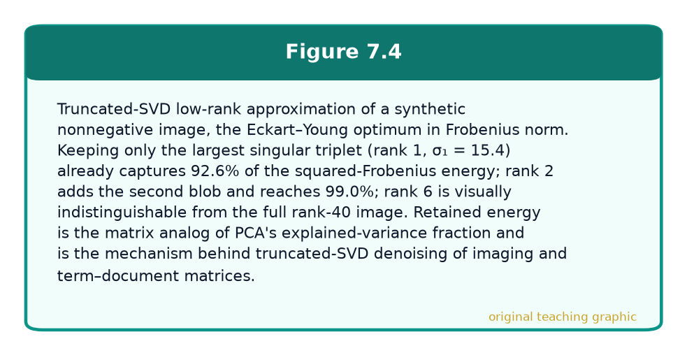

*Figure 7.4 — original teaching graphic.*

Because this A is symmetric, Aᵀ = A, so AᵀA = [[1, 2], [2, 1]]·[[1, 2], [2, 1]] = [[5, 4], [4, 5]] (top-left entry 1·1 + 2·2 = 5; each off-diagonal 1·2 + 2·1 = 4). Eigenvalues solve det(AᵀA − λI) = (5 − λ)² − 4² = 0, so (5 − λ)² = 16 and 5 − λ = ±4, giving λ₁ = 9 and λ₂ = 1. Two independent identities confirm the algebra before we continue: the eigenvalues sum to the trace, 9 + 1 = 10 = 5 + 5 ✓, and multiply to the determinant, 9 · 1 = 9 = 25 − 16 ✓. The singular values are the square roots of the eigenvalues: σ₁ = √9 = 3 and σ₂ = √1 = 1.

The right singular vectors are the eigenvectors of AᵀA. For λ₁ = 9, the matrix AᵀA − 9I = [[−4, 4], [4, −4]] forces −4a + 4b = 0, so v₁ ∝ (1, 1), i.e. v₁ = (1, 1)/√2. For λ₂ = 1, AᵀA − I = [[4, 4], [4, 4]] forces a = −b, so v₂ = (1, −1)/√2. The matching left singular vectors follow from u_i = A v_i / σ_i: u₁ = A·(1, 1)ᵀ/√2 ÷ 3 = (3, 3)ᵀ/√2 ÷ 3 = (1, 1)/√2, and u₂ = A·(1, −1)ᵀ/√2 ÷ 1 = (−1, 1)/√2. Thus A = U Σ Vᵀ with singular values 3 and 1.

The best rank-1 approximation (the Eckart–Young optimum in Frobenius norm) keeps only the largest singular triplet: A₁ = σ₁ u₁ v₁ᵀ = 3 · (1/√2, 1/√2)ᵀ (1/√2, 1/√2) = 3 · [[1/2, 1/2], [1/2, 1/2]] = [[1.5, 1.5], [1.5, 1.5]]. Verify through the residual: A − A₁ = [[−0.5, 0.5], [0.5, −0.5]], which is exactly the discarded triplet σ₂ u₂ v₂ᵀ = 1 · [[−1/2, 1/2], [1/2, −1/2]] ✓. The energy bookkeeping closes too: ‖A‖_F² = 1² + 2² + 2² + 1² = 10 = σ₁² + σ₂² = 9 + 1, and the rank-1 residual carries precisely ‖A − A₁‖_F² = σ₂² = 1. Retaining the top singular value therefore preserves 9/10 = 90% of the squared Frobenius energy—the matrix analog of PCA’s explained-variance fraction, and the exact mechanism behind truncated-SVD denoising of term–document and imaging matrices.

### LDA and Fisher Linear Discriminant

Linear Discriminant Analysis (LDA) for dimensionality reduction is supervised: it seeks projections that maximize between-class scatter relative to within-class scatter. For two classes, Fisher’s linear discriminant finds w maximizing (μ₁ − μ₀)² / (s₁² + s₀²) along the projected line, equivalently maximizing wᵀ S_B w / wᵀ S_W w with between- and within-class scatter matrices S_B and S_W. Multi-class LDA generalizes via generalized eigenvectors of S_W⁻¹ S_B, yielding at most C−1 discriminative directions for C classes.

Unlike PCA, LDA can discard high-variance directions that do not separate labels and amplify low-variance directions that do. It assumes roughly shared within-class covariances and needs enough samples per class to estimate S_W stably—problematic for rare stroke subtypes. Regularized or shrinkage LDA helps. Use LDA projections for visualization and as features for simple classifiers; do not confuse LDA-as-reduction with LDA-as-classifier, though they share mathematics.

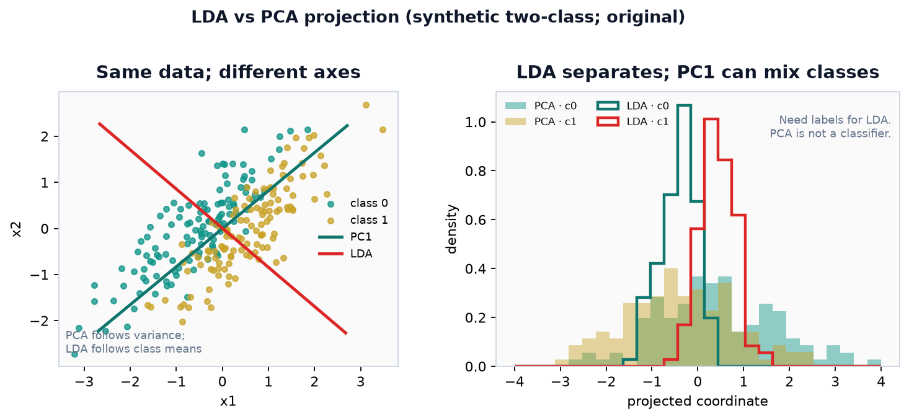

*Figure — Supervised vs unsupervised axes. **Left:** two classes share a high-variance diagonal; PC1 (deep) follows variance while Fisher/LDA (red) aims at class-mean separation. **Right:** 1-D projections—LDA often unmixes classes that PC1 still overlaps. LDA needs labels and enough per-class samples for S_W; PCA is not a classifier. Neither projection is a causal mechanism map.*

### Worked Example: Fisher’s Linear Discriminant on Two Small Classes

The exposition above states Fisher’s criterion abstractly; here we drive the whole computation on two tiny, clearly separable classes so every matrix is checkable by hand. Let Class A = {(1, 1), (2, 1), (1, 2)} and Class B = {(4, 4), (5, 4), (4, 5)}—two small triangular clouds sitting at opposite ends of the (1, 1) diagonal.

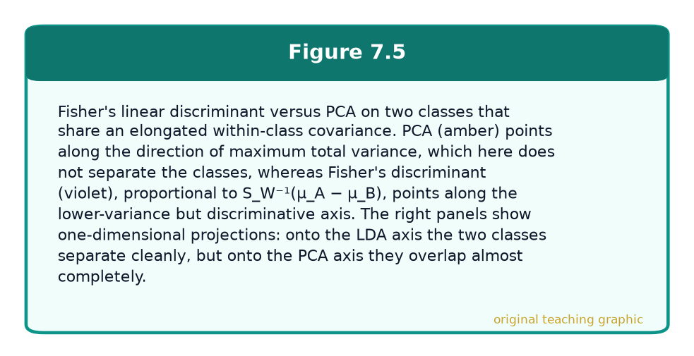

*Figure 7.5 — original teaching graphic.*

Class means. μ_A = ((1+2+1)/3, (1+1+2)/3) = (4/3, 4/3) ≈ (1.33, 1.33) and μ_B = ((4+5+4)/3, (4+4+5)/3) = (13/3, 13/3) ≈ (4.33, 4.33). Their difference is μ_A − μ_B = (4/3 − 13/3, 4/3 − 13/3) = (−3, −3).

Within-class scatter. Each within-class scatter matrix sums the outer products (x − μ)(x − μ)ᵀ over its class’s points. For Class A the three deviations from μ_A = (4/3, 4/3) are (−1/3, −1/3), (2/3, −1/3), and (−1/3, 2/3); their outer products are [[1/9, 1/9], [1/9, 1/9]], [[4/9, −2/9], [−2/9, 1/9]], and [[1/9, −2/9], [−2/9, 4/9]]. Summing entrywise, each diagonal term is 1/9 + 4/9 + 1/9 = 6/9 = 2/3 and each off-diagonal term is 1/9 − 2/9 − 2/9 = −3/9 = −1/3, so S_A = [[2/3, −1/3], [−1/3, 2/3]]. Class B is Class A translated by (3, 3), so its deviations—and hence its scatter—are identical: S_B = [[2/3, −1/3], [−1/3, 2/3]]. The pooled within-class scatter is S_W = S_A + S_B = [[4/3, −2/3], [−2/3, 4/3]].

Invert S_W. Using the 2×2 rule [[a, b], [c, d]]⁻¹ = (1/(ad − bc))·[[d, −b], [−c, a]], the determinant is (4/3)(4/3) − (−2/3)(−2/3) = 16/9 − 4/9 = 12/9 = 4/3. Hence S_W⁻¹ = (1/(4/3))·[[4/3, 2/3], [2/3, 4/3]] = (3/4)·[[4/3, 2/3], [2/3, 4/3]] = [[1, 1/2], [1/2, 1]]. Check S_W S_W⁻¹ = I: top-left (4/3)(1) + (−2/3)(1/2) = 4/3 − 1/3 = 1 ✓; top-right (4/3)(1/2) + (−2/3)(1) = 2/3 − 2/3 = 0 ✓; the other two entries mirror these to 0 and 1.

Fisher direction. w ∝ S_W⁻¹(μ_A − μ_B) = [[1, 1/2], [1/2, 1]]·(−3, −3) = ((1)(−3) + (1/2)(−3), (1/2)(−3) + (1)(−3)) = (−9/2, −9/2). Only direction matters, so w ∝ (1, 1) (equivalently (−1, −1)): the discriminant points straight along the diagonal that separates the clouds, orthogonal to the shared within-class spread.

Projected scores. Using w = (1, 1), project one representative from each class: for Class A’s (1, 1), wᵀx = 1 + 1 = 2; for Class B’s (4, 4), wᵀx = 4 + 4 = 8. Projecting every point gives Class A scores {2, 3, 3} and Class B scores {8, 9, 9}—two tight, non-overlapping intervals with a wide gap, so any threshold in (3, 8), for example 5.5, separates the classes perfectly. Here an unsupervised PCA of the pooled six points would also land near (1, 1), but only because the between-class shift happens to be the largest variance source; Fisher earns that axis deliberately, by maximizing the ratio wᵀS_B w / wᵀS_W w of between- to within-class scatter—which is what keeps it pointed at the discriminative direction even when that direction is not the highest-variance one.

## Nonlinear Dimensionality Reduction: LLE, t-SNE, and UMAP

Linear methods preserve global variance or linear discrimination but fail on curved manifolds: a Swiss roll needs unrolling, not a plane fit. Nonlinear neighbor embeddings aim to preserve local geometry in a low-dimensional map used primarily for visualization and exploratory phenotyping.

### Locally Linear Embedding (LLE)

LLE assumes each point lies on a locally linear patch of a manifold. For each point x_i, find k nearest neighbors and reconstruct x_i as a weighted combination of those neighbors, minimizing reconstruction error with weights summing to one. Then find low-dimensional coordinates y_i that respect the same weights, minimizing ∑ ‖y_i − ∑_j W_{ij} y_j‖² under centering and unit-covariance constraints. LLE can unroll smooth manifolds but is sensitive to k, noise, and gaps in sampling—common issues in small clinical cohorts.

### t-SNE

t-distributed Stochastic Neighbor Embedding (t-SNE) converts high-dimensional distances into conditional probabilities of neighborhood and finds low-dimensional points whose Student-t similarities match those probabilities by minimizing a KL divergence. The heavy-tailed t-distribution in the embedding space allows moderate distances to map farther apart, helping form tight visual clusters. Perplexity controls effective neighborhood size.

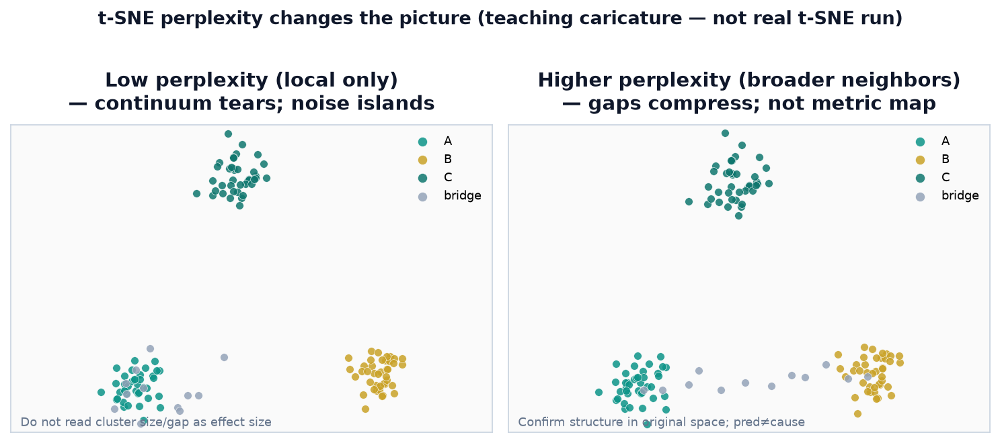

*Figure — Perplexity teaching caution (caricature of geometry, **not** a real t-SNE optimization). **Left:** low effective neighborhood size tears a continuum (gray bridge) into noise islands and tightens local clumps. **Right:** broader neighborhoods compress gaps and keep the bridge—but inter-cluster distance still is not a metric effect size. Confirm candidate structure in original (or PCA) space; embeddings are hypothesis generators, not causal maps.*

Caveats are essential for scientific use. t-SNE does not preserve global distances or densities reliably; cluster sizes and between-cluster gaps are not trustworthy as effect sizes. Results depend on perplexity, learning rate, and random initialization. Never report “t-SNE clusters” as phenotypes without confirmatory analysis in the original feature space or with stable supervised labels. For multi-site imaging, batch effects can dominate the embedding.

### UMAP

Uniform Manifold Approximation and Projection (UMAP) constructs a fuzzy topological representation of the high-dimensional data and finds a low-dimensional layout that preserves that structure, grounded in Riemannian geometry and algebraic topology motivations. Empirically UMAP often preserves more global structure than t-SNE, scales better, and supports transform of new points more naturally. Hyperparameters (n_neighbors, min_dist, metric) still strongly affect plots. The same scientific cautions apply: embeddings are hypotheses generators, not automatic cluster proofs.

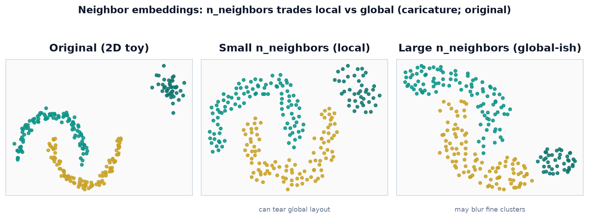

*Figure — n_neighbors tradeoff (force-layout caricature of the hyperparameter, **not** a production UMAP run). **Left:** original 2-D moons + blob. **Middle:** small neighborhoods emphasize local patches and can tear global arrangement. **Right:** large neighborhoods keep more global placement but blur fine structure. Always confirm candidate clusters in original/PCA space; map distances are not effect sizes and not causal subtypes.*

### How Neighbor Embeddings Mislead: A Reading Guide

Because t-SNE and UMAP optimize local neighborhoods while sacrificing global geometry, a handful of specific misreadings recur in imaging and omics work, each with a clinical failure mode. Cluster size is an artifact: both methods equalize local density, so a tight homogeneous group and a diffuse heterogeneous one can occupy similar map area—never read a cluster’s visual spread as biological heterogeneity or variance. Between-cluster distance is an artifact: two blobs far apart on the page may be no more dissimilar than two that touch, so do not rank subtypes by apparent separation. Point density is an artifact: crowding in the map does not track sample density in feature space. Most dangerous clinically, these methods can tear a genuine continuum into apparently discrete islands, or merge distinct groups into one—a smooth severity gradient (rising infarct volume, a titrated biomarker) can render as several disconnected clusters, inviting a false claim of discrete stroke subtypes when the biology is a continuum.

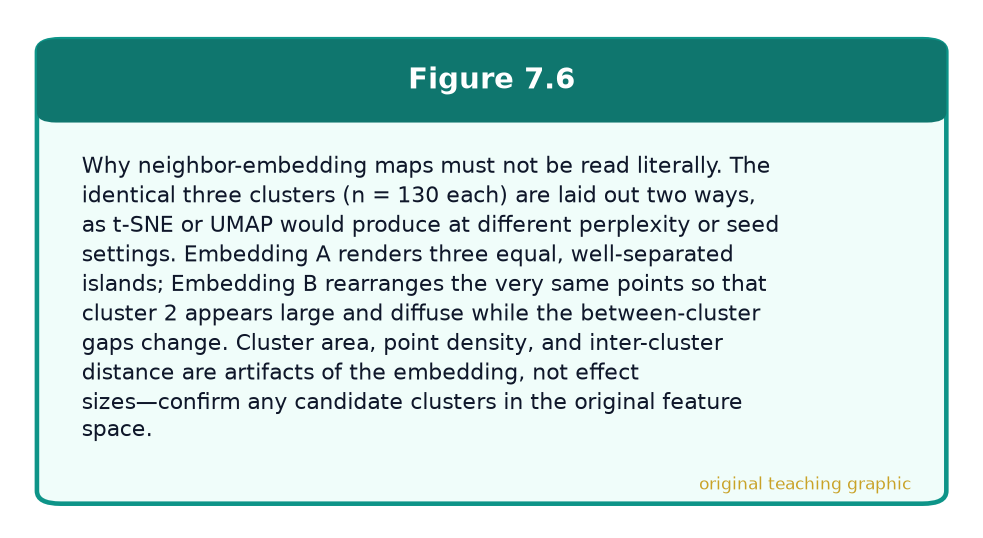

*Figure 7.6 — original teaching graphic.*

Two engineering realities sharpen the warning for p ≫ n biomedical data. Spurious clusters form easily: at small perplexity or n_neighbors, even isotropic Gaussian noise fragments into crisp-looking groups, so a compelling map is not evidence that structure exists. And technical variation dominates: in multi-site radiomics the leading axis of a UMAP is often scanner, sequence, or reconstruction kernel; in single-cell or bulk omics it is often library size, batch, or ancestry rather than cell type or disease—and it shifts again if highly-variable-feature selection or normalization changes. The discipline follows directly. Treat every embedding as a hypothesis generator, never proof. Confirm candidate clusters in the original (or PCA-reduced) feature space and quantify separation there—silhouette, or a held-out classifier—not by eye. Overlay known technical covariates (site, scanner, batch, sequencing run, ancestry PCs) and verify the clusters are not merely those. Regenerate the map across several random seeds and a range of perplexity/n_neighbors, keep only structure that persists, and report those settings. In a manuscript, a neighbor-embedding figure should illustrate a conclusion reached by other means, not carry the inferential weight of “natural clusters” by itself.

## Signal and Time Series Decomposition: Fourier, Wavelets, and Aggregation

### Fourier Transform

The Fourier transform decomposes a signal into sinusoidal frequency components. For discrete sampled series, the Discrete Fourier Transform (DFT) and its fast implementation (FFT) yield complex coefficients whose magnitudes form a power spectrum. Band powers (delta, theta, alpha, beta, gamma in EEG; respiratory and cardiac bands in physiology) become compact features. Fourier analysis assumes stationarity over the analysis window; sliding-window spectrograms (STFT) track time-varying spectra.

### Wavelet Transform

Wavelets provide simultaneous time and frequency localization by correlating the signal with scaled and translated wavelets (mother wavelet family). The Continuous Wavelet Transform (CWT) offers fine time–frequency maps; the Discrete Wavelet Transform (DWT) uses critically sampled filter banks for compact multi-resolution coefficients—approximation and detail coefficients at dyadic scales. Wavelets excel for transient events: seizure onsets, spikes, and non-stationary bursts that a global Fourier basis smears across time.

Choice of mother wavelet (Haar, Daubechies, Morlet, symlets) is a modeling decision. Thresholding wavelet coefficients implements denoising (wavelet shrinkage). For clinical ML, wavelet energy features at selected scales often feed classical classifiers when labeled EEG or sensor datasets are modest in size.

### Approximate Aggregation Methods

Long time series are often aggregated: piecewise aggregate approximation (PAA) replaces equal-length segments by their means; symbolic aggregate approximation (SAX) discretizes those means into symbols for motif and distance computations; histograms and sketches summarize distributions in windows. Aggregation reduces dimensionality and noise at the cost of fine temporal detail. Align segment lengths with clinical epochs (minutes around a code stroke, nightly sleep cycles) rather than arbitrary power-of-two convenience alone.

## Matrix Decomposition: Cholesky, NMF, SVD, and Topic Models

### Cholesky Decomposition

Any symmetric positive definite matrix A admits a Cholesky factorization A = L Lᵀ with L lower triangular and positive diagonal. Cholesky is the workhorse for solving A x = b (forward and back substitution), for sampling multivariate Gaussians (if Σ = L Lᵀ then L z with z ~ N(0,I) has covariance Σ), and for stable covariance manipulations in Gaussian processes and Kalman filters. In reduction pipelines, Cholesky appears inside whitening and in numerical linear algebra backends rather than as a “feature method” per se—but understanding it demystifies many library routines.

### Non-negative Matrix Factorization (NMF)

NMF approximates a nonnegative matrix X ≈ W H with W ≥ 0, H ≥ 0. Nonnegativity often yields parts-based, additive representations: topics as bags of words, imaging basis patterns as positive activations, or lab factors as co-elevated panels. Objectives include Frobenius loss or Kullback–Leibler divergence between X and W H, optimized by multiplicative updates or projected gradient methods. NMF is nonconvex; initializations matter. Rank r is a hyperparameter chosen by stability, held-out reconstruction, or domain interpretability.

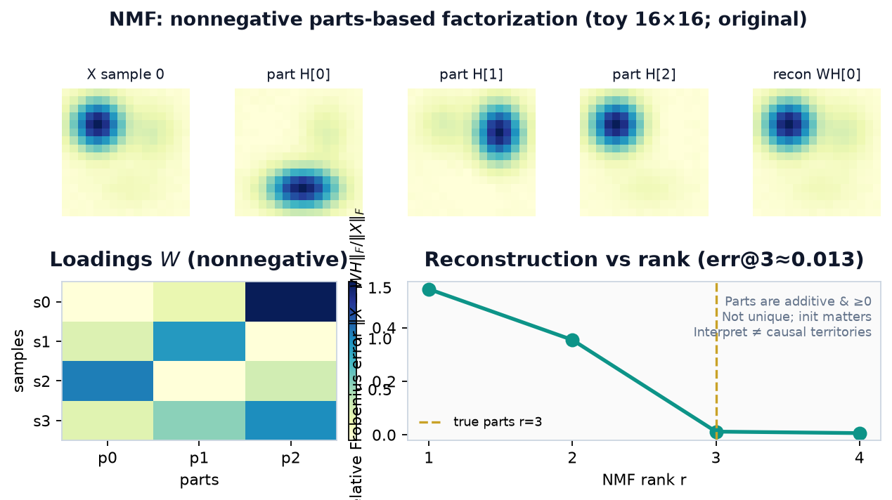\n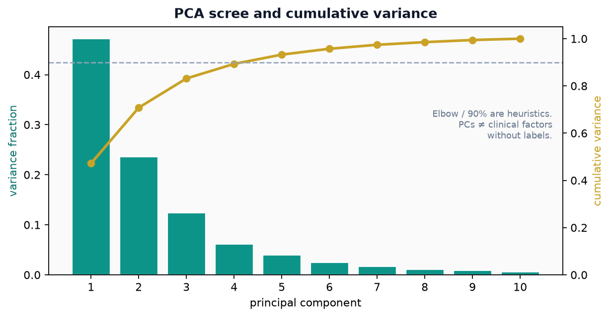

*Figure — Rank choice heuristics. Bars are per-component variance fractions; gold curve is cumulative mass with a 90% guide line. Elbows and thresholds are teaching tools—principal axes are not automatically clinical factors without labels. **Geometry ≠ etiology**.*\n\n

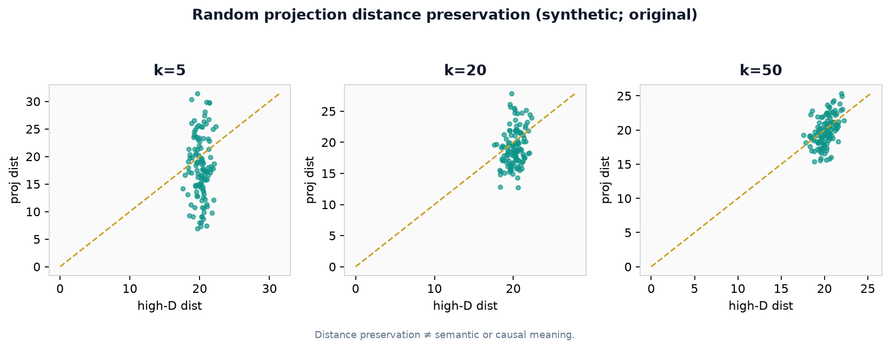

*Figure — JL-style intuition. Pairwise distances recover better as projection dimension grows. Preserving distances is a geometric guarantee—not semantic or causal meaning of axes.*

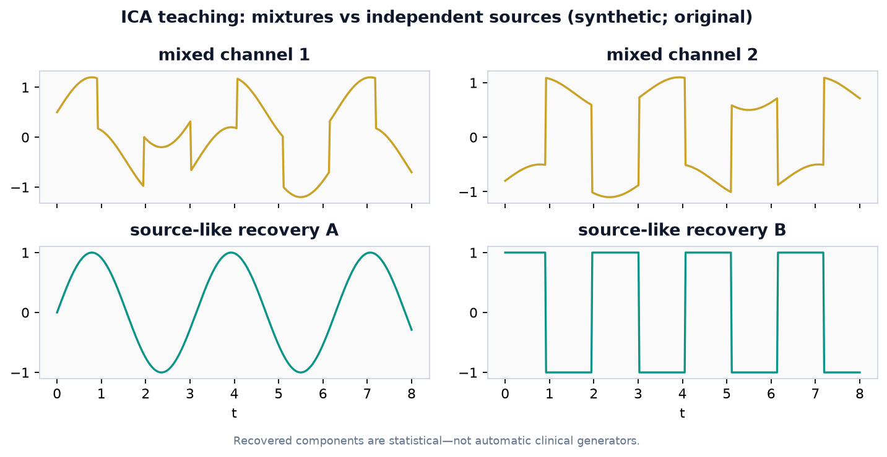

*Figure — Blind source separation cartoon. Recovered components can look like generators under independence assumptions—they are statistical, not automatic clinical mechanisms.*

*Figure — NMF teaching panel. A synthetic 16×16 nonnegative “map” is a sum of three blob parts. Multiplicative-update NMF recovers additive parts \(H\) and sample loadings \(W\); reconstruction error falls with rank and plateaus near the true \(r=3\). Parts are ≥0 and additive—useful for territories or topics—but solutions are non-unique, depend on initialization, and do not license causal anatomy labels without external validation.*

### Singular Value Decomposition (SVD)

SVD X = U Σ Vᵀ is the Swiss army knife of matrix analysis: PCA, low-rank denoising, pseudoinverses, and latent semantic structure all flow from it. Truncated SVD compresses term–document matrices and imaging matrices. Compared with NMF, SVD allows negative loadings, which can be harder to interpret as “parts” but optimal for squared-error low-rank approximation.

### Topic Modeling: LSI and LDA

Latent Semantic Indexing (LSI), also called Latent Semantic Analysis (LSA), applies truncated SVD to a term–document matrix (often TF–IDF weighted). Documents and terms map into a latent semantic space where synonymy and polysemy are partially mitigated: documents that share themes but few exact terms can still be near. Query retrieval becomes cosine similarity in the reduced space. LSI is linear algebra, not a generative probabilistic model.

Latent Dirichlet Allocation (LDA—not to be confused with Linear Discriminant Analysis) is a generative Bayesian model: each document is a mixture of topics; each topic is a distribution over words; Dirichlet priors encourage sparse mixtures. Inference (variational EM or collapsed Gibbs sampling) estimates topic–word and document–topic distributions. LDA topics are often more interpretable than LSI components for literature corpora and note collections, but require choosing the number of topics and careful preprocessing (stopwords, domain terms). In clinical epi, topics can surface documentation themes; they are not automatic diagnosis codes and can reflect hospital templates rather than disease biology.

## Tensor Decompositions

Tensors generalize matrices to multi-way arrays. A third-order tensor X ∈ R^{I×J×K} might store patients × labs × time, or height × width × modality, or subjects × voxels × conditions. Multi-way structure is lost if one naively flattens everything into a matrix before PCA; tensor decompositions preserve modes.

### Mode-n Unfolding and n-Mode Products

Mode-n unfolding (matricization) rearranges a tensor into a matrix whose columns (or rows) are mode-n fibers—vectors obtained by fixing all indices except the n-th. The n-mode product multiplies a tensor by a matrix along mode n, transforming that mode’s dimension. These operations are the building blocks of multilinear algebra analogs of matrix products.

### CP, Tucker, and Tensor Train

Canonical Polyadic (CP) decomposition, also called PARAFAC, expresses a tensor as a sum of rank-1 tensors: X ≈ ∑_{r=1}^R a_r ∘ b_r ∘ c_r (for order 3), with factor matrices collecting the a_r, b_r, c_r. CP rank is the minimal R; computing it is hard, but alternating least squares often finds useful approximations. CP factors can be uniquely identifiable under mild conditions—unlike matrix SVD factors up to rotation—which aids interpretability.

Tucker decomposition writes X ≈ G ×₁ A ×₂ B ×₃ C with a core tensor G and factor matrices along each mode. It generalizes SVD to multi-way data (higher-order SVD is a common orthogonal Tucker form). Tucker is more flexible than CP but the core can be dense; multilinear rank is a tuple of ranks per mode.

Tensor Train (TT) decomposition factorizes a high-order tensor into a chain of third-order cores, achieving compression when TT-ranks are small. TT and related hierarchical formats scale to very high orders better than dense Tucker cores. In neuroimaging and multi-modal fusion, tensor methods remain research-active tools for structured dimensionality reduction.

Mini example of mode thinking: suppose a toy tensor stores 2 patients × 3 regions × 2 timepoints of a nonnegative perfusion summary. Mode-1 fibers are length-2 vectors across patients for fixed region–time; mode-2 fibers are length-3 regional profiles; mode-3 fibers are length-2 time pairs. A rank-1 CP term a ∘ b ∘ c says that a single patient loading vector a, region pattern b, and time pattern c combine multiplicatively. If true structure is approximately rank-1, reconstruction is compact; if each patient has idiosyncratic region–time interactions, you need higher rank or a Tucker core that allows interactions among factor dimensions. This vocabulary is enough to read neuroimaging tensor papers without implementing ALS from scratch on day one.

## Worked PCA Numerics: Scores, Loadings, and Stability

Return to the three-point example with an extra check. Centered matrix rows: r1=(−2,−1), r2=(0,0), r3=(2,1). Unit loading vector v₁=(2/√5, 1/√5). Scores z_i = r_i · v₁ give (−√5, 0, √5). The second loading v₂=(−1/√5, 2/√5) gives scores all zero, confirming zero variance on PC2. The projection matrix P = v₁ v₁ᵀ equals (1/5) [[4, 2], [2, 1]]. Applying P to r1: (1/5)(−8−2, −4−1)=(−2,−1), recovering r1 exactly—as expected for rank-1 data.

Now alter the data slightly so PC2 is nonzero: replace x₂ with (3, 4) instead of (3, 3). New mean μ=((1+3+5)/3,(2+4+4)/3)=(3, 10/3). Centered rows become (−2, −4/3), (0, 2/3), (2, 2/3). Forming C and solving eigenvalues is a good homework exercise; qualitatively, points no longer collinear, λ₂ > 0, and a one-component reconstruction incurs positive Frobenius error. This is the usual clinical regime: choose k so that residual structure is mostly noise relative to the downstream task, not so that λ₂ is mathematically zero.

Loadings for a standardized four-lab panel might read PC1 ≈ 0.55·creatinine + 0.52·BUN + 0.45·potassium + 0.47·phosphate, a “renal–electrolyte” direction. Reporting loadings with confidence requires bootstrap stability: if signs flip across resamples, do not over-narrate the biology. Site-stratified PCA can reveal that PC1 is “scanner A versus B” rather than pathophysiology—plot scores colored by site before publishing a “phenotype axis.”

Incremental PCA on successive weekly batches of the same labs should be monitored for loading drift. If week-12 loadings rotate relative to week-1 because a new assay entered the panel, either freeze the projection learned on a locked training window or retrain and version the component definitions. Unsupervised maps are part of the feature pipeline and inherit the same MLOps discipline as scalers and encoders.

## Whitening, Reconstruction, and When Not to Reduce

Whitening (sphering) transforms data so that the empirical covariance becomes the identity. One form uses the PCA basis: z_white = Λ_k^{−1/2} V_kᵀ x_c after optional truncation to k components. Whitened features have unit variance and zero correlation, which can help independent component analysis and some neural initializations. Whitening amplifies low-variance directions—including assay noise—if small eigenvalues are inverted without truncation or regularization. Prefer truncated or ridge-regularized whitening when eigenvalues span many orders of magnitude, as in multi-omics merged with vitals.

Reconstruction error ‖X_c − X_c V_k V_kᵀ‖_F measures how much variance a k-dimensional PCA keeps. Plotting cumulative explained variance helps pick k, but predictive tasks should choose k (or whether to use PCA at all) by nested validation of the downstream model. A component that explains little variance can still be highly predictive; a dominant component can be pure batch effect (scanner, site, shift).

Do not reduce when stakeholders require feature-level coefficients on original labs; when n is already tiny and reduction adds unstable maps; when rare binary indicators carry the clinical signal; or when reduction is fit on the full cohort before train/test split (leakage of test geometry into the projection). Sometimes the right “reduction” is domain-guided feature selection (Chapter 6), not an unsupervised map.

## Connecting Decompositions Across Modalities

A practical multi-modal stroke workup might: standardize and PCA-compress a wide lab panel to 10 components; extract wavelet band energies from a short EEG montage; run truncated SVD/LSI on TF–IDF of the ED note; leave ASPECTS and NIHSS unreduced as interpretable anchors; then feed the concatenation to a regularized model. Each decomposition is documented with fit-on-train parameters (means, loadings, IDF, wavelet settings).

NMF on nonnegative perfusion maps can yield parts resembling vascular territories; compare qualitatively with known anatomy rather than forcing a territory label onto every factor. Topic models on progress notes may rediscover template headings (“Neuro check,” “Plan”) as “topics”—filter boilerplate before claiming disease themes. Tensor CP on patients × regions × time can summarize longitudinal imaging if missingness and registration quality allow; otherwise collapse time with clinically defined epochs first.

Computational notes: randomized SVD and truncated iterative methods scale to tall thin or wide short matrices common in imaging. Incremental PCA suits nightly batch arrivals from a registry. For t-SNE/UMAP of 100k notes or cells, pre-reduce with PCA to 50 dimensions for speed and noise control—another place where linear and nonlinear methods compose.

Fourier features on a 256-sample EEG window might yield band powers that reduce 256 samples to five numbers (delta through gamma). Wavelet packet energies might yield twenty numbers with better transient sensitivity. Neither automatically beats the other on seizure detection—compare with nested validation and patient-wise splits. LSI on 10,000 notes with vocabulary 20,000 may keep 100 semantic dimensions for retrieval; LDA with K=50 topics yields document mixtures used as features for phenotype classifiers. In each case, the decomposition is a feature engineer’s tool (Chapter 6), not an end in itself.

Cholesky appears when sampling synthetic multivariate lab panels for stress tests: if a training covariance Σ is SPD, factor Σ=LLᵀ and map standard normals through L to match correlations. If Σ is singular because p>n, use a reduced-rank or diagonal-loaded covariance first. This closes the loop from decomposition numerics back to practical simulation for pipeline testing without moving real PHI off-site.

Finally, keep a written decision log: why PCA versus NMF, why k or rank r, which modes a tensor used, whether embeddings were supervised. Future you—and multi-site collaborators—will need that log more than a colorful UMAP. Record random seeds for t-SNE/UMAP and the training window used for any incremental PCA update.

## Clinical and Epidemiologic Notes

Use PCA and SVD to denoise and compress when variance aligns with signal—bulk lesion burden, correlated lab panels—but verify that rare critical features (a single pathogenic mutation, a sparse ASPECTS region) are not discarded. Standardize mixed units before PCA. Prefer SVD implementations over forming huge covariances explicitly.

Supervised LDA projections can improve class separation for visualization of stroke subtypes but need enough events per class and external validation. Nonlinear embeddings (t-SNE, UMAP) are excellent for talks and hypothesis generation; they are poor as sole evidence of “natural clusters” in manuscripts without confirmatory statistics. Always re-cluster or re-label in original space, and report stability across seeds and sites.

For signals, match Fourier versus wavelet features to stationarity and transient structure of the clinical phenomenon. For notes, LSI/LDA topics help explore corpora and build retrieval indices; they do not replace chart review for phenotype gold standards. Multi-way tensors fit multi-modal longitudinal designs conceptually; start simple (matrix methods) unless multi-way structure is clearly needed and n supports it.

Epidemiologic analyses that use principal components as covariates (for ancestry adjustment in genetics, or for lab summaries) should pre-specify how many components and from which samples they are estimated. Using components built with test outcomes in view is circular. When components become exposure proxies, interpretability and measurement error deserve the same scrutiny as any constructed index.

Curse of dimensionality: expect distance concentration and unstable covariances when p ≫ n.

PCA/SVD: variance-maximizing linear maps; worked eigenvalues tell reconstruction fidelity.

LDA/Fisher: supervised axes; limited to C−1 dimensions; shrinkage when n is small.

t-SNE/UMAP: visualize locally; do not over-interpret global geometry.

Fourier/wavelets: complementary spectral tools for EEG and physiology.

NMF/LSI/LDA topics: parts and themes; validate against clinical meaning.

Tensors: preserve multi-way structure (patient × feature × time) when justified.

Whitening and full-rank inversions amplify noise—truncate or regularize.

Fit projections on training data only; validate k by downstream performance.

## Chapter Summary

High-dimensional clinical data suffer geometric and statistical curses that motivate reduction and decomposition. PCA finds orthogonal maximum-variance directions; a full numerical example with three points shows centering, covariance eigen-decomposition, scores, and explained variance. SVD implements PCA stably; incremental PCA handles streaming or out-of-core data. LDA/Fisher seeks supervised discriminative projections. Nonlinear methods—LLE, t-SNE, UMAP—preserve local manifold structure for visualization with important interpretive caveats. Fourier and wavelet transforms decompose signals in frequency and time–frequency; aggregation methods compress long series. Matrix tools include Cholesky for SPD linear algebra, NMF for nonnegative parts-based factors, and SVD for optimal low-rank approximation. Topic models apply these ideas to text: LSI via truncated SVD and LDA as a Bayesian generative mixture of topics. Tensors extend factorizations multi-way via mode-n products with CP, Tucker, and tensor-train forms. Clinically, reduce when it denoises and clarifies; refuse reduction when it erases rare signals, harms calibration, or replaces needed interpretable covariates.

## Practice and Reflection

(1) Recompute the chapter’s 3-point PCA using divisor n−1 in the covariance. How do eigenvalues scale, and do principal directions change?

(2) Prove that for centered X, right singular vectors of X equal eigenvectors of XᵀX. Relate singular values to eigenvalues.

(3) For two-class Fisher discriminant in 2D with isotropic within-class variance, sketch why the optimal direction aligns with the mean difference.

(4) List three reasons a beautiful t-SNE plot of multi-center stroke radiomics might not imply transportable phenotypes.

(5) Compute by hand the 2-point DFT of the series [1, −1] and interpret the spectrum.

(6) Explain one clinical scenario favoring wavelets over a single global FFT window for EEG feature extraction.

(7) Contrast NMF and SVD on a nonnegative term–document matrix: reconstruction optimality versus interpretability of parts.

(8) Describe how LSI would rank documents for a query in the reduced space, and how LDA’s document–topic vector differs conceptually.

(9) Define mode-1 unfolding of a 2×3×2 tensor in words and state the shape of the resulting matrix.

(10) You have n = 120 ICH patients and p = 5000 gene-expression features. Propose a reduction pipeline for visualization and for supervised prediction, with leakage controls.
