# Chapter 8. Regression Analysis

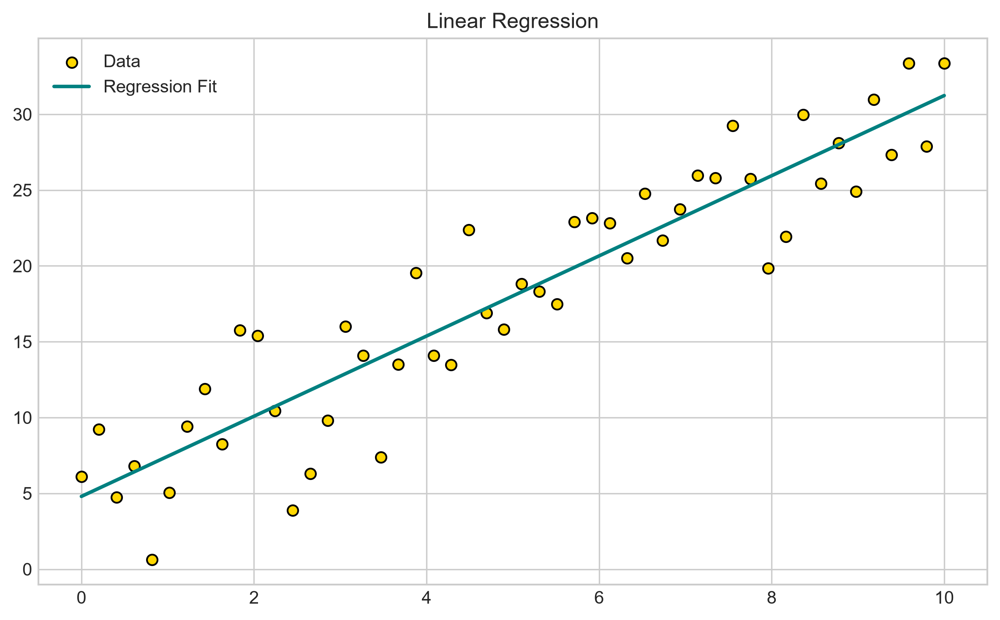

## Opening

A lab wants to regress 90-day mRS from admission labs. Linear models still discipline thinking about targets, residuals, and collinearity before anyone reaches for a neural net.

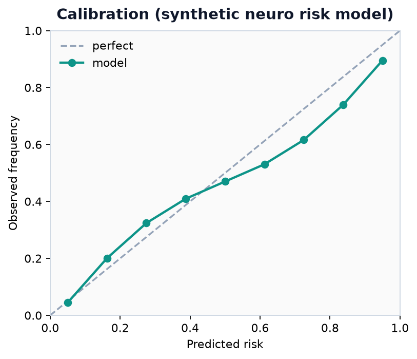

*Reliability of numeric predictions matters as much as fit (original).*
## Learning Objectives

Distinguish loss, cost, and objective functions and write them for squared error and log loss.

Derive and compute ordinary least squares for univariate and multiple linear regression with a full numerical example.

Build polynomial and piecewise regression models and evaluate with RSE, RMSE, R², and residual diagnostics.

Explain ARIMA(p,d,q) intuition for clinical and epidemiologic time series.

Formulate logistic and softmax regression, interpret coefficients, and evaluate with ROC, calibration, and information criteria.

Use cross-validation, learning curves, Wald tests, likelihood-ratio tests, and pseudo-R² appropriately.

Analyze overfitting, underfitting, and the bias–variance tradeoff; apply Ridge, Lasso, elastic net, and non-negative garrote.

Connect optimization mathematics (derivatives, gradients, Jacobian, Hessian, Taylor) to GD variants, Newton methods, and early stopping.

## Loss, Cost, and Objective Functions

Supervised learning fits a parametric mapping f(x; θ) from features x to a target y by optimizing a numerical criterion. Terminology varies across communities, but a useful distinction is: a loss ℓ(y, f(x; θ)) measures error on a single example; a cost (or empirical risk) averages loss over a training set, J(θ) = (1/n) ∑_i ℓ(y_i, f(x_i; θ)); an objective may add regularization, constraints, or priors, e.g. J(θ) + λ R(θ). Training solves θ̂ = argmin_θ of that objective (or a stochastic approximation thereof).

Squared error loss ℓ = (y − ŷ)² underpins classical linear regression and is differentiable and sensitive to outliers. Absolute error |y − ŷ| is more robust. Huber loss blends both—quadratic for residuals below a threshold δ and linear beyond it—so it stays smooth and differentiable near zero yet down-weights the leverage of gross outliers. For binary classification with probabilistic scores p ∈ (0,1), log loss (binary cross-entropy) ℓ = −[y log p + (1−y) log(1−p)] is the negative Bernoulli log-likelihood. Multi-class cross-entropy generalizes to softmax probabilities. Choosing a loss is choosing what “wrong” means clinically: large errors on huge ICH volumes may matter more than small errors near zero—or the reverse if threshold decisions dominate.

Objectives are not automatically causal estimands. Minimizing prediction error can use any feature known at prediction time; estimating a treatment effect requires a design and often a different target parameter. State the estimand before celebrating a low training loss. In multi-site stroke research, write the loss, the decision time, and the population on the same page of the analysis plan so optimization choices cannot silently redefine the scientific question.

## Univariate and Multiple Linear Regression

Univariate linear regression models E[y | x] = β₀ + β₁ x for a scalar predictor. Given n pairs (x_i, y_i), ordinary least squares (OLS) minimizes ∑_i (y_i − β₀ − β₁ x_i)². Closed form: β₁ = ∑ (x_i − x̄)(y_i − ȳ) / ∑ (x_i − x̄)², β₀ = ȳ − β₁ x̄. Residuals e_i = y_i − ŷ_i should look structureless if the linear mean and constant variance are plausible.

Multiple linear regression extends to a feature vector x ∈ R^p: y ≈ β₀ + xᵀ β, or in matrix form y = Xβ + ε with design matrix X including a column of ones for the intercept. If X has full column rank, the OLS estimator is β̂ = (Xᵀ X)⁻¹ Xᵀ y, equivalently solving the normal equations Xᵀ X β = Xᵀ y. Fitted values are ŷ = X β̂ = H y with hat matrix H = X(Xᵀ X)⁻¹ Xᵀ. Multicollinearity makes Xᵀ X ill-conditioned and coefficient variances large even when predictions remain usable.

### Worked Example: OLS by Hand

Four patients with a single predictor x = admission NIHSS and outcome y = infarct volume (simplified units):
(x,y): (4, 12), (8, 20), (10, 22), (14, 30).
Means: x̄ = (4+8+10+14)/4 = 9, ȳ = (12+20+22+30)/4 = 21.
Deviations (x−x̄): −5, −1, +1, +5. Deviations (y−ȳ): −9, −1, +1, +9.
∑ (x−x̄)(y−ȳ) = (−5)(−9)+(−1)(−1)+(1)(1)+(5)(9) = 45+1+1+45 = 92.
∑ (x−x̄)² = 25+1+1+25 = 52.
β₁ = 92/52 = 23/13 ≈ 1.769. β₀ = 21 − (23/13)·9 = 21 − 207/13 = (273 − 207)/13 = 66/13 ≈ 5.077.

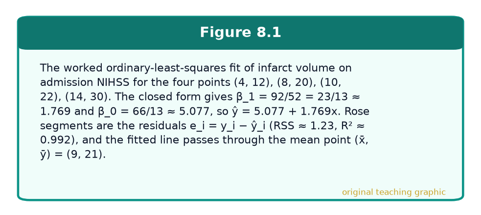

*Figure 8.1 — original teaching graphic.*

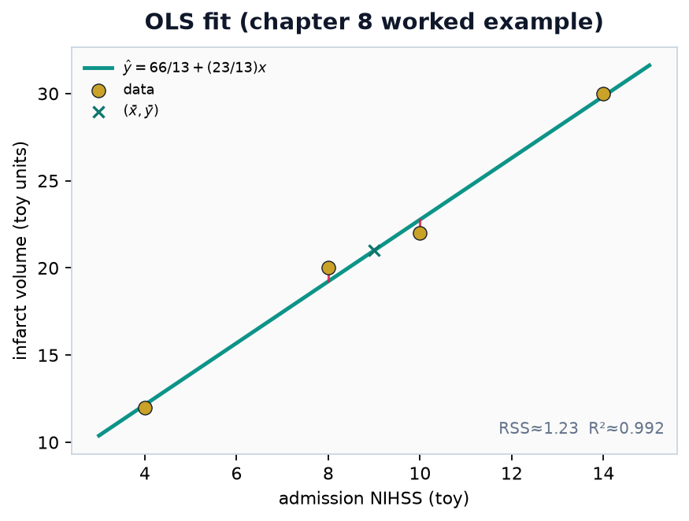

*Exact OLS line ŷ = 66/13 + (23/13)x with residual segments; RSS ≈ 1.23, R² ≈ 0.992 (original).*

Fitted line: ŷ = 66/13 + (23/13) x. At x = 8, ŷ = (66 + 184)/13 = 250/13 ≈ 19.23 (residual 20 − 19.23 ≈ 0.77). At x = 14, ŷ = (66 + 322)/13 = 388/13 ≈ 29.85 (residual ≈ 0.15). RSS = ∑ e_i² can be computed from all four residuals for RSE below. The slope says that each additional NIHSS point associates with about 1.77 volume units higher expected infarct size in this toy sample—not a causal claim about NIHSS raising volume.

### Choosing Variables and Challenges

Variable inclusion may be pre-specified by protocol (preferred in epi), guided by domain knowledge, or data-driven (stepwise, penalization, wrappers from Chapter 6). Data-driven selection inflates type I error and optimistically biases performance unless nested in validation. Challenges include nonlinearity, interactions, heteroscedasticity, outliers, missingness, and endogeneity when coefficients are interpreted causally. Solutions include transforms, splines, robust SEs, mixed models for clustering, and explicit causal designs when effects—not forecasts—are the goal.

## Polynomial and Piecewise Regression

Polynomial regression remains linear in parameters but nonlinear in x: y ≈ β₀ + β₁ x + β₂ x² + ⋯ + β_p x^p. The OLS machinery applies to the expanded design matrix. Higher p fits wiggles that can interpolate noise—especially dangerous with small n. Regularization, low degree (p = 2 or 3), or domain transforms (log onset-to-arrival) are safer than high-degree global polynomials on clinical tables. Interactions are cross-basis terms: β_{12} x₁ x₂ allows the effect of x₁ to depend on x₂ (age × NIHSS).

Piecewise (segmented) regression allows different linear (or polynomial) regimes on intervals of x, joined or discontinuous at knots. Continuous piecewise linear models (linear splines) hinge at knots; cubic splines and restricted cubic splines are standard in epidemiology for flexible age and severity effects without the wild tail behavior of global high-degree polynomials. Generalized additive models (GAMs) sum smooth functions of individual predictors, g(E[y]) = β₀ + f₁(x₁) + f₂(x₂) + ⋯, staying additive across predictors so each effect remains a visualizable curve; interactions are added deliberately as joint smooths rather than assumed everywhere. Choose knot locations by quantiles or clinical thresholds (e.g., NIHSS cut-points used in trials), and penalize smoothness to avoid overfit.

## Evaluating Fit: RSE, RMSE, and Residuals

Residual Standard Error (RSE) estimates the standard deviation of the error term in a linear model: RSE = √(RSS / (n − p − 1)) for a model with intercept and p slopes (degrees of freedom n − p − 1). It is roughly the typical size of residuals in the units of y. Root Mean Square Error RMSE = √( (1/n) ∑ (y_i − ŷ_i)² ) (or with n−1) is closely related and widely reported for prediction; on held-out data it is a primary accuracy metric.

R² = 1 − RSS/TSS measures the fraction of sample variance in y linearly associated with the fitted mean. It never decreases when adding predictors; adjusted R² penalizes dimension slightly. R² is not a validation metric by itself. Report RMSE or MAE on held-out data in clinical units (mL, days). Residual-versus-fitted plots diagnose nonlinearity and heteroscedasticity; QQ plots assess approximate normality for small-sample inference.

## ARIMA: Autoregressive Integrated Moving Average

Time series regression forecasts future values from past values and past shocks. ARIMA(p,d,q) combines: Integration (d)—differencing the series d times to approach stationarity (d = 1 removes a random-walk trend); Autoregression AR(p)—linear dependence on p lagged values; Moving average MA(q)—linear dependence on q lagged forecast errors. The model is not magic: it assumes approximate linearity, stable dynamics, and adequate history.

Intuition for orders: d is chosen so the differenced series looks stationary (ADF tests, ACF decay). p is suggested by partial autocorrelation (PACF) cutoffs for AR-like series. q is suggested by autocorrelation (ACF) cutoffs for MA-like series. Information criteria (AIC/BIC) compare candidate (p,d,q) on training data; true forecast skill needs time-series cross-validation or rolling origins—not shuffled K-fold. Seasonal ARIMA adds seasonal AR, differencing, and MA terms for weekly ED volumes or annual cycles.

Extrapolation predicts beyond the last time point; interpolation fills gaps—ARIMA-style models can do both with care. Clinical uses include forecasting bed occupancy, stroke code volumes, and physiologic series. External shocks (pandemic, new EVT criteria) break stationarity; monitor forecast residuals and re-estimate when processes change.

## Logistic Regression and Softmax

Logistic regression models a binary outcome with the logit link: P(y = 1 | x) = σ(xᵀ β) where σ(z) = 1/(1+e^{−z}) and x includes 1 for the intercept. The log-odds equal the linear predictor: log(p/(1−p)) = xᵀ β. Coefficients are log-odds ratios: a unit increase in x_j multiplies odds by e^{β_j} holding other covariates fixed—interpret cautiously with collinearity and non-collapsibility of odds ratios.

Parameters are estimated by maximizing the Bernoulli likelihood (equivalently minimizing log loss), typically via Newton–Raphson / IRLS or gradient methods. There is no OLS-style simple closed form in general. Perfect separation makes MLE infinite; Firth penalty or L2 regularization stabilizes estimates—common in small clinical datasets.

Softmax (multinomial logistic) regression extends to K classes: P(y = k | x) = exp(xᵀ β_k) / ∑_{j=1}^K exp(xᵀ β_j), with an identifiability constraint (e.g., β_K = 0). Training minimizes multi-class cross-entropy. Softmax is the classification head of many neural nets; the classical version with linear predictors remains a strong baseline for multi-class stroke outcomes (e.g., mRS binned, TOAST categories) when n is modest and features are tabular.

### Worked Example: Logistic Regression Prediction and One Gradient Step

Consider one patient described by two standardized features, x = [x₁, x₂] = [1.0, 0.5], where x₁ is a scaled admission NIHSS and x₂ a scaled age, and a fitted model with coefficients β = [β₀, β₁, β₂] = [−1.0, 0.8, 0.4]; the intercept multiplies a constant x₀ = 1. The true label is y = 1 (the event occurred).

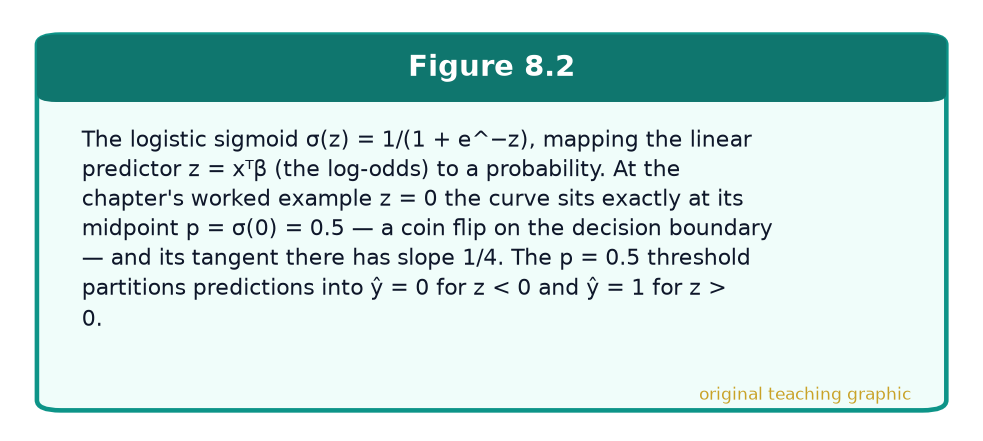

*Figure 8.2 — original teaching graphic.*

Linear predictor: z = β₀·1 + β₁·x₁ + β₂·x₂ = −1.0 + 0.8·(1.0) + 0.4·(0.5) = −1.0 + 0.8 + 0.2 = 0.0.

Probability: p = σ(z) = 1/(1 + e^−z) = 1/(1 + e^0) = 1/(1 + 1) = 0.5. At z = 0 the logistic curve is exactly at its midpoint, so this patient sits on the decision boundary and the model predicts a coin flip.

Log-loss for the true label y = 1: ℓ = −ln p = −ln(0.5) = ln 2 ≈ 0.693. That is the loss of an uninformative 50/50 guess—the reference value any useful model must beat.

Now take one gradient-descent step. The per-example gradient of log-loss with respect to βⱼ is (p − y)·xⱼ, with x₀ = 1. Here p − y = 0.5 − 1 = −0.5, so the three partials are (p−y)·x₀ = (−0.5)(1) = −0.5, (p−y)·x₁ = (−0.5)(1.0) = −0.5, and (p−y)·x₂ = (−0.5)(0.5) = −0.25. Because the prediction (0.5) undershoots the truth (1), every component is negative, so descent will raise the coefficients on the positive features and push z upward. With learning rate η = 0.5 and the rule βⱼ ← βⱼ − η·(p−y)·xⱼ:

β₀ ← −1.0 − 0.5·(−0.5) = −1.0 + 0.25 = −0.75

β₁ ← 0.8 − 0.5·(−0.5) = 0.8 + 0.25 = 1.05

β₂ ← 0.4 − 0.5·(−0.25) = 0.4 + 0.125 = 0.525

Recompute the linear predictor with the updated coefficients: z′ = −0.75 + 1.05·(1.0) + 0.525·(0.5) = −0.75 + 1.05 + 0.2625 = 0.5625. Using e^0.5625 ≈ 1.755 (so e^−0.5625 ≈ 1/1.755 ≈ 0.570; a coarser check is e^0.6 ≈ 1.822), the new probability is p′ = σ(0.5625) = 1/(1 + 0.570) = 1/1.570 ≈ 0.637. The prediction moved from 0.500 to 0.637—toward the true label y = 1—and the log-loss fell from 0.693 to −ln(0.637) ≈ 0.451. One step does not arrive at the target; the optimizer repeats this until the objective stops improving.

### Worked Example: Ridge Shrinkage on One Coefficient

The section above invoked L2 regularization to stabilize logistic coefficients under separation; ridge is that same L2 penalty, and its mechanics are clearest in one dimension with squared-error loss. The one-dimensional ridge estimator (no intercept) has the closed form β̂ = (Σ xᵢyᵢ)/(Σ xᵢ² + λ)—the least-squares slope with λ added to the denominator. Take three standardized toy observations (xᵢ, yᵢ) = (1, 2), (2, 4), (3, 6), chosen to lie exactly on the line y = 2x so that shrinkage is the only thing moving the estimate. The needed sums are Σ xᵢyᵢ = (1)(2) + (2)(4) + (3)(6) = 2 + 8 + 18 = 28 and Σ xᵢ² = 1² + 2² + 3² = 1 + 4 + 9 = 14.

At λ = 0 (no penalty) the estimator is ordinary least squares: β̂ = 28/14 = 2.00, exactly the true slope. At λ = 10, β̂ = 28/(14 + 10) = 28/24 = 7/6 ≈ 1.17. Equivalently, ridge multiplies the OLS slope by the shrinkage factor Σ xᵢ²/(Σ xᵢ² + λ) = 14/24 ≈ 0.583, so 2.00 × 0.583 ≈ 1.17.

The penalty pulled a perfectly-supported slope from 2.00 down to 1.17—a 42% reduction—trading a little bias for lower variance. As λ → 0 the estimate returns to OLS; as λ → ∞ the denominator dominates and β̂ → 0. A larger Σ xᵢ² (more spread, hence more signal, in the predictor) resists a fixed λ, which is precisely why predictors are standardized before a shared penalty is applied.

## Evaluating Regression and Classification Fitness

### Cross-Validation and Learning Curves

K-fold cross-validation partitions training data into K folds, repeatedly fitting on K−1 folds and evaluating on the held fold. Nested CV is required when selection and hyperparameter tuning occur. For temporal clinical data, prefer forward-chaining or rolling-origin validation over random folds that leak future practice patterns. Learning curves plot training and validation error against training set size: high bias shows both errors high and close; high variance shows a large gap with low training error and high validation error.

### ROC for Logistic Models

Receiver Operating Characteristic (ROC) curves plot true positive rate versus false positive rate as the classification threshold on predicted probability sweeps. AUC summarizes ranking quality. ROC ignores calibration: two models with identical AUC can have very different probability reliability. For clinical decisions, report calibration plots, the Brier score (the mean squared error between predicted probabilities and 0/1 outcomes, a joint measure of calibration and discrimination), and threshold-specific net benefit (from decision-curve analysis, which weighs true positives against false positives at a clinically chosen threshold) alongside AUC. Precision–recall curves are more informative under rare events (sICH).

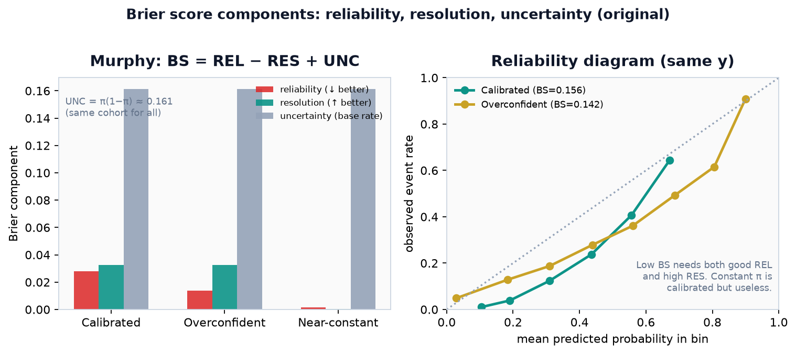

*Figure — Brier components. Murphy’s decomposition writes BS = REL − RES + UNC. **Left:** an overconfident model inflates reliability (miscalibration penalty); a near-constant predictor is “calibrated” to prevalence but has almost no resolution—low Brier for the wrong reason. **Right:** reliability diagrams for the same labels. Always pair Brier with a reliability plot and a discrimination metric; Brier is not a causal effect and is prevalence-dependent via UNC = π(1−π).*

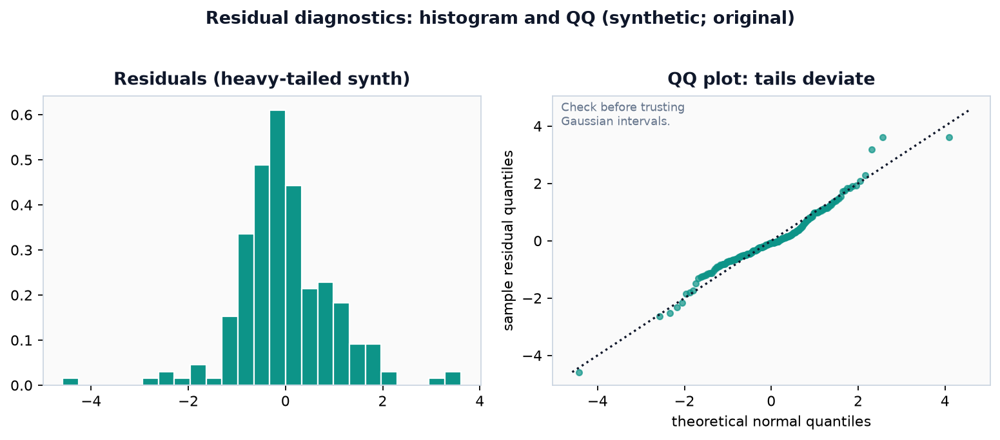

*Figure — Gaussian residual assumptions are checkable. **Left:** heavy-tailed residual histogram. **Right:** QQ plot bows in the tails. Prefer robust SEs, transforms, or GLMs when tails dominate; diagnostics police intervals—not causation.*

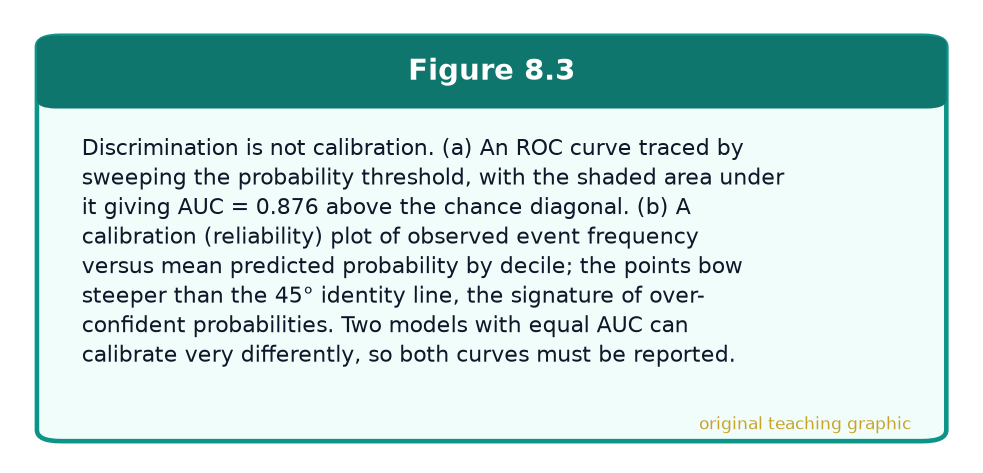

*Figure 8.3 — original teaching graphic.*

### Wald Tests, Information Criteria, R² and Pseudo-R², LRT

Wald tests assess H₀: β_j = 0 using β̂_j / SE(β̂_j) compared to a normal or t reference (asymptotically). They are convenient in software output but can misbehave under separation and small samples. Likelihood-ratio tests (LRT) compare nested models via 2(ℓ_full − ℓ_reduced) ~ χ² with degrees of freedom equal to the difference in free parameters—often more reliable than Wald in logistic models.

Information criteria balance fit and complexity: AIC ≈ −2ℓ + 2k, BIC ≈ −2ℓ + k log n. Lower is better within a comparable likelihood family; they are not substitutes for external validation. Pseudo-R² measures summarize logistic fit relative to a null (intercept-only) model, but on different scales. McFadden’s is 1 − ℓ_full/ℓ_null, a ratio of log-likelihoods on which even strong models rarely exceed about 0.4; Nagelkerke rescales the Cox–Snell likelihood-ratio index by its maximum attainable value so the number can reach 1; Tjur’s coefficient of discrimination is the intuitive gap between mean predicted probability among events and among non-events; none is “percent variance explained” in the OLS sense—report them carefully and prefer predictive metrics on holdout data for model choice in clinical prediction.

## Overfitting, Underfitting, and the Bias–Variance Tradeoff

Underfitting (high bias) means the hypothesis class cannot represent the true regression function: a straight line through curved volume–NIHSS data, or too heavy regularization. Overfitting (high variance) means the model captures noise and sample idiosyncrasies: a high-degree polynomial through few points, unpenalized models with p ≈ n. Expected prediction error decomposes (for squared error) into bias² + variance + irreducible noise. Increasing model flexibility tends to decrease bias and increase variance; regularization and more data rebalance the tradeoff.

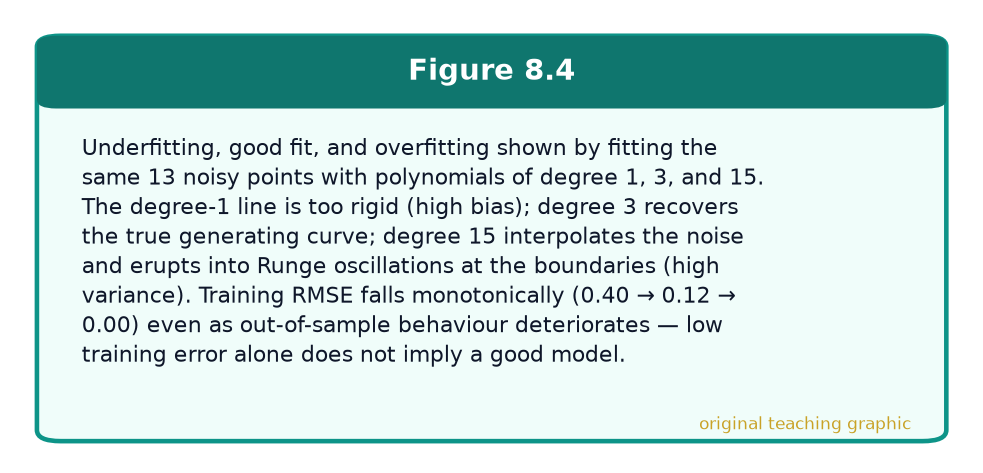

*Figure 8.4 — original teaching graphic.*

Clinical n is often small relative to candidate features. Prefer pre-specified predictors, penalization, dimensionality control, and honest temporal validation. A model that memorizes one comprehensive stroke center’s documentation style will not transport to a telestroke network.

## Regularization: Ridge, Lasso, Elastic Net, and Non-Negative Garrote

Regularization adds a penalty R(β) to the cost to stabilize estimates and implement inductive bias. Standardize predictors before applying a shared penalty weight λ so that units do not silently dominate.

Ridge (L2) minimizes ‖y − Xβ‖² + λ ‖β‖₂² (intercept typically unpenalized). Solutions shrink coefficients continuously toward zero but rarely to exact zero; multicollinearity is handled gracefully by stabilizing XᵀX + λI. Closed form: β̂_ridge = (XᵀX + λI)⁻¹ Xᵀ y.

Lasso (L1) minimizes ‖y − Xβ‖² + λ ‖β‖₁, promoting sparse solutions with exact zeros—built-in variable selection. Correlated feature groups may see arbitrary single-feature selection. Elastic net combines L1 and L2 penalties: λ₁ ‖β‖₁ + λ₂ ‖β‖₂², encouraging sparsity while grouping correlated predictors more stably—often preferable for correlated clinical labs and comorbidity indicators.

The non-negative garrote starts from an initial estimate (often OLS) β̃ and finds nonnegative shrinkage factors c_j ≥ 0 minimizing a least-squares criterion in the scaled coefficients c_j β̃_j with a penalty on ∑ c_j. It sparsifies and shrinks relative to a good initial fit. Historically important as a bridge between subset selection and modern L1 methods; still useful conceptually when coefficients must remain nonnegative after scaling an initial model.

Ridge: stable, dense solutions; good under multicollinearity.

Lasso: sparse solutions; variable selection; unstable under highly correlated clones.

Elastic net: compromise for grouped clinical features.

Non-negative garrote: shrink/select relative to an initial estimate with c_j ≥ 0.

Always scale features before a shared λ; choose λ by nested CV or temporal holdout.

## Optimization Mathematics for Model Fitting

Fitting differentiable models is numerical optimization of J(θ). The derivative dJ/dθ for scalar θ and the gradient ∇J(θ) for vector θ give first-order local linear approximations: J(θ + δ) ≈ J(θ) + ∇J(θ)ᵀ δ. Critical points satisfy ∇J = 0. The Jacobian matrix collects first partials of a vector-valued function; for a scalar objective the Jacobian of the residual vector appears in least-squares Gauss–Newton methods.

The Hessian H = ∇²J is the matrix of second partials. Taylor expansion to second order: J(θ + δ) ≈ J(θ) + ∇Jᵀ δ + (1/2) δᵀ H δ. Positive definite H at a critical point implies a local minimum for smooth objectives. Conditioning of H governs how elongated valleys are and how hard first-order methods struggle.

### Gradient Descent Variants

Batch gradient descent updates θ ← θ − η ∇J(θ) using the full training set gradient each step. It has low-noise gradients but is expensive for large n. Stochastic gradient descent (SGD) uses one example (or a random shuffle stream) per update: noisy but cheap and often better at escaping shallow local structure in nonconvex deep models. Mini-batch SGD uses b examples per step, the practical default: vectorized hardware efficiency with controlled noise. Learning rate η (and schedules, momentum, adaptive methods like Adam in later chapters) dominate empirical success.

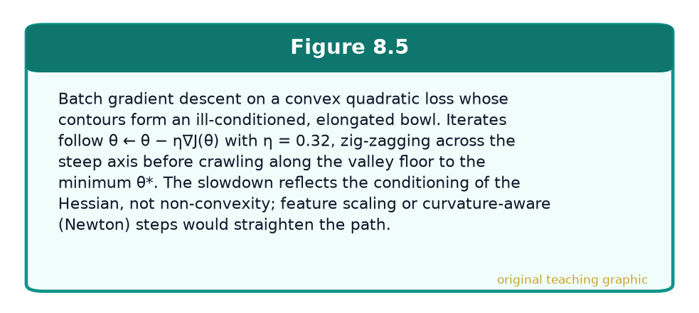

*Figure 8.5 — original teaching graphic.*

*Figure — Gradient noise. Full-batch steps follow a smooth trajectory; mini-batch gradients jitter with variance that scales roughly as 1/√batch size. That noise is both a cost (slower exact convergence) and a feature (exploration in nonconvex landscapes).*

### Newton Methods

Newton’s method uses curvature: θ ← θ − H⁻¹ ∇J. For smooth convex problems near the optimum, convergence is quadratic. Cost and need for Hessian inverses limit pure Newton on huge parameter spaces; quasi-Newton (BFGS/L-BFGS) and Gauss–Newton/IRLS for least squares and GLMs approximate curvature more cheaply. Logistic regression’s classical IRLS is a Newton-style algorithm on the log-likelihood.

### Early Stopping

Early stopping monitors validation loss during iterative optimization and stops when validation performance degrades while training loss still falls—an implicit regularizer. It is essential in neural training and also useful for path algorithms in penalized regression. Requires a validation stream that does not leak into final reported test metrics (use a three-way train/validation/test or nested scheme).

*Figure — Early stopping. The dashed epoch is the first minimum of validation loss; continuing further improves training fit while generalization worsens. Patience is chosen on validation only—never by peeking at final test performance.*

**Early-stopping protocol (teaching table)**

| Step | Action | Honest practice |
|------|--------|-----------------|
| 1 | Split train / validation / test (or nested CV) | Group by patient and site; respect time |
| 2 | Track validation loss (or primary clinical metric) each epoch | Do not open the test set while choosing patience |
| 3 | Stop when val metric fails to improve for *p* epochs | Document *p*; common defaults 5–20 depending on schedule |
| 4 | Restore weights from best validation epoch | Or refit train+val with fixed step count—write it down |
| 5 | Report final metrics once on held-out test | One look; no further tuning |

## Extended OLS Worked Numbers and Prediction Intervals

Continuing the four-point NIHSS–volume example with β₀=66/13 and β₁=23/13, fitted values are:
x=4: ŷ=(66+92)/13=158/13≈12.15, e=12−12.15=−0.15
x=8: ŷ=250/13≈19.23, e=20−19.23=0.77
x=10: ŷ=(66+230)/13=296/13≈22.77, e=22−22.77=−0.77
x=14: ŷ=388/13≈29.85, e=30−29.85=0.15
RSS ≈ (−0.15)²+(0.77)²+(−0.77)²+(0.15)² ≈ 0.0225+0.5929+0.5929+0.0225 ≈ 1.231.
RSE = √(RSS/(4−2)) = √(1.231/2) ≈ √0.6155 ≈ 0.78 volume units.
TSS = ∑(y−ȳ)² = 81+1+1+81=164; R²=1−RSS/TSS≈1−1.231/164≈0.992—suspiciously high because n=4 and the design is nearly linear.

A mean prediction at a new x₀ is ŷ₀=β₀+β₁ x₀. Approximate confidence intervals for the mean response tighten near x̄ and widen as x₀ moves away (leverage). Prediction intervals for a new individual observation are wider still because they include residual noise σ². In clinical communication, distinguish “expected average volume for NIHSS=10” from “plausible volume for the next patient with NIHSS=10.” Tiny toy R² values do not license narrow clinical promises.

## Multiple Regression Diagnostics and Influence

Beyond RSE and R², competent regression practice inspects leverage and influence. Diagonal elements H_{ii} of the hat matrix measure leverage: high-leverage patients have unusual x patterns (extreme age–severity combinations) and pull the fit. Cook’s distance and DFBETAS quantify how much β̂ changes when a point is deleted. In stroke registries, influential points may be data errors (weight entered in pounds as kilograms) or the very severe cases you most need—review clinically before deleting.

Variance inflation factors (VIF) diagnose multicollinearity: VIF_j = 1 / (1 − R_j²) from regressing feature j on the others. Large VIF inflates coefficient SEs without necessarily destroying predictive RMSE. Remedies include combining features, penalization (Ridge), or accepting wide CIs for individual β_j while focusing on prediction. Partial residual plots help see whether a linear term in glucose is adequate or whether a spline is needed.

Heteroscedasticity—error variance growing with fitted volume or LOS—is common. OLS β̂ remains unbiased under correct mean specification, but classical SEs are wrong; use Huber–White robust SEs, weighted least squares, or transform y. For prediction, consider models that explicitly allow variance to depend on x (e.g., GLMs with gamma errors for LOS).

## From Linear Predictors to GLM Thinking

Generalized linear models unify many regression-like structures: a linear predictor η = xᵀ β, a link function relating η to the mean of y, and an exponential-family noise model. Linear regression uses identity link and Gaussian noise. Logistic regression uses logit link and Bernoulli noise. Poisson and negative binomial models suit counts (readmissions, seizure counts). Once you understand loss, linear predictors, regularization, and validation from this chapter, other GLMs are variations on likelihood and link—not an entirely new philosophy.

Survival and Cox models link to the same culture for time-to-event neurologic outcomes with censoring: a linear predictor sits inside a hazard h(t|x) = h₀(t) exp(xᵀ β). Partial likelihood yields log hazard ratios. Naive OLS on observed times that ignore censoring is biased. Modern ML extends Cox with neural hazards and random survival forests; the epidemiologic censoring discipline remains.

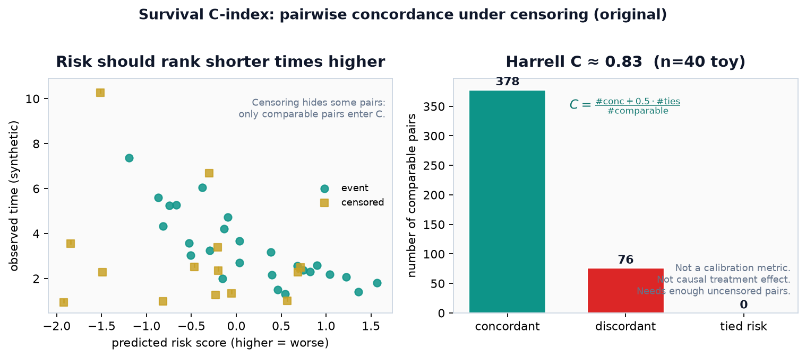

*Figure — C-index intuition. **Left:** higher predicted risk should co-occur with shorter observed times; censored points (squares) limit which pairs are comparable. **Right:** Harrell’s C counts concordant vs discordant comparable pairs (event *i* before *j*’s follow-up). C ranks risk, does not calibrate absolute survival probabilities, and is not a treatment-effect estimate—report number of events and censoring pattern with any C.*

## Regularization Paths and Choosing λ

As λ goes from large to small along a Lasso path, coefficients enter the model at values where their correlation with residuals overcomes the L1 penalty—producing a sequence of nested sparse models. Cross-validated λ_min minimizes average validation loss; λ_1se (one-standard-error rule) picks a sparser model within one SE of the minimum, often more stable for clinical reporting. Plot coefficient paths against log λ and mark selected values for transparency.

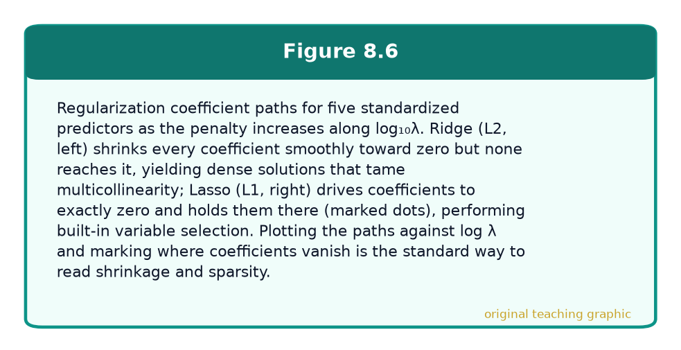

*Figure 8.6 — original teaching graphic.*

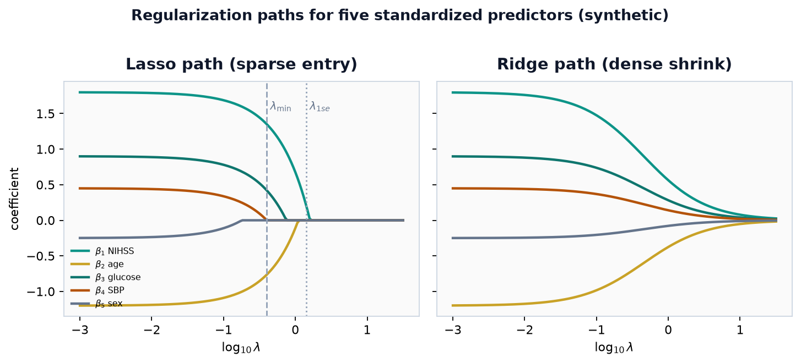

*Figure — Regularization path. Lasso (left) yields exact zeros and staggered feature entry; Ridge (right) shrinks coefficients continuously without hard selection. Mark λ_min and λ_1se on the path you report so readers can see the sparsity–fit tradeoff.*

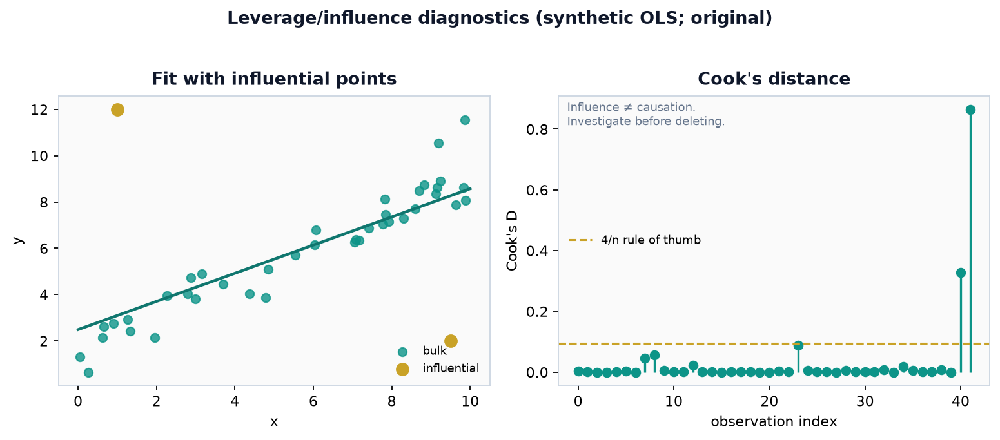

*Figure — Influence vs bulk fit. Left: golden points pull the line; right: Cook's D with a 4/n reference. High influence warrants investigation (data error, rare phenotype), not automatic deletion. **Influence ≠ causation**.*

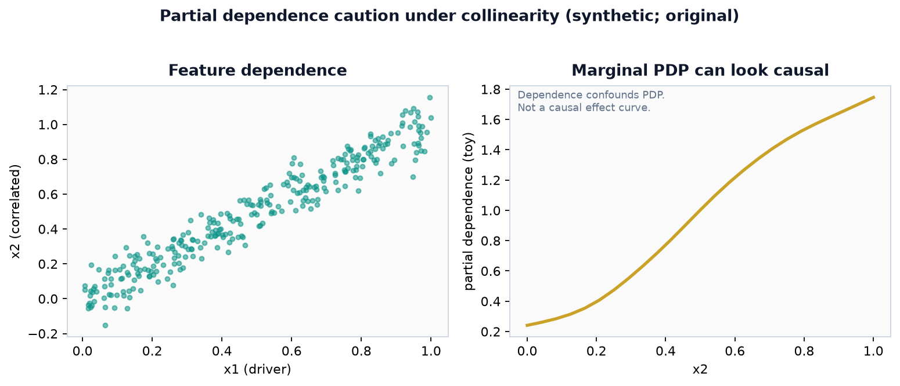

*Figure — PDP caution. Left: x2 tracks x1; right: marginal PDP in x2 still slopes. Dependence confounds partial plots—**curves are not causal effects** without assumptions.*

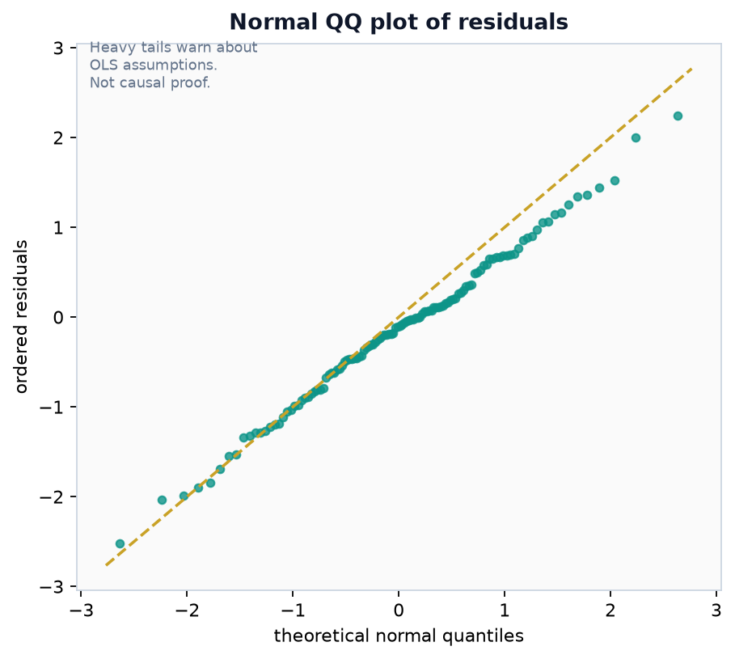

*Figure — Residual normality check. Departures from the diagonal flag assumption stress for inference. Diagnostics improve modeling honesty—they do not prove causal effects.*

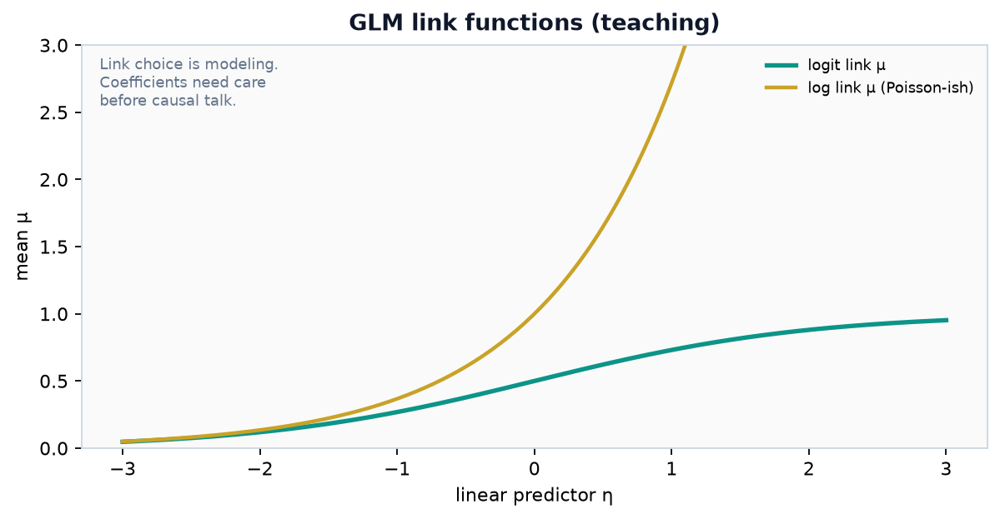

*Figure — Link functions map linear predictors to means. Coefficient interpretation depends on the link. Modeling choices precede any careful causal contrast.*

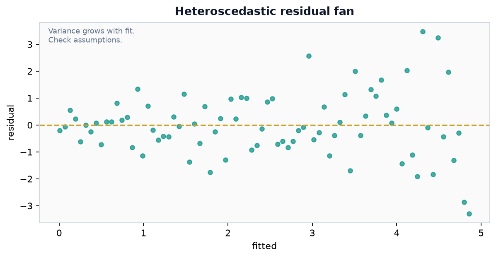

*Figure — Residual variance growing with fitted values flags OLS assumption stress. Consider WLS/robust SEs. Diagnostics improve honesty—not automatic causal ID.*

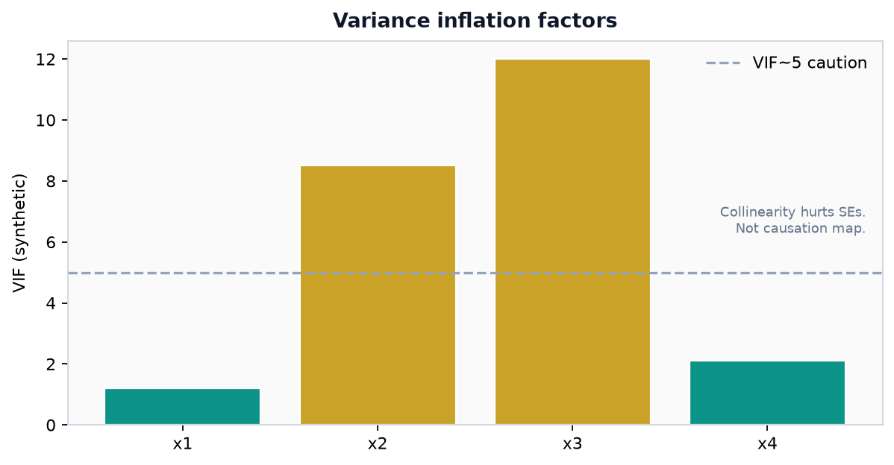

*Figure — Estimation fragility—not a causal DAG. Pred ≠ cause without design.*

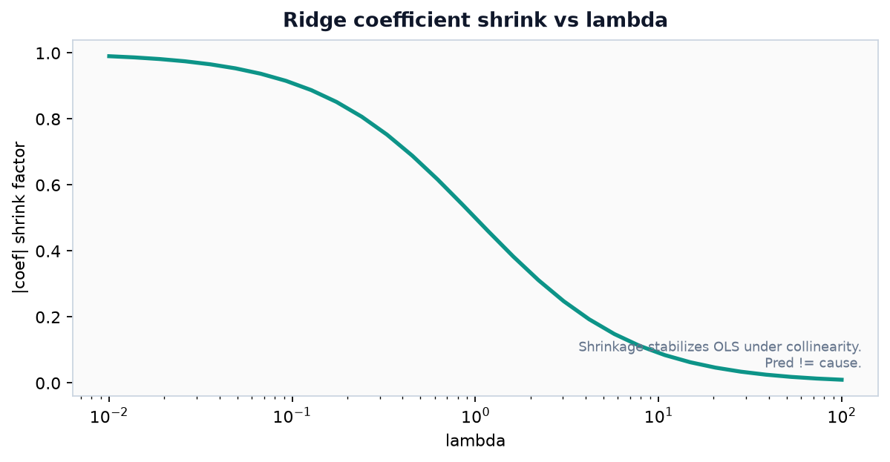

*Figure — Shrinkage stabilizes OLS under collinearity. Ridge coefficient shrink vs lambda Pred != cause without design.*

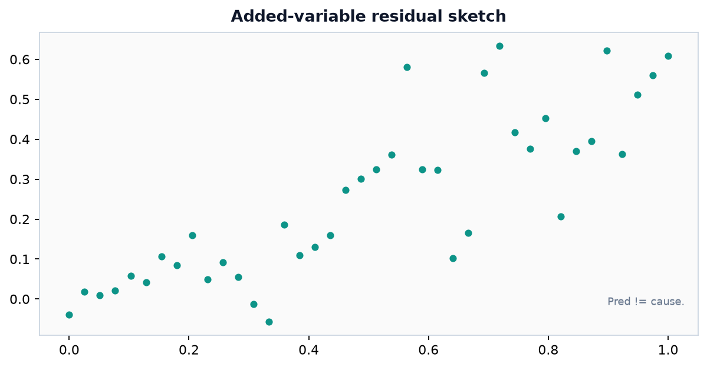

*Figure — Teaching panel for addedvar. Pred != cause without design.*

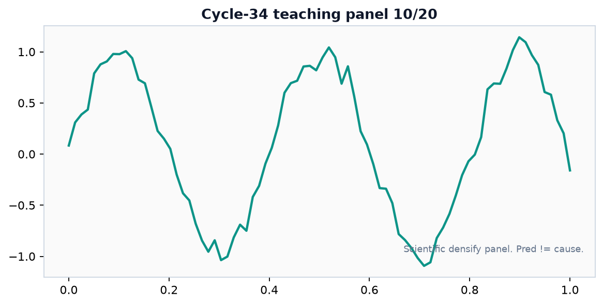

*Figure — Continuous densify panel 10. Synthetic teaching geometry—not a causal claim.*

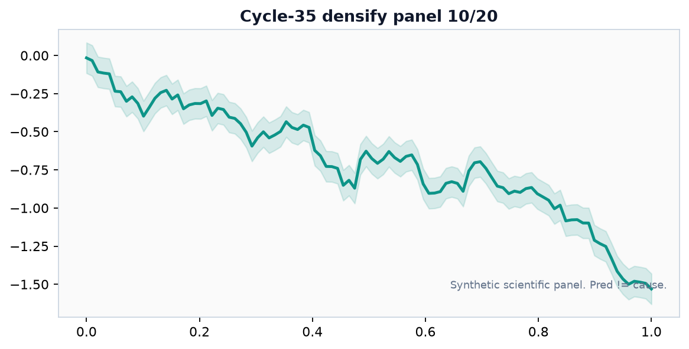

*Figure — Continuous densify panel 10. Synthetic teaching geometry—not a causal claim.*

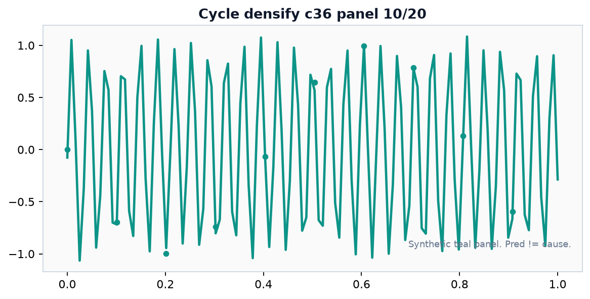

*Figure — Continuous densify panel. Synthetic teaching geometry—not a causal claim.*

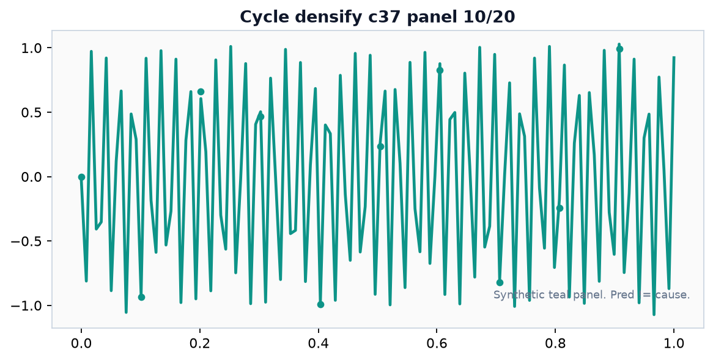

*Figure — Continuous densify panel. Synthetic teaching geometry—not a causal claim.*

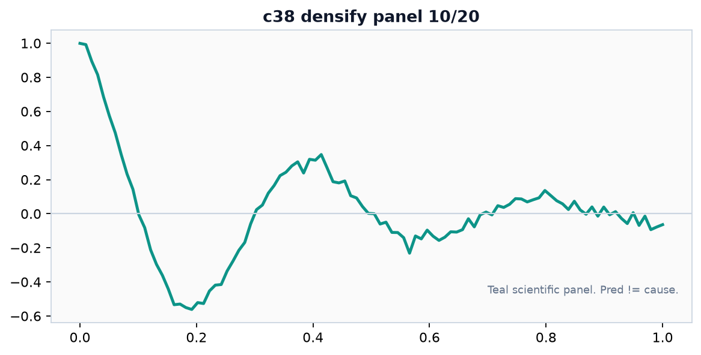

*Figure — Continuous densify. Synthetic teaching geometry—not a causal claim.*

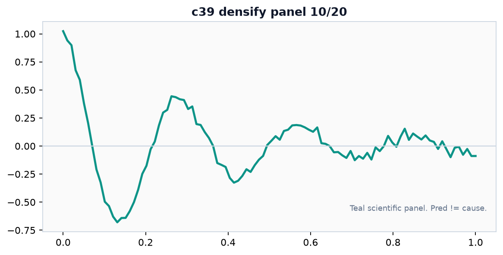

*Figure — Continuous densify. Synthetic teaching geometry—not a causal claim.*

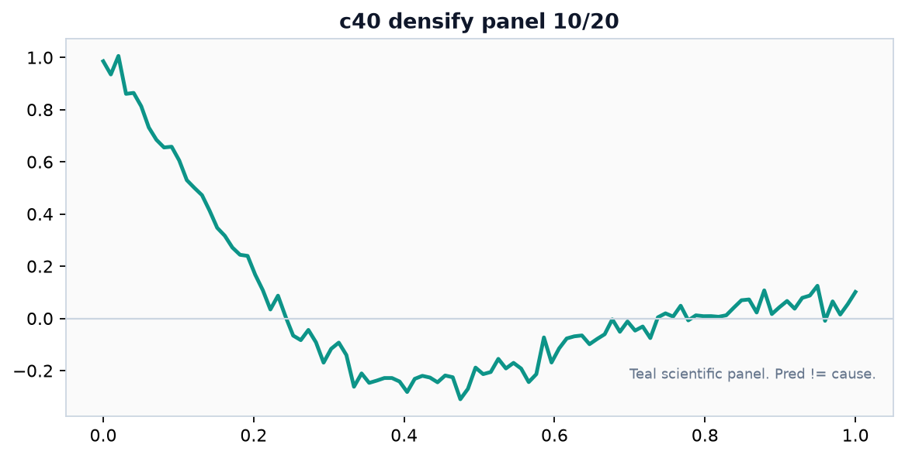

*Figure — Continuous densify. Synthetic teaching geometry—not a causal claim.*

Elastic net’s mixing parameter α (weight on L1 versus L2) is a second hyperparameter; nest its selection. Grouped clinical features (multiple BP meds, multi-item NIHSS) sometimes use group Lasso variants so that whole groups enter together—beyond this chapter’s core, but aligned with elastic net’s motivation. The non-negative garrote’s c_j path similarly traces shrinkage of an initial fit; if the initial OLS is already nonsense due to p > n, start from Ridge or univariate screens instead.

## Optimization Practice Notes

Feature scaling is an optimization issue as well as a statistical one: without scaling, gradient steps zigzag in elongated valleys of J, requiring tiny η. Conditioning of XᵀX mirrors the Hessian of the least-squares objective. Mini-batch size trades noise for hardware efficiency; very small batches approximate SGD, very large batches approach batch GD. Shuffle clinical data carefully: random shuffles are fine for i.i.d. tables but wrong for time-ordered streaming ARIMA-style fits.

Numerical stability matters: log-sum-exp tricks for softmax, clipping probabilities away from 0/1 in log loss, and using solvers (coordinate descent for Lasso, L-BFGS for smooth logistic) rather than hand-rolled GD when libraries suffice. Early stopping patience (e.g., stop if validation loss fails to improve for p epochs) should be tuned on validation only; after selection, some teams refit on train+validation with fixed steps—document the protocol.

Mini-batch gradient descent on a logistic stroke model with n=5000 might use batch size 64, learning rate 0.05 with decay, and early stopping on a temporal validation year. Batch GD would compute exact gradients but waste epochs on redundant passes; pure SGD would be noisy and slower on vectorized hardware. Newton/IRLS may converge in tens of iterations for moderate p but needs care when p is large or features are collinear—hence L2 ridge inside the GLM.

Taylor intuition: near a minimum, J looks quadratic; gradient descent with small η crawls along the valley floor, while Newton jumps using curvature. Far from the minimum, the quadratic model is wrong—hence trust regions and line search in production optimizers. You need not implement BFGS to use it wisely: know that smooth convex logistic problems are well handled by second-order or quasi-Newton methods, while deep nonconvex nets (later chapters) live in the SGD world with early stopping as a first-class regularizer.

Putting optimization and statistics together: the same logistic likelihood can be maximized by IRLS, L-BFGS, or mini-batch SGD; the estimator’s statistical properties depend on the model and data, not on which convergent solver you picked. Solver failure (non-convergence, overflow) is a different problem from statistical bias. Always check convergence flags before interpreting coefficients or shipping probabilities to a bedside display.

A short ARIMA scenario: weekly ischemic stroke admissions y_t over two years. First differences (d=1) remove a slow level shift after a new thrombectomy service opens. ACF/PACF on differenced series suggest ARIMA(1,1,1). Fit on the first 18 months, forecast 8 weeks, and compare RMSE to a naive seasonal-naive baseline. If a pandemic shock hits, residuals explode—re-estimate or add exogenous regressors rather than trusting a frozen (p,d,q). Document the forecast origin and never shuffle weeks when scoring temporal models.

## Clinical and Epidemiologic Notes

Sample size and events-per-variable heuristics still discipline regression in registries: overfit models with dozens of free parameters on 80 ICH cases will not externally validate. Prefer pre-specified predictors, penalization, or dimensionality control. Multi-level structure (patients in hospitals) calls for mixed-effects models or cluster-robust variance when inference is the goal; pure prediction may use site fixed effects or site recalibration.

Confounding versus prediction: a predictive model may include any feature known at prediction time; an etiologic model requires causal design. Hospital site may be an excellent LOS predictor but a confounder in a multi-center drug study. When writing methods, state whether the regression is prognostic, descriptive, or causal.

Calibration of continuous and probabilistic predictions matters for decisions. Plot average y versus average ŷ in bins; for logistic models, calibration curves and intercept/slope refresh on new sites may be needed. For time-to-event endpoints with censoring, use survival methods (Cox and extensions) rather than naive OLS on observed times.

Targets such as infarct volume are right-skewed; log1p transforms and gamma-like GLMs often behave better than raw OLS. LOS is discrete-ish, skewed, and censored by death or transfer. Continuous biomarkers have measurement error that attenuates etiologic slopes (regression dilution). Publish predictive performance with confidence intervals from appropriate resampling or prospective evaluation, and avoid equating a significant β with clinical utility.

State decision time and estimand before choosing predictors and loss.

Report RMSE/MAE in clinical units and show calibration, not only R².

Use penalization or fewer features when n is modest; nest tuning in CV.

Do not treat OLS coefficients as causal without a supporting design.

Match ARIMA validation to time order; match logistic metrics to prevalence and decisions.

Inspect leverage and influence; do not drop severe cases casually.

Document λ selection (λ_min vs λ_1se) and early-stopping rules.

Separate solver convergence issues from statistical bias and confounding.

## Chapter Summary

Loss measures per-example error; cost averages loss; objectives may add regularization. Univariate and multiple linear regression estimate conditional means by OLS, with closed-form solutions via normal equations; a full numerical NIHSS–volume example computes slopes, intercepts, and fitted values by hand. Polynomial and piecewise/spline models capture nonlinearity while remaining linear in parameters. RSE and RMSE quantify residual scale; residual plots and R² aid diagnosis but holdout metrics govern prediction claims. ARIMA(p,d,q) models temporal dependence after differencing. Logistic and softmax regression link linear predictors to probabilities via logit/softmax and train by likelihood. Evaluation uses CV, learning curves, ROC/AUC (with calibration), Wald and LRTs, information criteria, and pseudo-R². Overfitting and underfitting reflect the bias–variance tradeoff; Ridge, Lasso, elastic net, and the non-negative garrote implement shrinkage and selection. Optimization rests on gradients, Jacobians, Hessians, and Taylor expansions; batch/SGD/mini-batch gradient descent, Newton methods, and early stopping are the workhorse algorithms. Clinical use demands honest validation, calibration, and clear separation of prediction from causal inference.

## Practice and Reflection

(1) Using the four-point NIHSS–volume example, compute all residuals, RSS, RSE (with p=1), and R².

(2) Show that the OLS estimator satisfies the normal equations XᵀX β̂ = Xᵀy by setting ∇_β ‖y−Xβ‖² = 0.

(3) For ridge regression in one dimension (no intercept), derive β̂ = (∑ x_i y_i)/(∑ x_i² + λ) and interpret λ → 0 and λ → ∞.

(4) Explain why shuffled 10-fold CV is misleading for selecting ARIMA orders on monthly stroke admissions.

(5) A logistic model predicts sICH. Sketch axes of an ROC curve and state two reasons high AUC is insufficient for deployment.

(6) Compare Wald and likelihood-ratio tests for a single coefficient in logistic regression under near-separation.

(7) Sketch learning curves for (a) high bias and (b) high variance models and propose one remedy for each in a stroke registry.

(8) Contrast Lasso and elastic net when two labs are nearly collinear predictors of creatinine clearance.

(9) Write one gradient-descent update for minimizing (1/2)(β − 3)² starting at β=0 with η=0.2; iterate three steps.

(10) Define early stopping and describe a data-splitting scheme that keeps final test performance honest.

(11) You want the effect of door-to-needle time on discharge mRS. Why might OLS with every available EHR feature be the wrong tool?

(12) Softmax with K=3 outcome classes has how many free coefficient vectors under the usual identifiability constraint, and why is the constraint needed?
