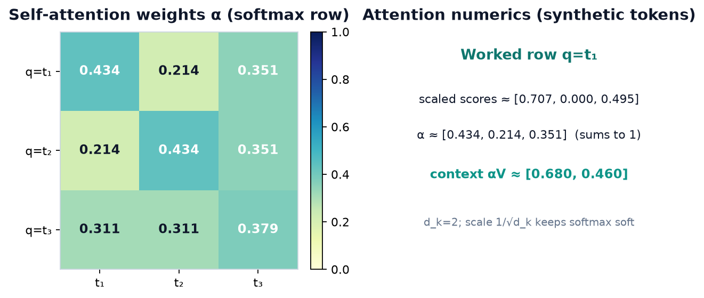
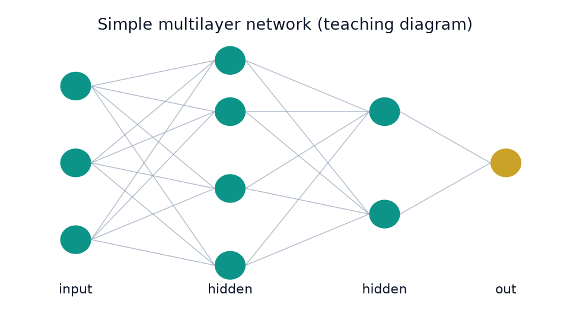
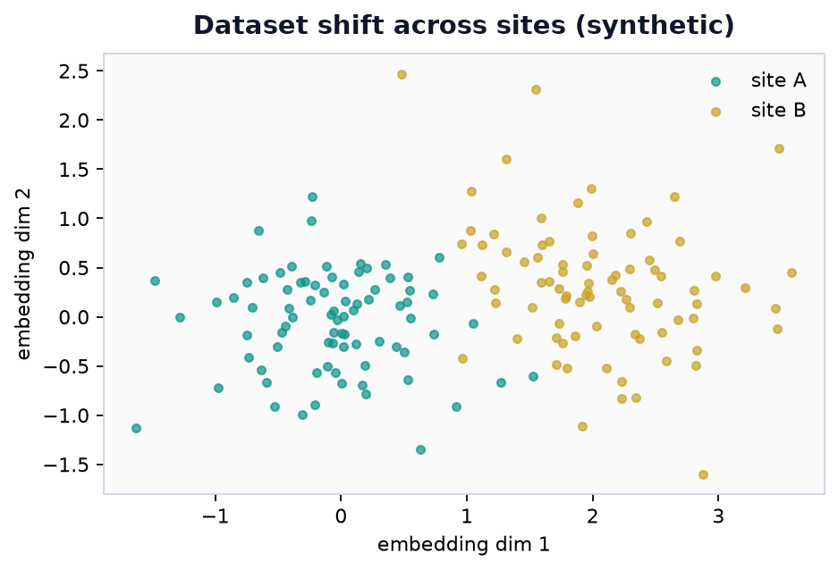
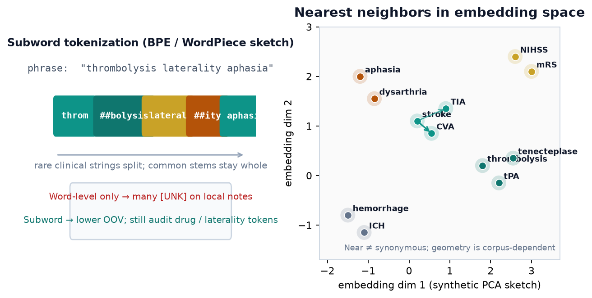
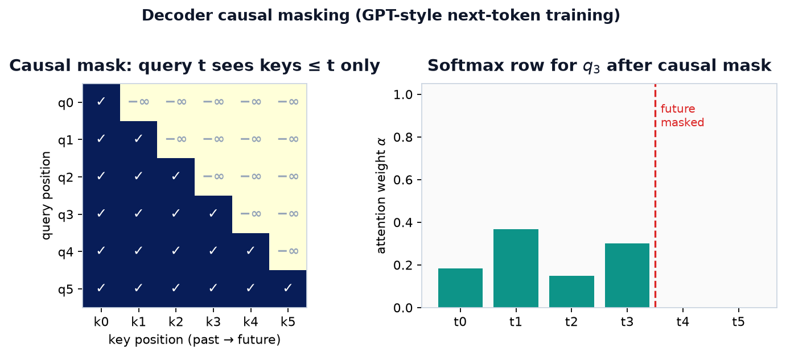
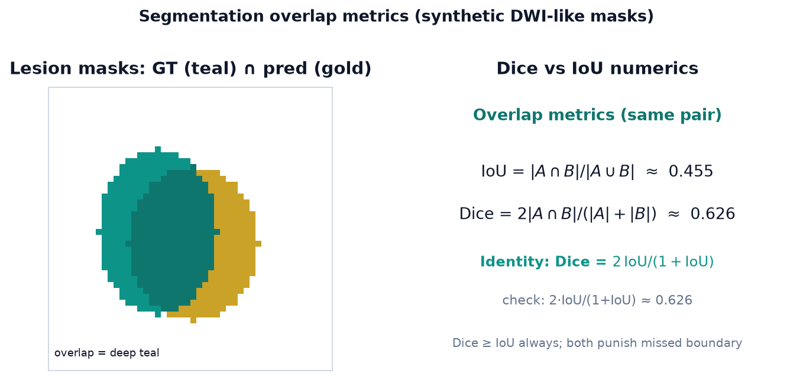

# Chapter 12. Deep Learning Models and Applications for Text, Vision, and Audio

## Opening

A multimodal model claims to fuse note text, DWI, and audio dysphagia screens. Cross-modal architectures are exciting; they also multiply failure modes. This chapter separates capability demos from clinically transportable systems.




*Scaled dot-product self-attention α and context vector for q=t₁.*



*Deep models compose layered representations.*



*Site shift in embedding space.*
## 12.1 Sequence-to-Sequence and Attention

Sequence-to-sequence (seq2seq) models map an input sequence (tokens, frames, time points) to an output sequence of possibly different length—machine translation, summarization, speech recognition, discharge-summary generation. The classic encoder–decoder RNN compresses the input into a single fixed vector passed to the decoder. That bottleneck can lose detail on long inputs and motivates attention: at each decoder step, compute a weighted average of encoder states rather than rely on a single summary. Candidate research tasks include EMS narrative → candidate last-known-well and anticoagulant mentions; radiology impressions → candidate ICD-style codes; or serial NIHSS plus vitals → a draft description for review. Attention and subword tokenization are common responses to long inputs and specialized vocabulary, but their value must be compared with task-appropriate alternatives.

Before Transformers, attention was a module bolted onto RNNs; after Transformers, attention became the primary computational motif and recurrence became optional. Contemporary text, vision, and audio stacks also include efficient sequence models that try to escape quadratic attention cost. Multi-head attention, instruction tuning, detection metrics, and speech foundation models now appear routinely in grant aims and vendor demos. Each architecture family should therefore be appraised through a concrete stroke-system use case, a plausible failure mode, and a decision-relevant metric.

### Attention mechanisms

Dot-product attention scores compatibility of a query vector q with keys k_i by q^T k_i (optionally scaled by 1/√d), softmax-normalizes scores to weights α_i, and returns Σ_i α_i v_i for values v_i. Bahdanau (additive) attention computes scores with a small feedforward network a(s, h) = v^T tanh(W_s s + W_h h) combining decoder state s and encoder state h—historically first successful alignment for neural MT. Luong attention explores dot, general (q^T W k), and concat variants and couples them with input-feeding decoders. Self-attention sets queries, keys, and values from the same sequence so tokens contextualize each other. Cross-attention sets queries from one sequence (decoder) and keys/values from another (encoder or image tokens), fusing modalities or stages.

Scaled dot-product attention Attention(Q,K,V) = softmax(QK^T / √d_k) V is the workhorse of Transformers. Scaling prevents dot products from growing with dimension in a way that saturates softmax. Attention maps are sometimes inspected for ‘explanations,’ but they are not causal attributions; use them as weak diagnostic visualizations only.

A compact statement of the core algorithm—with an optional additive mask M holding 0 at allowed positions and −∞ at disallowed ones—makes the tensor shapes explicit:

```text
# Scaled dot-product attention (one head)
# Q: n_q x d_k K: n_k x d_k V: n_k x d_v mask M: n_q x n_k (entries 0 or -inf)
function attention(Q, K, V, M=0):
 S = (Q @ transpose(K)) / sqrt(d_k) # scores, n_q x n_k
 A = softmax(S + M, axis=keys) # weights, each row sums to 1
 return A @ V # context, n_q x d_v

# Multi-head attention: query source X_q, key/value source X_kv, h heads
function multi_head(X_q, X_kv, M=0):
 for i in 1..h: # each head has d_k = d_model / h
 Q_i = X_q @ W_q[i]
 K_i = X_kv @ W_k[i]
 V_i = X_kv @ W_v[i]
 head_i = attention(Q_i, K_i, V_i, M)
 return concat(head_1, ..., head_h) @ W_o
```

Self-attention passes X_q = X_kv (one sequence contextualizes itself); cross-attention passes X_q from the decoder and X_kv from the encoder; a decoder’s masked self-attention supplies the lower-triangular M so no position attends to its future.

## 12.2 The Transformer

Transformers replace recurrence with stacked self-attention and position-wise feedforward layers, enabling full parallelization over sequence length during training. Residual (skip) connections around sublayers plus layer normalization stabilize deep stacks: output = LayerNorm(x + Sublayer(x)) (pre-norm variants reorder operations).

### Positional encoding

Bare attention is permutation-equivariant: without position information, bag-of-tokens behavior emerges. Sinusoidal positional encodings add fixed functions of position index to embeddings; learned absolute position embeddings are alternative; relative position biases and rotary embeddings (RoPE) encode pairwise geometry more flexibly for long contexts. Medical notes and genomic sequences both stress long-context positional design. Extrapolation beyond training context lengths is imperfect: a model trained at 4k tokens may degrade at 32k without specialized positional schemes or continued training. For chart summarization, compare explicit retrieval of relevant note sections with long-context ingestion under the same evidence-coverage and omission tests; neither strategy is universally superior.

### Multi-head attention and architecture

Multi-head attention runs h parallel attention heads with different learned projections, concatenates outputs, and projects again—allowing heads to specialize (syntax vs rare tokens, local vs long range). The original encoder stack applies multi-head self-attention and feedforward sublayers repeatedly. The decoder stack adds masked multi-head self-attention (causal mask so position t cannot attend to future tokens) and cross-attention over encoder outputs, then feedforward blocks. Encoder-only models (BERT-style) use bidirectional self-attention for understanding; decoder-only models (GPT-style) use causal masks for autoregressive generation; encoder–decoder models (T5-style) use both for conditional generation.

## 12.3 Structured State-Space Models and Mamba

Quadratic cost of self-attention in sequence length motivates efficient sequence layers. State-space models (SSMs) describe continuous-time latent dynamics h’(t) = A h(t) + B x(t), y(t) = C h(t) + D x(t), discretized for sequences. Linear time-invariant SSMs can be written as convolutions, enabling fast training with FFT-based methods while retaining recurrent inference.

Structured state space for sequence modeling (S4) imposes structure on A (e.g., diagonal plus low-rank) so long-range dependencies remain tractable and numerically stable. Mamba extends selective SSMs: parameters depend on the input so the model can ignore or retain information content-dependently, with hardware-aware parallel scan implementations. These architectures target strong sequence modeling with near-linear scaling in length, but quality and realized efficiency relative to transformers depend on the task, sequence length, implementation, and hardware. As with any new backbone, clinical claims require the same validation hygiene as Transformers. A pragmatic evaluation for long EHR sequences is to hold the prediction task fixed (for example, 30-day readmission or delayed cerebral edema) and compare Transformer, S4/Mamba-style, and gradient-boosted summaries of the same features under identical splits—architecture wins only if the gain is stable across sites and calendar years.

## 12.4 Large Language Models

### BERT family

BERT (Bidirectional Encoder Representations from Transformers) is an encoder-only model pretrained with masked language modeling (predict randomly masked tokens from full bidirectional context) and next-sentence prediction (later work found NSP unnecessary in some training recipes). Inputs pack token, segment, and position embeddings with special [CLS] and [SEP] tokens. Fine-tuning attaches task heads for classification, span extraction, or sequence labeling. Derivatives include RoBERTa (more data, dynamic masking, no NSP), DistilBERT (distilled smaller student), and XLM/XLM-R for multilingual settings. Domain-adaptive pretraining on appropriately governed clinical text can improve some phenotyping and entity-recognition tasks, but gains are corpus- and evaluation-dependent. Tokenization choices (WordPiece, BPE, SentencePiece) affect rare drug names and laterality phrases; inspect unknown tokens, fragmentation length, and downstream errors on local text rather than treating any one tokenizer diagnostic as dispositive.



*Figure — Tokens and neighbors. Left: a clinical phrase is split into subword pieces (BPE / WordPiece style)—stems such as `throm` + `##bolysis` and `lateral` + `##ity` stay productive, while pure word-level vocabularies can map local terms to `[UNK]`. On local discharge summaries and medication lists, measure unknown tokens when the tokenizer permits them, fragmentation length, and downstream task errors. Right: a synthetic two-dimensional sketch of static embedding neighborhoods (vascular events, scales, reperfusion drugs, language signs, hemorrhage terms). Proximity supports retrieval and transfer but is corpus-dependent: near ≠ synonymous, and embedding geometry is not a causal map of disease relationships.*

### T5 and the text-to-text framework

T5 casts every NLP problem as text-to-text: inputs and outputs are token sequences, with task prefixes (‘translate English to German:’, ‘cola sentence:’). An encoder–decoder Transformer is pretrained with span corruption objectives and fine-tuned per task. The unified interface simplifies multi-task learning and transfer—useful when a stroke group wants one stack for summarization, coding, and question answering over guidelines.

### GPT line and instruction-following chat models

GPT models are decoder-only Transformers trained to predict the next token. GPT-1 showed generative pretraining plus fine-tuning; GPT-2 scaled and emphasized zero-shot task transfer; GPT-3 demonstrated few-shot in-context learning at much larger scale. Instruct models and ChatGPT-style systems add instruction tuning and alignment so models follow user intents in dialogue rather than only continue web text. Capability jumps often come from scale, data mix, and alignment, not only architectural novelty.

### Llama, Mistral, and mixture-of-experts

Open-weight Llama generations popularized decoder-only models using rotary embeddings and efficient attention implementations; Llama 4 (2025) moved the line to a mixture-of-experts, natively multimodal (text-plus-image) design. Mistral 7B is a smaller model that uses grouped-query attention (GQA)—several query heads share key/value heads, shrinking the key/value cache that can dominate memory during long-context generation—and sliding-window attention, in which each token attends only to a fixed window of recent tokens, bounding per-layer attention cost while still letting information propagate across stacked layers. Mixtral models use sparse mixture-of-experts (MoE): each token routes to a subset of expert FFNs (e.g., 8×7B with 2 experts active), increasing parameter capacity without activating every parameter for every token. MoE also complicates serving because expert parameters still require storage and routing; any quality–compute advantage is model-, workload-, and hardware-specific.

### Fine-tuning: RLHF, DPO, LoRA, and domain adaptation

Full fine-tuning updates all weights on task data—costly and prone to catastrophic forgetting. LoRA freezes a pretrained matrix W₀ ∈ R^(d_out×d_in) and parameterizes its update as ΔW = (α/r)BA, with A ∈ R^(r×d_in) and B ∈ R^(d_out×r). For one 4096×4096 projection at r=8, this trains 65,536 adapter parameters instead of 16,777,216 base parameters—256× fewer for that matrix. Merging BA into W₀ before serving adds no extra matrix multiplication; keeping adapters separate enables swapping but may add serving overhead. A common LLM RLHF pipeline performs supervised instruction tuning, fits a reward model from ranked outputs, and then optimizes a policy—often with PPO—while constraining drift from a reference policy. DPO instead fits preferred/rejected pairs directly relative to a reference policy under a pairwise preference model, avoiding a separately trained reward model and explicit RL optimization stage. Newer critic-free variants such as GRPO estimate each sampled response’s advantage by normalizing its reward within a group of responses to the same prompt, and have become common for training reasoning models. These methods inherit preference-data bias and require task-specific factuality, safety, privacy, and external validation.

### Evaluation benchmarks

LLM evaluation mixes automatic and human protocols. General benchmarks include language understanding suites (GLUE/SuperGLUE historically), knowledge and reasoning sets (MMLU, BIG-bench subsets), reading comprehension, math (GSM8K), and coding tests. Chat models need preference win rates, safety evaluations, and instruction-following rubrics. Medical benchmarks (e.g., clinical QA, medical licensing-style questions) measure knowledge but not bedside utility, calibration, or site-specific workflow fit. Always evaluate on local notes for phenotype extraction: entity F1, document-level AUROC for computable phenotypes, and error analysis for negation and temporality. Latency, cost per 1k tokens, and hallucination rate under retrieval-augmented generation belong in the same report as accuracy.

## 12.5 Computer Vision: Classification Backbones

LeNet pioneered CNN digit recognition with conv–pool stacks and dense layers. AlexNet reignited deep vision at ImageNet scale with ReLU, dropout, and GPU training. VGG showed that deep stacks of small 3×3 convolutions work well. GoogLeNet/Inception introduced multi-branch modules mixing 1×1, 3×3, 5×5 convolutions and pooling in parallel, with 1×1 bottlenecks for efficiency; later Inception-v4 and Inception-ResNet hybridize residual links. ResNet introduced identity skip connections so deep nets train by learning residual functions F(x) with output x+F(x), enabling very deep networks and becoming a widely used medical-imaging baseline. “Baseline” is not “best”: acquisition physics, task, label volume, pretraining, compute, and external validation should determine the comparison set.

Vision Transformers (ViT) split images into patch tokens, embed them linearly, add position encodings, and run Transformer encoders—treating vision as a sequence problem. ViTs, CNNs, and hybrids can each lead on a given task after suitable pretraining and tuning; published rankings do not establish a universal architecture order. On a modest labeled stroke-CT cohort, locality and translation-equivariance priors may make a CNN a data-efficient comparator, while domain-matched pretraining may change that result. Transfer learning recipes should log which layers were frozen, what input normalization matched pretraining, and whether grayscale CT was replicated across RGB channels—an example of reproducibility detail needed to interpret any comparison.

## 12.6 Object Detection

Detection outputs class labels and bounding boxes (and optionally confidence) for instances. Metrics include mean average precision (mAP) over IoU thresholds. Two-stage detectors propose regions then classify; one-stage detectors predict densely in one shot.

### R-CNN, Fast R-CNN, Faster R-CNN

R-CNN runs selective search proposals, warps each region through a CNN classifier, and refines boxes—accurate but slow due to per-region forward passes. Fast R-CNN shares a convolutional feature map and uses RoI pooling to extract per-proposal features with a multi-task loss for classification and box regression. Faster R-CNN replaces external proposals with a region proposal network (RPN) trained end-to-end with the detector, becoming a standard two-stage template for medical detection (e.g., aneurysm candidates) when latency allows.

### SSD and YOLO

Single Shot MultiBox Detector (SSD) predicts boxes and classes from multi-scale feature maps with default anchor boxes in one forward pass. YOLO (You Only Look Once) frames detection as grid-cell regression: v1 divides the image into cells predicting boxes and class probabilities; v2/YOLO9000 introduce anchor priors, batch norm, multi-scale training, and joint detection–classification training on large label spaces; v3 adds multi-scale predictions and deeper backbones. Later YOLO versions continue accuracy–speed engineering. Real-time YOLO-style detectors appeal to triage workflows (e.g., flagging potential ICH) if false-positive rates are managed in product design.

## 12.7 Semantic and Instance Segmentation

Semantic segmentation labels each pixel with a class (ischemic lesion vs background). Instance segmentation separates object instances (each hemorrhage component). U-Net’s encoder–decoder with skips is a common biomedical-segmentation baseline, not a universally best architecture. Fully convolutional networks (FCN) replace dense layers with convolutions for spatial outputs and upsample coarse score maps. Mask R-CNN extends Faster R-CNN with a parallel mask head on RoI features for instance masks. DeepLab models use atrous (dilated) convolutions and atrous spatial pyramid pooling for multi-scale context; v3+ adds a decoder module for sharper boundaries.

Segment Anything Model (SAM) is a promptable foundation-model family for segmentation: an image encoder, prompt encoder, and mask decoder generate masks from inputs such as points, boxes, or masks. SAM v2 extended promptable segmentation and tracking to video; SAM 3 (2025) adds promptable concept segmentation intended to detect and segment instances named by a short text or exemplar prompt, with a companion SAM 3D line for single-image 3D reconstruction. In stroke research, SAM-assisted labeling may reduce annotation effort, but performance and time savings require domain-specific measurement; promptable generality is not the same as validated or authorized clinical use.

## 12.8 3D View Synthesis: NeRF and Gaussian Splatting

Neural Radiance Fields (NeRF) represent a scene as a continuous function mapping 3D position and viewing direction to color and density, typically with an MLP. Rendering integrates colors along camera rays using volume rendering integrals; training minimizes error between rendered and observed pixels from multiple views. NeRFs enable novel-view synthesis and 3D-consistent reconstruction without explicit meshes, at the cost of slow training/rendering in classic form (many accelerations exist).

3D Gaussian splatting represents scenes as collections of anisotropic 3D Gaussians with opacity and appearance parameters, rasterized via fast splatting rather than dense ray marching. Optimization fits Gaussian parameters to multi-view images, often achieving real-time rendering with high visual quality. Concepts matter for surgical planning visualization, photogrammetric anatomy teaching, and research on 3D stroke anatomy from limited views—distinct from diagnostic voxel labeling in native CT/MRI grids.

## 12.9 Audio Models

Audio pipelines start from waveforms or spectrograms (STFT, mel-scale filterbanks). Modeling goals include generation (text-to-speech), enhancement, and recognition (speech-to-text). Domain features—pitch, MFCCs historically, learned filterbanks now—interact with architectural choice.

### WaveNet and Tacotron

WaveNet generates raw audio autoregressively with stacks of dilated causal convolutions, capturing long-range temporal structure for high-fidelity speech synthesis. Parallel WaveNet / probability density distillation accelerates sampling by training a parallel student. Tacotron systems map text to spectrograms with seq2seq (attention) models; Tacotron 2 pairs an improved spectrogram predictor with a neural vocoder (WaveNet-style) for natural TTS. Clinical relevance includes accessibility tools and standardized spoken prompts—not diagnostic auscultation replacements without targeted validation.

### wav2vec and Whisper

wav2vec models learn speech representations from unlabeled audio via contrastive self-supervision over latent convolutional encodings (v1) and, in wav2vec 2.0, masked latent prediction with quantization—enabling strong ASR with limited labeled speech. Whisper trains a sequence-to-sequence Transformer on large-scale weakly supervised audio–transcript pairs for robust multilingual speech recognition and translation, with multitask formatting (language ID, transcription, translation). Whisper-style models can transcribe clinical dictation or research interviews; privacy, domain accents, and medical vocabulary error rates need local measurement before chart integration. Combined audio–NLP pipelines (dictation → Whisper → LLM structuring → EHR fields) multiply error sources; insert human confirmation at medication and laterality fields even if free-text drafting is automated. Benchmarks for clinical ASR should report word error rate overall and on a medication-name subset, plus critical information omission rates judged by clinicians—not only generic WER on call-center corpora. For research interviews, store audio under IRB rules separate from model logs. Vendor speech engines and open Whisper checkpoints should be compared on the same held-out local sample before procurement decisions. Document microphone type and room noise when collecting that sample so results remain fully interpretable over time.

## 12.10 Worked Example: Attention Weights and a Causal Mask

Consider a decoder step with query q = [1.0, 0.0] and three encoder keys k1=[1.0,0.0], k2=[0.0,1.0], k3=[0.7,0.7], with values equal to keys for simplicity and d_k=2 so √d_k=√2≈1.414. The dot products q·k_i are 1.0, 0.0, and 0.7 (only the first component of q is nonzero, so each score reads off the first component of the key). Dividing by √2 gives scaled scores 0.707, 0.000, and 0.495. Exponentiate: exp(0.707)≈2.028, exp(0.000)=1.000, exp(0.495)≈1.640, which sum to 2.028+1.000+1.640=4.668. Softmax divides each exponential by that sum, giving weights α≈[2.028/4.668, 1.000/4.668, 1.640/4.668]=[0.434, 0.214, 0.351] (these sum to 1.000—a useful check). The attention output is the weighted sum 0.434·k1 + 0.214·k2 + 0.351·k3: the x-coordinate is 0.434·1.0 + 0.214·0.0 + 0.351·0.7 = 0.434 + 0.246 = 0.680, and the y-coordinate is 0.434·0.0 + 0.214·1.0 + 0.351·0.7 = 0.214 + 0.246 = 0.460, so the output ≈ [0.680, 0.460]. The query preferentially weights the aligned key k1 (largest α) while still mixing in context from k2 and k3, and the output lands between the keys, pulled toward k1 and k3. Had we skipped the 1/√d_k scaling, the ranking would be unchanged but the weights would be sharper (α≈[0.474, 0.174, 0.351], more mass on k1)—exactly the softmax saturation that scaling is designed to temper.

Causal mask example for length 3: the allowed attention pattern is lower-triangular—each position attends to itself and earlier positions only. Position 0 attends to key 0; position 1 attends to keys 0 and 1, with key 2 (a future token) masked; position 2 attends to keys 0, 1, and 2. Masked entries are set to −∞ before the softmax so their weight α=0 (since exp(−∞)=0). During training of GPT-style models, this same triangular mask is applied at every layer and every position in parallel, so the prediction at position t never sees tokens after t—essential for valid next-token likelihoods, and the reason a single forward pass yields a training signal for all positions at once.



*Lower-triangular causal mask: query position t may attend only to keys ≤ t; future positions receive −∞ before softmax so their weight is zero.*

## 12.11 Systems, Context Length, Retrieval, and Hallucination Control

Production LLMs are systems, not only weight matrices. Context windows limit how many tokens of chart, guideline, and user text can be considered; hierarchical summarization or retrieval-augmented generation (RAG) pulls relevant passages from a vector index of notes or PDFs. RAG can reduce some unsupported answers when retrieval and citation requirements work as intended, but wrong or incomplete retrieval can still mislead—retrieval precision and recall belong in evaluation. Chunking strategies, embedding model choice, and metadata filters (date, service line) can strongly affect quality for stroke-pathway Q&A systems.

Serving constraints: quantization (8-bit, 4-bit) can shrink weight memory; speculative decoding (a small draft model proposes several tokens that the large target model verifies in one pass, keeping the longest accepted prefix) and FlashAttention-style kernels (IO-aware exact attention that avoids writing the full n×n score matrix to slow memory) can improve throughput on supported workloads; MoE serving may require expert parallelism. Institutional policy or a particular risk assessment may require local hosting for PHI, but location alone does not establish privacy. Retain prompts or outputs for incident review only when that logging is authorized and protected by minimum-necessary, access, retention, and security controls, so the log does not become a new unprotected PHI store.

Hallucination-control candidates include schema-constrained outputs, extractive evidence spans for critical fields, and a human-review or safe-fallback path. Abstention based on model confidence or retrieval similarity is useful only after those scores and thresholds are calibrated for the intended task; a low or high similarity score alone is not a safety guarantee. An example evaluation set should include adversarial notes with negation, family history (‘mother had ICH’), and hypotheticals that models may mis-attribute to the patient.

## 12.12 Detection and Segmentation Metrics in Clinical Context

Bounding-box mAP averages precision across recall levels and classes, often at IoU≥0.5 or a range (COCO-style). For tiny intracranial findings, IoU thresholds and center-distance criteria may better match clinical usefulness than strict overlap. Free-response ROC (FROC) plots lesion-level sensitivity against false positives per image—standard in CAD literature and preferable to image-level AUROC alone when multiple findings exist.

Segmentation Dice = 2|A∩B|/(|A|+|B|) emphasizes overlap; Hausdorff distance emphasizes worst-case boundary errors that matter for eloquent cortex. Volume error and relative volume difference matter for edema growth studies. Always pair geometric metrics with reader studies when claims enter care pathways. An example reporting table for DWI lesion models should include Dice, volume MAE, site-stratified results, and failure cases (small cortical dots, motion, craniotomy hardware).



*Same predicted/GT pair: Dice = 2|A∩B|/(|A|+|B|) and IoU = |A∩B|/|A∪B| are monotone transforms of each other (Dice = 2·IoU/(1+IoU)); both punish boundary misses that matter near eloquent cortex.*

### Architecture family quick map (teaching table)

| Family | Core motif | Stroke-system use case | Failure mode to demand evidence on |
|--------|------------|------------------------|-------------------------------------|
| Encoder-only (BERT-line) | Bidirectional self-attention | Note phenotyping, NER, coding assist | Negation/temporality errors; site note-style shift |
| Decoder-only (GPT-line) | Causal mask + next-token | Draft summaries, guideline Q&A with RAG | Hallucinated meds/laterality; citation invention |
| Encoder–decoder (T5-line) | Cross-attention conditional gen | Impression → structured codes | Length/format drift; rare-entity collapse |
| CNN / U-Net | Local filters + skips | DWI lesion seg, ICH detection | Domain shift (scanner/protocol); tiny-lesion miss |
| ViT / multimodal | Patch or token fusion | Joint note+image demos | Data hunger; uncalibrated cross-modal confidence |

Class imbalance in detection means most anchors or pixels may be background. Focal loss, online hard-example mining, and balanced sampling of positive slices are candidate responses whose effects and sampling-induced prevalence changes should be evaluated. Slice-level models need a prespecified study-level aggregation rule (for example, max score, noisy-OR, or learned pooling) so evaluation matches the intended use.

## 12.13 Putting Modalities Together: Multimodal Stroke Decision Support

**Synthetic architecture sketch—not a deployment recommendation.** A hypothetical comprehensive stroke center might study separate functions for: (1) speech-to-text support for EMS radio; (2) extraction of candidate last-known-well and medication mentions from ED notes; (3) an ICH triage flag on NCCT; (4) a CTA LVO classifier; (5) protocol-specific CTP segmentation; and (6) a tabular prognostic model. Product names in such a sketch are replaceable examples, not endorsements. Each function has its own intended user, input, output, failure modes, evidence, privacy controls, and potentially regulatory status; combining functions can also create new interaction risks. Modular boundaries can make faults easier to localize, whereas an end-to-end design may sometimes be justified if the complete system—not just each component—is prospectively evaluated in its intended workflow.

Epidemiologic uses differ from bedside triage. Validated NLP phenotype pipelines can support estimates of incidence or disparities across years. An imaging-AI system may contribute candidate timestamps to a prespecified care-process measure only after timestamp accuracy, synchronization, missingness, and workflow meaning are validated. Hospitals that adopt AI may already have different processes, so study designs should separate algorithm-accuracy studies from interrupted time-series, stepped-wedge, or other justified evaluations of clinical impact—different claims require different methods.

Already unfolding, not speculative: foundation models that accept mixed image patches and text tokens now blur chapter boundaries between vision and language. Still, the invariants of this textbook remain—index time, leakage, calibration, external validation, and respect for uncertain labels. Mastery means choosing Transformers, SSMs, CNNs, or boosted trees deliberately, not defaulting to the largest model available.

## 12.14 Fine-Tuning Recipes and Parameter-Efficient Adaptation in Practice

Domain-adaptive pretraining continues a general LLM or vision backbone on unlabeled in-domain corpora (notes, guidelines, imaging) before task fine-tuning. Continual pretraining can degrade some general abilities; replay mixtures and lower learning rates are candidate mitigations whose effects should be measured. For imaging, contrastive or masked pretraining on domain-matched head CT can outperform naive ImageNet transfer on some tasks, but the result depends on pretraining data, objective, cohort, and evaluation design.

Parameter-efficient fine-tuning (PEFT) families include LoRA, adapters inserted between layers, prefix/prompt tuning that learns virtual tokens, and (IA)³-style rescaling vectors. [QLoRA](https://arxiv.org/abs/2305.14314) holds a frozen base model in 4-bit precision while training LoRA adapters, reducing memory in the configurations studied in the paper. Similar quality to higher-precision fine-tuning is an empirical result for particular models and benchmarks, not a guarantee for a clinical task, language, subgroup, or hardware stack; compare factuality, calibration where applicable, safety errors, latency, and memory on the intended evaluation set. LoRA rank and which modules receive adapters (query/value projections vs all linear layers) trade capacity and memory in task-dependent ways. Merging LoRA weights can simplify serving when multiple adapters are not required. A synthetic hospital design might evaluate one locally authorized base model with separately versioned adapters for distinct tasks, but access control alone does not establish that those adapters are safe or interchangeable.

Instruction-tuning datasets for a clinical research system should reflect its intended use and prohibited uses—for example, not presenting unreviewed dose changes as directives, not fabricating citations, and surfacing uncertainty. Preference data for DPO/RLHF may warrant multiple independent, appropriately qualified annotations and adjudication in proportion to risk; a fixed two-reviewer rule is not universal. Noisy preferences can encode annotator bias (verbosity bias, sycophancy). Measure not only preference win rates but source-grounded factuality on a frozen audit set.

Vision fine-tuning recipes include a linear probe, partial fine-tuning of later stages, full fine-tuning with discriminative learning rates, and multi-task heads that share encoders. Augmentation strength should be justified against acquisition physics and label semantics; for CT, candidate geometric or intensity transforms require visual and quantitative checks that they preserve the clinical target. Early stopping on a patient-grouped validation set is one useful capacity-control strategy, not a universal requirement or proof against overfitting. Pre-specify checkpoint selection, keep the test set sealed, and compare learning curves, regularization, and sensitivity across seeds.

## 12.15 Benchmarks, Reporting Standards, and Common Failure Modes

Public vision benchmarks (ImageNet, COCO, Cityscapes) shaped architectures but do not measure stroke-care utility. Choose reporting guidance by claim and study design: [TRIPOD+AI](https://www.bmj.com/content/385/bmj-2023-078378) for prediction-model studies, the [2024 CLAIM update](https://doi.org/10.1148/ryai.240300) for applicable medical-imaging AI model-development and evaluation reports, [DECIDE-AI](https://www.nature.com/articles/s41591-022-01772-9) for early live clinical evaluation, and [CONSORT-AI](https://www.nature.com/articles/s41591-020-1034-x) for randomized trials of AI interventions. CLAIM's stated scope does not extend to every imaging-AI study design, including radiomics or imaging-biomarker research. These checklists improve reporting completeness; checking boxes does not itself establish validity, clinical utility, regulatory status, or authorization to operate.

Common NLP failure modes: negation inversion, section confusion (past medical history vs assessment), temporal mis-ordering of events, unit errors, and copy-paste note artifacts that models treat as fresh observations. Common vision failure modes: slice selection bias, partial volume effects, postoperative cases excluded from training but present at deployment, and over-reliance on endotracheal tubes or other devices spuriously correlated with severity labels.

Example incident review: a CTA LVO model’s precision drops after a vendor software update changes reconstruction kernels. Response requires monitoring input feature drift (intensity histograms, noise estimates), not only outcome metrics, plus a rollback plan. MLOps for clinical models is part of the curriculum of responsible deployment—not an afterthought once the paper is accepted.

When comparing BERT vs GPT-style vs proprietary chat APIs for a phenotyping task, hold constant the label definition, split, and preprocessing; vary only the model and prompt or fine-tune recipe. Cost per thousand notes and PHI policy compliance can eliminate otherwise accurate systems. The ‘best’ model is the one that survives governance, budget, and external validation simultaneously.

## Clinical and Epidemiologic Notes: Stroke Imaging and Clinical NLP

Stroke imaging ML spans detection (ICH on NCCT), large-vessel occlusion classification on CTA, ASPECTS-like regional scoring, DWI/PWI lesion segmentation, and outcome prediction from mixed imaging–clinical features. CNN/ViT backbones and U-Net segmenters are tools; the science is in reference standards, slice selection, vendor shift, and whether outputs change door-to-needle or transfer decisions. Report operating points co-designed with stroke teams, not only mAP or Dice peaks.

Clinical NLP with BERT-family or LLM extractors can identify candidate AF, anticoagulation, last-known-well, and mRS mentions from notes. Temporality and negation (‘no evidence of LVO’) remain primary error sources. LLMs summarizing charts risk hallucinated medications and omitted contradictions—use source-sentence retrieval, require accountable human review for documentation, and never auto-file unreviewed text into the EHR. A suspected de-identification failure is a potential privacy incident requiring assessment under applicable policy; use institutionally authorized environments.

Multimodal systems that attend jointly over imaging tokens and report text can improve some retrieval or prioritization metrics, but correlated training labels (the report already states the finding) create leakage if the task is ‘predict report from image’ while evaluating against the same report. Define whether the use case is triage before reading or coding after reading. Epidemiologic phenotype pipelines should version models, track drift when note templates change, and validate against chart-review samples at a prespecified, risk- and change-sensitive cadence; a calendar-quarter rule is not universally adequate.

### Clinical NLP de-identification

Clinical free text commonly contains protected health information (PHI): patient and provider names, dates, ages over 89, medical-record and account numbers, addresses, phone and fax numbers, and institution names. Before notes are used or disclosed outside their current protected environment, the team must establish the applicable authority, contract, minimum-necessary scope, security controls, and whether de-identification is actually required; HIPAA permits some authorized uses and disclosures of PHI, so removal of identifiers is not the only possible legal pathway. When an artifact is represented as de-identified under the [U.S. HIPAA Privacy Rule de-identification guidance](https://www.hhs.gov/hipaa/for-professionals/special-topics/de-identification/index.html), Safe Harbor requires removal of the specified identifier categories and no actual knowledge that the remaining information could identify an individual, alone or in combination; Expert Determination requires a qualified expert to document that re-identification risk is very small. De-identification can use clinical NLP, deterministic components, and human quality control: regex may catch structured MRNs, phone numbers, and date formats, while sequence-labeling models may catch names, locations, and misspellings. Detected spans can be deleted, replaced with a category tag such as ⟨NAME⟩, or surrogated, but those transformations do not by themselves prove that either HIPAA method has been satisfied.

The two error types can have asymmetric costs. If data are released on the basis that they were de-identified, a missed identifier can contribute to an unauthorized disclosure and may trigger institutional assessment under the [HHS breach-notification framework](https://www.hhs.gov/hipaa/for-professionals/breach-notification/index.html); notification depends on the use or disclosure, applicable exceptions, and the documented risk assessment. De-identification pipelines often prioritize high identifier recall, but over-redaction can delete clinically important tokens (an eponymous syndrome such as Wallenberg, a drug or device named after a person, or a place-name embedded in a stent model) and degrade downstream phenotyping. Report performance by identifier category and audit a held-out sample using a precision-justified design; no observed misses in that sample proves zero residual risk. De-identified is not synonymous with anonymous: residual quasi-identifiers can permit linkage, so a scrubbed corpus still requires governance review before use with an external service. Prospective in-workflow tools that read a live chart retain PHI by design and must be handled only through an institutionally authorized, access-controlled environment with risk-appropriate logging and lifecycle controls.

### Site shift and distribution shift

A model trained at one hospital routinely underperforms at another because the input distribution has moved—dataset shift—and it helps to name the flavors. Covariate shift: the inputs themselves differ (a different CT scanner vendor, reconstruction kernel, slice thickness, field strength, or contrast timing; note templates, abbreviations, and section headings that vary by EHR and service line) while the true feature→label mapping is unchanged. Label (prior) shift: outcome prevalence differs—a comprehensive stroke center sees more large-vessel occlusions than a primary center—which mis-calibrates thresholds even when discrimination is preserved. Concept shift: the feature→label relationship itself changes (coding practice, a guideline update, a new thrombectomy pathway that alters who gets imaged). The intuition is that networks latch onto whatever predicts the label in the training set, including scanner- or site-specific artifacts—the ‘an AI can tell which hospital a scan came from’ phenomenon—so a model can look excellent internally and fail externally with no bug at all.

Because site shift may appear in inputs before labeled outcomes mature, monitoring should include input integrity and distribution measures alongside AUROC, Dice, calibration, and workflow outcomes. Mitigations depend on the mechanism: external or temporally separated evaluation can test transportability; harmonization and matched preprocessing may reduce measured covariate differences but can also erase real signal; recalibration or threshold revision may address some target-setting changes; and domain-adaptive pretraining may help when representative unlabeled data exist. For a consequential multi-site use, prospective monitoring and a rollback path are usually needed, but no single validation design is universally sufficient. Internal cross-validation estimates internal reproducibility and cannot by itself demonstrate performance at a different site.

Use modality-appropriate families as comparators—not prescriptions: candidates include CNN/ViT/U-Net for images, Transformer/SSM or other sequence models for long text or signals, and wav2vec- or Whisper-style models for speech.

For detection/segmentation, publish IoU/Dice with confidence intervals and external sites.

For LLMs, measure hallucination, calibration, and workflow time—not only exam-style accuracy.

Prevent leakage from reports into imaging labels and from future notes into admission-time prediction.

Govern synthetic media and auto-generated text under clinical documentation policy.

## Connections

Nothing here escapes the training machinery of earlier chapters: mini-batch SGD/Adam, weight decay, dropout, and batch/layer normalization drive these models too; attention, convolution, and state-space layers are just structured layers inside the same optimization loop. Early stopping on patient-grouped validation is one useful safeguard when its rule is prespecified, but it does not replace independent testing or make every small-data training problem reliable.

Representation learning links backward to static embeddings (word2vec) and forward to the contextual embeddings produced by BERT/GPT encoders, which feed the same downstream classifiers, survival models, and calibrated risk scores developed for tabular data.

Every honest claim in this chapter rests on the evaluation discipline established elsewhere in the book: patient-level splits, leakage control (report→image, future→admission-time), calibration assessment, and external validation. A Transformer or a foundation model earns no exemption from any of these.

Measuring clinical impact is a different inferential target than measuring model accuracy: whether automated detection shortens door-to-needle time, or an LLM summary changes decisions, belongs to the causal-inference and study-design chapters (interrupted time series, stepped-wedge), not to a held-out AUROC.

Model selection is a portfolio decision spanning this chapter and the tabular-methods chapter—boosted trees for structured features, CNN/ViT/U-Net for images, Transformer/SSM for long text and signals, Whisper/wav2vec for speech—chosen by data size, latency, interpretability, and governance rather than by novelty or parameter count.

## Chapter Summary

Modern multimodal deep learning rests on attention and its efficient cousins. Seq2seq models gain from dot-product, additive Bahdanau, Luong, self-, and cross-attention; Transformers industrialize multi-head attention with positional encodings, residual blocks, and causal masking—illustrated by a numerical attention-weight example and a causal mask sketch. S4 and Mamba offer state-space alternatives for long sequences with near-linear scaling ambitions. LLMs span BERT-style encoders and derivatives (RoBERTa, DistilBERT, XLM), T5 text-to-text models, GPT decoder-only generators through instruction-tuned chat systems, and open Llama/Mistral MoE lines, adapted with RLHF, DPO, LoRA, and other PEFT methods and judged on general, coding, medical, and local workflow benchmarks. Systems issues—context length, RAG, quantization, hallucination control—matter as much as weight counts. Vision progresses from LeNet–AlexNet–VGG–Inception–ResNet classifiers to ViTs; detectors from R-CNN through Faster R-CNN to SSD and YOLO; segmenters from FCN/U-Net through Mask R-CNN and DeepLab to promptable SAM, with Dice, Hausdorff, FROC, and mAP interpreted clinically. NeRF and 3D Gaussian splatting synthesize novel views. Audio stacks include WaveNet, Tacotron, wav2vec, and Whisper. Multimodal stroke decision support should remain modular and prospectively evaluated. In stroke imaging and clinical NLP, architecture choice is secondary to labels, leakage control, external validation, MLOps drift monitoring, and safe human–AI workflow design.

## Practice and Reflection

(1) Write the scaled dot-product attention formula and explain the role of 1/√d_k.

(2) Contrast encoder-only, decoder-only, and encoder–decoder Transformers with one clinical NLP task suited to each.

(3) Why does causal masking matter for GPT-style training but not for BERT-style masked LM?

(4) Sketch how LoRA modifies a weight matrix and estimate parameter savings for rank r ≪ min(d_in, d_out).

(5) Compare two-stage Faster R-CNN with one-stage YOLO for on-call ICH flagging: accuracy vs latency trade-offs.

(6) Design a U-Net evaluation plan for DWI lesion volume including inter-rater reliability and site shift.

(7) Explain how NeRF rendering differs from predicting a 3D CT voxel grid with a 3D CNN.

(8) Propose a governed evaluation plan for Whisper-assisted neurology clinic dictation, including medication-error analysis, human review, privacy controls, and the evidence and authorization gates required before any live use.

(9) List three leakage patterns when training a multimodal model on paired CTA images and radiology reports to ‘predict LVO.’

(10) Outline an RLHF vs DPO choice for aligning a hospital-local note-summarization model, including data needed for each.

(11) Recompute the worked attention example with q=[0,1] and interpret the new α weights.

(12) Draft a one-page monitoring plan for production CTA detection covering data drift, performance drift, and rollback.
