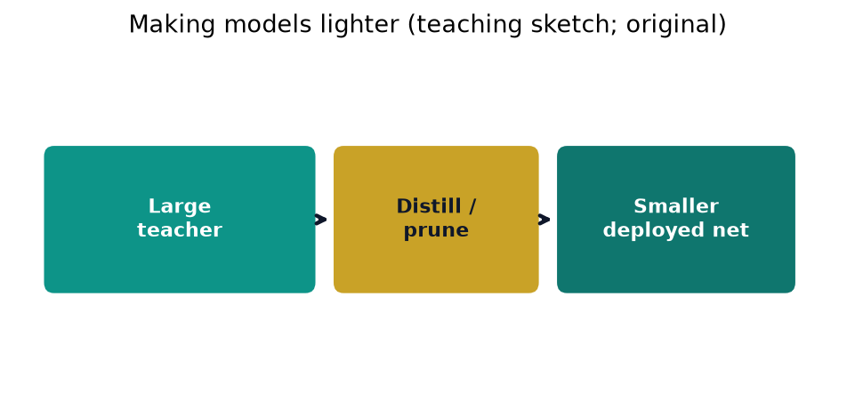

# Chapter 14. Making Lighter Neural Network and Machine Learning Models

## Opening


*Distill/prune teaching sketch.*


A hospital edge device may be unable to run a 7-billion-parameter model within a time-critical workflow. Compression, distillation, and efficient architectures are deployment-engineering candidates, not evidence of clinical readiness.


*Smaller deployed nets still need appraisal discipline.*
## 14.1 Why Lighter Models Matter

A model that is accurate in a data center can still fail as a clinical tool if it is too slow, too large, too power-hungry, or too dependent on continuous cloud connectivity. Lighter models address the practical constraints of deployment: milliseconds of latency in a stroke alert pathway, limited RAM on a tablet at the bedside, intermittent connectivity in a mobile stroke unit (MSU), battery life for wearable continuous monitoring, and institutional rules that prefer keeping identifiable data on-device rather than streaming raw waveforms or images off-site. Compression and efficient design are therefore not cosmetic optimizations; they are often the difference between a research prototype and a system that can operate under real clinical logistics.

Efficiency also has scientific and ethical dimensions. Training and repeatedly fine-tuning massive networks for multi-site consortium projects consumes substantial electricity and researcher time. Green AI asks us to report compute cost alongside accuracy and to prefer methods that achieve acceptable clinical utility at lower carbon and dollar cost. Institutionally authorized local inference can reduce some movement of protected health information, but it is not inherently private and does not replace review, data-use authority, access controls, or secure multi-site analytics. This chapter surveys classical data compression, sparse coding, quantization, pruning, LoRA, efficient attention, memory-efficient training, transfer and related training paradigms, knowledge distillation, and AutoML—with evaluation of whether decision-relevant performance survives each change.

Latency: time from input ready to prediction (p50/p95 matter more than mean alone).

Throughput: predictions per second under batching; important for research jobs.

Memory footprint: parameters, activations, optimizer state, and runtime buffers.

Energy: joules per inference; critical for battery devices and green accounting.

Communication: bytes moved on and off device; costly in MSUs and rural tele-neurology.

## 14.2 Measuring Parameters, FLOPs, Latency, and Energy

Before compressing, measure. Parameter count is the number of stored trainable weights and biases. For a dense layer mapping R^{d_in} to R^{d_out}, parameters equal d_in * d_out + d_out if a bias is used. Convolutional layers store C_out * C_in * K_h * K_w weights for standard convolutions (plus biases). Parameter count predicts disk size under a given numeric format: roughly 4 bytes per parameter in float32, 2 in float16, 1 in int8, and less for structured sparse formats when zeros are not stored densely.

FLOPs (floating-point operations) approximate arithmetic work for a forward pass. For the same dense layer, multiply-adds are about d_in * d_out (often counted as 2 FLOPs per multiply-add; conventions differ—state yours). For a convolution with output spatial size H_out x W_out, a common estimate is 2 * H_out * W_out * C_out * C_in * K_h * K_w. FLOPs are not latency: memory bandwidth, kernel fusion, batch size, and hardware (CPU, GPU, NPU, microcontroller) can determine wall-clock behavior. Benchmark on the target device with realistic input sizes and specified cold/warm cache conditions.

Worked numerical example: parameters and quantization memory. Consider a small multilayer network for tabular stroke risk scoring with layers 20 → 64 → 64 → 2 (binary logits). Parameter counts: Layer 1: 20×64+64=1344; Layer 2: 64×64+64=4160; Layer 3: 64×2+2=130; total P=5634. Float32 storage: 5634×4=22536 bytes ≈ 22.0 KiB. Float16: 11268 bytes ≈ 11.0 KiB. Int8 weight-only: 5634 bytes ≈ 5.5 KiB plus tiny scale metadata. If we prune 40% of weights to exact zero and store a dense bitmask plus nonzero int8 values: nonzero ≈ 3380 bytes + 5634/8 ≈ 705 bytes mask ≈ 4.0 KiB before alignment. Structured pruning (removing whole neurons) avoids index overhead and better matches hardware.

Approximate dense FLOPs for one forward pass (counting multiply-adds as 2 FLOPs): 2×(20×64 + 64×64 + 64×2)=11008 FLOPs, ignoring activations. On a microcontroller that sustains 10 MFLOP/s effective, pure arithmetic would be ~1.1 ms, but memory loads dominate; measured latency might be several milliseconds. Use parameter and FLOP counts for design comparisons, then measure latency and energy on-device.

```python
def mlp_params(layer_sizes, bias=True):
    p = 0
    for d_in, d_out in zip(layer_sizes, layer_sizes[1:]):
        p += d_in * d_out + (d_out if bias else 0)
    return p

P = mlp_params([20, 64, 64, 2])
assert P == 5634
print(P, P * 4, P * 1) # params, float32 bytes, int8 bytes
```

## 14.3 Data Compression Algorithms: BPE, Bitmap, Huffman, and LZW

Before neural compression, classical data compression reduces storage and communication of features, tokens, and indices. These algorithms appear inside modern ML pipelines (tokenizers, inverted indexes, feature stores) and teach information-theoretic intuition that also motivates quantization and sparse codes.

Byte Pair Encoding (BPE). BPE is a tokenization algorithm widely used in NLP and large language models. Start with an initial symbol vocabulary (often bytes or characters). Iteratively find a frequent adjacent pair of symbols and merge it into a new symbol until a target vocabulary size or merge budget is reached. The result is a subword vocabulary that trades vocabulary size against sequence length and can represent rare strings compositionally. BPE is not a general-purpose compressor for arbitrary binary files. Relative to a byte- or character-level representation it often yields fewer tokens and therefore less attention work, but sequence length relative to word-level or alternative subword tokenizers is corpus-dependent. Drug names, dosages, and abbreviations require local fragmentation and error analysis rather than an assumed benefit.

Bitmap indexes. A bitmap index stores, for each distinct value of a categorical column (or each token in a set), a bit vector with a 1 in rows where that value occurs. Intersection and union of predicates become bitwise AND/OR—extremely fast for selective filters on large clinical tables (e.g., “ICD ischemic stroke AND age>=65 AND not comfort care”). Compression schemes such as run-length encoding and roaring bitmaps (which split the row space into fixed-size chunks and store each chunk as a sorted integer array, a dense bitset, or a run list, whichever is smallest) keep sparse bitmaps small. Bitmap indexes trade space for query speed and are foundational in analytic databases used for cohort construction.

Huffman coding. Huffman coding assigns shorter binary codes to more frequent symbols and longer codes to rare ones, producing a prefix-free code that is optimal among symbol codes for a known discrete distribution. Build a binary tree by repeatedly merging the two least frequent nodes; the code length of a symbol equals its depth in that tree, and no codeword is a prefix of another (so a stream decodes unambiguously left to right). In ML systems, Huffman (and related entropy codes) compress postings lists, sparse feature IDs, and sometimes quantized residual streams. The lesson for quantization: allocate fewer bits where mass concentrates.

Lempel-Ziv-Welch (LZW). LZW builds a dictionary of previously seen substrings on the fly and emits codes for dictionary entries—no need for a prior frequency table. It underpins classic formats (GIF, early compressors) and illustrates adaptive dictionary compression. For streaming telemetry from wearables or MSUs, dictionary methods can reduce bandwidth when signals or event logs repeat patterns. Modern learned compressors and neural codecs go further, but LZW remains a clean teaching algorithm: initialize dictionary with alphabet; while reading input, grow the longest match already in the dictionary and emit its code, then add the match-plus-next-symbol as a new entry.

BPE: subword tokens for text; reduces sequence length for transformers.

Bitmap indexes: fast set operations for cohort filters on categorical columns.

Huffman: shorter codes for frequent symbols; optimal prefix codes for the specified symbol weights.

LZW: adaptive dictionary; good for repetitive streams without a prior model.

### Worked Example: Huffman Coding a Wearable Event Stream

A wearable cardiac patch classifies each detected beat into one of six event codes and streams that code sequence to a phone over a low-power radio. To cut bandwidth (and therefore battery drain) we entropy-code the stream. Over one monitoring window it logs 100 beats with the empirical counts below (toy data). We convert counts to probabilities by dividing by 100.

| Symbol | Meaning (toy) | Count | Probability p |
| --- | --- | --- | --- |
| N | normal | 40 | 0.40 |
| S | supraventricular | 25 | 0.25 |
| V | ventricular | 15 | 0.15 |
| A | artifact | 10 | 0.10 |
| P | paced | 6 | 0.06 |
| Q | unclassified | 4 | 0.04 |

Fixed-length baseline. Six distinct symbols need ceil(log2 6) = ceil(2.585) = 3 bits each. That is 3 bits/symbol, or 3 * 100 = 300 bits for the whole window, regardless of how skewed the frequencies are.

Build the tree. Maintain a pool of nodes, each carrying a weight; repeatedly remove the two smallest-weight nodes, join them under a new parent whose weight is their sum, and return the parent to the pool. Each row below shows the two nodes merged and the pool that results.

| Step | Merge (weights) | New node | Pool after step |
| --- | --- | --- | --- |
| 1 | Q(4) + P(6) | n1(10) | N40, S25, V15, A10, n1(10) |
| 2 | A(10) + n1(10) | n2(20) | N40, S25, V15, n2(20) |
| 3 | V(15) + n2(20) | n3(35) | N40, S25, n3(35) |
| 4 | S(25) + n3(35) | n4(60) | N40, n4(60) |
| 5 | N(40) + n4(60) | root(100) |  |

Assign codes. Branch labels are arbitrary and do not affect code lengths or optimality. To reproduce the table below deterministically, assign 0 to the first child shown in each merge and 1 to the second child. The codeword of a leaf is the sequence of labels from root to leaf.

| Symbol | Codeword | Length L |
| --- | --- | --- |
| N | 0 | 1 |
| S | 10 | 2 |
| V | 110 | 3 |
| A | 1110 | 4 |
| P | 11111 | 5 |
| Q | 11110 | 5 |

This code is prefix-free: N begins with 0, every other codeword begins with 1, and the branching continues to separate S, V, A, P, Q, so no codeword is a prefix of another.

Average code length. Multiply each probability by its code length and sum:

N: 0.40 * 1 = 0.40

S: 0.25 * 2 = 0.50

V: 0.15 * 3 = 0.45

A: 0.10 * 4 = 0.40

P: 0.06 * 5 = 0.30

Q: 0.04 * 5 = 0.20

Sum L̄ = 0.40 + 0.50 + 0.45 + 0.40 + 0.30 + 0.20 = 2.25 bits/symbol. Over the 100-beat window that is 225 bits, versus 300 bits for the fixed-length code—a saving of 75 bits, or (3 − 2.25)/3 = 25%.

Compare to the entropy bound. For a specified discrete source distribution, entropy H = −Σ p log2 p lower-bounds the expected length of any uniquely decodable binary code under the standard source-coding assumptions; block and arithmetic codes can approach the bound while framing and codebook costs still matter. Computing term by term (using log2 0.40 = −1.322, log2 0.25 = −2.000, log2 0.15 = −2.737, log2 0.10 = −3.322, log2 0.06 = −4.059, log2 0.04 = −4.644):

N: 0.40 * 1.322 = 0.529

S: 0.25 * 2.000 = 0.500

V: 0.15 * 2.737 = 0.411

A: 0.10 * 3.322 = 0.332

P: 0.06 * 4.059 = 0.244

Q: 0.04 * 4.644 = 0.186

H = 0.529 + 0.500 + 0.411 + 0.332 + 0.244 + 0.186 ≈ 2.20 bits/symbol (the exact value is 2.2008; the displayed terms are each rounded to three decimals). So Huffman’s 2.25 bits sits only about 0.05 bits above the entropy floor of 2.20 and well below the naive 3-bit fixed code—the classic result that Huffman is optimal among integer-length symbol codes and never more than about one bit above H. A consistency check via the Kraft equality confirms a complete prefix code: 2⁻¹ + 2⁻² + 2⁻³ + 2⁻⁴ + 2⁻⁵ + 2⁻⁵ = 0.5 + 0.25 + 0.125 + 0.0625 + 0.03125 + 0.03125 = 1.0.

This particular distribution happens to produce a maximally skewed (“comb”) tree, so codeword lengths climb 1, 2, 3, 4, 5, 5; more uniform frequencies give bushier, more balanced trees with codes closer to the fixed length. Different tie-breaking rules when two nodes share a weight can yield different bit patterns but the same optimal average length. The takeaway that carries into quantization and pruning: spend bits where the probability mass lives, and starve the rare tail—but check first that the rare tail is not the clinically critical one (a run of ventricular beats is exactly the event you do not want to under-resolve).

```python
# Huffman construction from symbol frequencies, and average code length.
import heapq

def build_huffman(freq): # freq: {symbol: weight}
    heap = [(w, i, sym) for i, (sym, w) in enumerate(freq.items())]
    heapq.heapify(heap) # min-heap keyed by weight
    k = len(freq) # tie-break id so nodes never compare
    while len(heap) > 1:
        w1, _, n1 = heapq.heappop(heap) # two smallest-weight nodes
        w2, _, n2 = heapq.heappop(heap)
        heapq.heappush(heap, (w1 + w2, k, (n1, n2)))
        k += 1
    root = heap[0][2]

    codes = {}
    def walk(node, prefix):
        if isinstance(node, str): # leaf
            codes[node] = prefix or "0" # lone-symbol edge case
        else:
            walk(node[0], prefix + "0") # first popped child -> 0
            walk(node[1], prefix + "1") # second popped child -> 1
    walk(root, "")
    return codes

def avg_bits(freq, codes):
 total = sum(freq.values())
 return sum(freq[s] * len(codes[s]) for s in freq) / total

freq = {"N": 40, "S": 25, "V": 15, "A": 10, "P": 6, "Q": 4}
codes = build_huffman(freq)
print(codes) # {'N': '0', 'S': '10', 'V': '110', ...}
print(avg_bits(freq, codes)) # 2.25
```

## 14.4 Sparse Coding

Sparse coding represents a vector x approximately as a linear combination of a few columns of a dictionary D: x ≈ D z with z sparse (many zeros). Learning D and z jointly is a classic unsupervised problem related to dictionary learning, compressed sensing, and efficient sensory coding hypotheses in neuroscience. Optimization typically alternates sparse inference for z (lasso; OMP, which greedily adds the dictionary atom most correlated with the current residual; ISTA/FISTA, which alternate a gradient step with soft-thresholding of the coefficients) with dictionary updates.

Why sparse codes can lighten models: (1) storing and computing with few active coefficients reduces operations only when the implementation exploits sparsity; (2) overcomplete dictionaries can capture recurring structure with inspectable atoms; (3) L1-penalized linear models can set coefficients to zero and remain useful tabular baselines, although zero coefficients are not proof of stable or causal feature selection. Sparse coding differs from incidental ReLU sparsity: the former optimizes an explicit sparsity objective on codes. Compare sparse linear models and tree ensembles with any neural compression pipeline on the same tabular task.

Worked intuition. Suppose \(x \in R^{100}\) is represented with a dictionary of 200 atoms. A dense coefficient vector for that dictionary uses 200 active coefficients, whereas a 5-sparse code uses 5—40× fewer atom contributions if the reconstruction is implemented to skip zeros. That does not imply 40× lower wall-clock latency: indexing, memory access, and the target hardware matter. Dictionary quality determines reconstruction error; over-aggressive sparsity can underfit rare but critical patterns (subtle ECG morphology, rare imaging signs).

## 14.5 Quantization: Vector, Companding, PTQ, QAT, and Channel-wise

Quantization represents continuous values with a smaller discrete set. Vector quantization (VQ) and cluster quantization map vectors to a codebook of centroids (k-means style); encoding stores the centroid index rather than the full vector. VQ-VAE and product quantization (which splits each vector into subvectors and quantizes each subvector with its own small codebook, so a handful of indices approximate a high-dimensional vector—the workhorse of billion-scale approximate nearest-neighbor search) in retrieval systems use related ideas. Scalar quantization maps each number independently.

Non-uniform quantization and signal companding. Human perception and many signals have wide dynamic range. µ-law and A-law companding (classic telephony) apply a logarithmic-like transform before uniform quantization so that small amplitudes get finer effective resolution. The µ-law compressor is roughly F(x) = sign(x) ln(1+µ|x|)/ln(1+µ) for |x|<=1 (telephony uses µ=255); expand after transmission. The A-law variant is piecewise. These remind us that uniform int8 grids can waste levels on rarely used tails; learned or logarithmic quantizers sometimes help audio and sensor streams.

Quantization for neural networks. Fixed-point and integer formats can replace float32 operations with supported int8/int4 kernels. Uniform affine quantization maps a real value r to an integer q by q = round(r / scale) + zero_point, followed by clipping to the representable range; dequantization is r_hat = scale * (q - zero_point). Per-tensor scales are simple; per-channel (channel-wise) scales for convolutional weights can reduce error by adapting to each filter’s range. Dynamic quantization computes some scales at runtime; static quantization calibrates scales on a representative dataset ahead of time and may enable faster inference on compatible hardware.

Post-Training Quantization (PTQ) converts a trained float model using calibration data without full retraining; it is comparatively simple but may reduce performance on sensitive models. Quantization-Aware Training (QAT) simulates quantization during training (often with straight-through estimators for rounding) so weights adapt to discrete grids; it adds training cost and may recover fidelity that PTQ loses, but it is not guaranteed to be more accurate. Quantize only after defining target-hardware constraints, then validate discrimination, calibration, and subgroup or pathology-tail metrics. For clinical imaging, aggressive int4 weights may attenuate rare lesion cues; mixed precision is one candidate to compare, not a substitute for pathology-stratified evaluation.

Worked scale example. A weight tensor with min=-1.2, max=1.8 quantized to int8 in [-128,127] might use scale = (1.8-(-1.2))/(127-(-128)) ≈ 3.0/255 ≈ 0.0118, zero_point chosen so that 0.0 maps near an integer. Channel-wise quantization computes such scales per output channel, reducing error when channels have very different magnitudes.

```python
import numpy as np

def affine_quantize(x, n_bits=8):
 qmin, qmax = 0, 2**n_bits - 1
 xmin, xmax = float(np.min(x)), float(np.max(x))
 scale = (xmax - xmin) / (qmax - qmin) if xmax > xmin else 1.0
 zp = int(np.clip(round(qmin - xmin / scale), qmin, qmax))
 q = np.clip(np.round(x / scale + zp), qmin, qmax).astype(np.int32)
 x_hat = scale * (q - zp)
 return q, scale, zp, x_hat
```

## 14.6 Pruning and Sparsification

Pruning sets selected weights or structures to zero (or removes them) so that computation and storage shrink. Key design choices: what to prune (weights, neurons, channels, heads, blocks), when to prune (one-shot after training, iterative prune-retrain, or during training), and structured versus unstructured sparsity.

Unstructured pruning can reach high sparsity but needs compatible sparse kernels and hardware to reduce latency. Structured pruning removes channels, filters, attention heads, or entire residual blocks and can yield smaller dense tensors that supported BLAS and convolution kernels execute more efficiently; an actual speedup still depends on shapes, compiler/runtime behavior, memory movement, and hardware.

How to identify pruning candidates. Magnitude-based pruning removes weights with the smallest absolute value and is a useful baseline, often followed by fine-tuning. The lottery-ticket hypothesis is a related empirical claim: in some architectures and training settings, a sparse subnetwork retrained from its original initialization can match a dense reference. It is not a guarantee that every trained network contains a practically discoverable “winning ticket.” Activation-based pruning removes units that rarely activate on calibration data. Optimal Brain Damage (OBD) and Optimal Brain Surgeon (OBS) use second-order (Hessian) information to approximate the loss increase from removing a parameter; OBS also models parameter interactions through an inverse-Hessian approximation. Taylor-based pruning uses first-order products such as gradient times weight, or higher-order approximations, to rank estimated impact.

A practical recipe: train to convergence; rank weights or structures by magnitude or saliency; remove a fraction s; fine-tune with a modest learning rate; validate not only average accuracy but calibration and subgroup performance (age bands, scanner vendors, transferring hospitals). In medical imaging, aggressive channel pruning can erase rare but critical features (subtle hyperdense MCA sign, small diffusion lesions); use class-wise and pathology-wise checks, not only global AUC.

Unstructured: fine-grained zeros; potentially high sparsity; latency gains require sparse support.

Structured: remove filters/neurons/heads; hardware-friendly dense shapes in many runtimes; coarser search.

OBD/OBS: Hessian-aware saliency; costly but classic theory.

Fine-tuning after pruning is common, but whether it is needed and how much it recovers must be measured; one-shot and iterative methods should be compared under the same budget.

## 14.7 Low-Rank Adaptation (LoRA)

Full fine-tuning of large language or vision models updates all parameters and stores a separate copy per task—prohibitive when many clinical sites or tasks share a foundation model. Low-Rank Adaptation (LoRA) freezes the pretrained weights W0 and injects trainable low-rank updates: W = W0 + B A, where B is d x r, A is r x k, and rank r << min(d,k). Only A and B are trained (often with scaling alpha/r). At inference, BA can be merged into W0 so there is no extra latency, or kept separate for multi-tenant adapters.

LoRA is a parameter-efficient fine-tuning method, not a general compressor of the base model, but it makes specialization lighter: multiple small adapters can share one frozen backbone. Variants include QLoRA (LoRA on quantized bases), higher-rank or adaptive-rank schemes, and related adapters (prefix tuning and (IA)^3-style rescaling). A multi-hospital study might evaluate separately versioned local adapters on an institutionally authorized backbone, but this design does not itself resolve data-use authority, privacy leakage from updates, cross-site bias, adapter access control, or clinical validation. Evaluate the final adapter or merge for task performance, calibration where applicable, and prohibited behaviors; low rank may also underfit rare local phenotypes.

## 14.8 Lighter Self-Attention: FlashAttention, MQA/GQA, Sliding Windows

Self-attention is the computational bottleneck of transformers: naive attention materializes an N x N score matrix for sequence length N, with memory and time quadratic in N. Long clinical notes, genomic sequences, and high-resolution imaging tokens make quadratic cost painful.

FlashAttention computes exact attention up to ordinary numerical differences using tiles that fit in fast on-chip memory, avoiding storage of the full attention matrix in high-bandwidth memory. Reduced memory traffic can improve speed and practical context length, but the gain depends on sequence length, dtype, GPU generation, kernel support, and surrounding operations. Successive versions further optimize parallelism and hardware utilization on supported accelerators. Use maintained, tested kernels and benchmark the complete workload on the target stack.

Multi-Query Attention (MQA) and Grouped-Query Attention (GQA). Standard multi-head attention uses separate key/value projections per head. MQA shares key/value projections across query heads, reducing KV-cache size during autoregressive decoding. GQA is a middle ground in which groups of query heads share key/value heads; its quality–memory trade-off is empirical rather than guaranteed. In any evaluated assistant, profile whether decode-time cache, weights, activations, retrieval, or another component actually dominates before choosing the architecture.

Sliding window and dilated sliding window attention. Restrict each token to attend only to a local window of width w (and optionally dilated neighbors), reducing complexity from O(N^2) to O(N w). Stacking layers expands the receptive field. Dilated windows insert gaps to reach farther tokens without full density. These patterns suit long signals (EEG, continuous monitoring) where local context dominates but some long-range markers matter. Hybrid designs combine local windows with a few global tokens (CLS, summary tokens) for document-level information.

## 14.9 Memory-Efficient Gradient Descent: Accumulation, Checkpointing, Conjugate Gradients

Training memory, not only inference size, constrains who can fine-tune models. Gradient accumulation splits a large logical batch into micro-batches, computing and summing gradients before one optimizer step—simulating large batches under limited GPU memory at the cost of fewer synchronous updates per wall-clock time. It does not reduce activation memory within a micro-batch.

Gradient checkpointing (activation recomputation) stores only a subset of intermediate activations during the forward pass and recomputes the rest during backward. It trades activation memory for extra computation; the wall-clock overhead depends on checkpoint placement, model structure, compiler, and hardware rather than a universal percentage. For a simple chain of L equal-cost layers, a square-root checkpoint schedule can reduce stored activations from O(L) to O(sqrt(L)) with an additional forward-equivalent amount of recomputation. Real graphs require workload-specific memory and time measurements.

Conjugate gradient (CG) methods solve linear systems Ax=b using A-conjugate search directions, converging faster than steepest descent for quadratic objectives when A is SPD. In ML, CG appears inside Hessian-free optimization, natural gradient / Fisher-vector products (as in TRPO’s inner loop), and large least-squares problems. Computing the next CG step uses recurrence: residual r, search direction p, step size alpha = (r·r)/(p·A p), update x and r, then beta to mix the next direction—without forming A explicitly if matrix-vector products are available. For most deep nets, first-order methods (AdamW) dominate; know CG as the workhorse when second-order or trust-region subproblems appear.

## 14.10 Neural Network Training Paradigms for Efficiency

Transfer learning reuses a model pretrained on a source task (ImageNet, web text, or appropriately governed domain data) and adapts it to a target task. It can reduce target-data or compute needs relative to training from scratch, but negative transfer is possible when source and target differ. Candidate strategies include a frozen-feature baseline, partial unfreezing, and end-to-end fine-tuning under a common validation protocol. Multitask learning trains shared representations on related tasks (e.g., ICH detection and midline-shift regression) and may improve data efficiency when tasks share structure; conflicting tasks can cause negative transfer.

Meta-learning aims to learn how to learn: model-based methods adapt internal state quickly; metric-based methods (prototypical networks, matching networks) classify by similarity in an embedding space; optimization-based methods (MAML) learn initial parameters that fine-tune in a few gradient steps. Few-shot rare disease imaging is the natural clinical story—results are promising but brittle under domain shift.

Curriculum learning orders examples according to a designed schedule, such as easy to hard; whether it improves optimization or final performance is task-dependent, and ordering common before rare phenotypes can itself worsen rare-class learning. Federated learning trains across sites without pooling raw records: sites compute updates and an aggregation protocol combines them (e.g., FedAvg). Updates and the final model can still leak information, and non-IID sites can destabilize or bias training. Secure aggregation, differential privacy, communication design, threat modeling, and governance address different risks; federation alone is not a privacy guarantee.

## 14.11 Knowledge Distillation

Knowledge distillation trains a smaller student model to mimic a larger teacher. Hard targets are one-hot labels; soft targets are the teacher’s probability distribution over classes, which carry dark knowledge about similarities (e.g., confusing ischemic subtypes). Softmax temperature T flattens distributions: p_i = exp(z_i/T) / sum_j exp(z_j/T). Higher T reveals more inter-class structure; the distillation loss often scales by T^2 when using cross-entropy on soft targets (so that soft-target gradients keep a magnitude comparable to the hard-label term as T grows). A balancing factor alpha mixes soft distillation loss with hard label loss on the transfer set (data used for distillation—labeled or unlabeled): L = alpha * T^2 * CE(soft_student, soft_teacher) + (1 - alpha) * CE(student, hard_labels).

A candidate experimental workflow is to train a teacher under a fixed protocol, choose a student architecture that fits the edge budget, run distillation on an appropriately governed transfer set, tune T and alpha without exposing the final test set, and compare student calibration and failure modes with the reference. Architectures include response-based distillation (logits), feature-based (matching intermediate maps), and relation-based (matching pairwise structures). For stroke-imaging research, a heavy ensemble teacher may be distilled into a student that can execute on MSU hardware, but including scanner characteristics in the transfer set is not sufficient for clinical readiness; target-device, pathology-tail, workflow, and prospectively governed evaluation still apply.

```python
import numpy as np

def softmax(z, T=1.0):
 z = np.asarray(z, dtype=float) / T
 z = z - z.max()
 e = np.exp(z)
 return e / e.sum()

teacher_logits = np.array([2.0, 1.0, 0.1])
print(softmax(teacher_logits, T=1.0)) # peaked -> ~[0.66, 0.24, 0.10]
print(softmax(teacher_logits, T=4.0)) # softer -> ~[0.42, 0.32, 0.26]
```

## 14.12 Automatic Machine Learning: Hyperparameters and NAS

AutoML automates model selection and hyperparameter search, but it does not automate problem definition or validation design. Grid search enumerates a Cartesian product of candidate values—simple and parallelizable but inefficient in many dimensions. Random search samples combinations independently and can cover influential dimensions more efficiently than a grid when only a few hyperparameters matter. Bayesian optimization fits a surrogate to observed scores and selects configurations with an acquisition function; Hyperband allocates small initial budgets and promotes configurations according to interim results; population-based training copies and perturbs selected models during training. Their relative efficiency depends on the search space, noise, budget, and fidelity of interim scores.

Neural Architecture Search (NAS) searches over network structures (depth, width, cell motifs, connectivity). Approaches include reinforcement learning controllers, evolutionary search, and differentiable search (DARTS-style continuous relaxations that make the choice of operation a trainable weight). NAS can discover efficient architectures but can consume substantial compute and overfit the validation signal used for search. Keep a final evaluation set outside the search and encode target-hardware constraints when they are part of the claim. Disciplined random search is a useful lower-cost comparator; neither method has a universal advantage under unequal budgets or validation designs.

Report search budget (trials, GPU-hours) alongside accuracy so that “state of the art” claims are comparable under green AI norms.

## 14.13 Clinical and Epidemiologic Notes: Bedside, Edge, and MSU

Mobile stroke units, ED tablets, ICU bedside monitors, and rural tele-neurology endpoints may face limited compute, limited bandwidth, strict latency, and high consequence of failure. A small AUROC difference and a latency difference do not by themselves determine which system should enter a clinical pathway: compare uncertainty, calibration, operating-point errors, workflow timing, availability, human factors, and net benefit in the intended setting under appropriate governance. Quantization, structured pruning, distillation, adapters, and efficient-attention kernels are candidate engineering levers only after the target hardware and evidence claim are defined.

A risk-proportionate evaluation of a compressed clinical-model candidate should cover the task-relevant whole-cohort, operating-point, calibration, subgroup, and pathology-tail metrics; uncertainty; p95 latency under realistic load on target hardware; energy or battery impact when relevant; distribution-shift stress cases; human factors; and privacy review of every data flow. Federated learning can train across MSUs without centralizing raw DICOM, but non-IID patient mixes, intermittent connectivity, update leakage, and version drift still require technical controls and institutional governance.

Green AI and equity intersect: the institutions that can afford massive models are not always the ones that need bedside tools most. Lightweight models, openly reported compute costs, and transfer from well-resourced pretraining to under-resourced deployment sites are practical justice levers—not panaceas, but better than accuracy-only leaderboards.

Use target-device benchmarks rather than FLOP estimates alone when making engineering advancement decisions.

MSU/edge: benchmark supported structured sparsity, quantization formats, and offline-capable fallbacks on the actual device.

Validate pathology tails after every compression step.

Report compute and energy with accuracy for green and multi-site science.

## 14.14 Putting Compression Techniques Together

A candidate evaluation pipeline is: (1) establish the simplest credible baseline; (2) train a reference implementation; (3) test distillation if a justified teacher exists; (4) compare pruning strategies; (5) test PTQ and, if needed, QAT; (6) profile supported attention and serving kernels for transformers; (7) evaluate adapters only where their governance and maintenance model is defined; and (8) measure the final artifact on target hardware. Each stage is optional and must be justified by the bottleneck. Classical compressors (BPE, bitmaps, Huffman, LZW) can reduce data movement around the model. AutoML can tune a defined pipeline but does not replace clinical validation.

Complementary methods may compound memory or compute reductions, but gains are not automatically multiplicative and utility retention cannot be inferred from compression ratios. Measure the complete distilled, pruned, quantized, or GQA system against the same reference task, hardware, and intended-use distribution.

## 14.15 Worked Compression Stack on a Tiny CNN

Consider a purely synthetic CNN bookkeeping example for binary ICH-vs-no-ICH on downsampled slices: two convolutional blocks (16 then 32 filters, 3×3 kernels) and a 64-unit dense head. Approximate parameter counts: first conv 1×16×3×3 + 16 = 160; second 16×32×3×3 + 32 = 4640; dense if flattened spatial size is 8×8×32=2048 inputs: 2048×64+64=131136; logits 64×2+2=130; total 136,066 parameters (544,264 bytes, about 531.5 KiB, in float32, ignoring file-format metadata). These architecture and outcome values are not measured clinical results.

As an arithmetic illustration, prune 25% of the second convolution’s output channels (32→24), reducing that layer’s output-channel parameters by 25% and shrinking the dense input from 2048 to 1536 features (8×8×24), which cuts the dense layer from about 131k to about 98k parameters. A real experiment would then select any fine-tuning duration by a prespecified validation rule. Int8 weight storage is about one quarter of float32 storage for the remaining weights before scale, zero-point, padding, and container overhead. Fictional measurements such as AUROC 0.91→0.90→0.89 and latency 180→70 ms can illustrate a trade-off, but they make no performance claim; acceptability requires uncertainty, calibration, operating-point utility, and target-device workflow evidence.

A fictional distillation result might move the student from AUROC 0.89 to 0.905, but recovery is not guaranteed and a teacher’s errors can transfer to the student. The storyboard illustrates one sequence to test—measure, prune, quantize or distill where justified, and re-measure on device and on rare positive tails—not a deployment recipe.

Structure first: channel/head pruning before unstructured lottery tickets on edge CPUs.

Compare PTQ with the reference after training stabilizes; evaluate QAT when PTQ does not meet prespecified whole-cohort or tail criteria.

Evaluate whether distillation retains or recovers student quality without shipping the teacher.

After each material step, re-benchmark prespecified latency, whole-cohort, subgroup, and rare-tail metrics relevant to the intended claim.

## 14.16 Classical Feature Selection and Hashing as Non-Neural Lightening

Not every light model is a compressed neural net. For tabular stroke registries, L1-regularized logistic regression, shallow tree ensembles, and carefully selected feature filters are important comparators and can outperform deep models in some cohorts. Feature hashing maps high-cardinality categorical strings (med names, ICD strings) into a fixed-dimensional feature space with collisions, enabling streaming and bounded memory. Bloom filters test set membership with a tunable false-positive rate and no false negatives under their standard insertion/query assumptions; whether they are suitable for a retrieval filter depends on the consequence of each error type.

Sparse linear models are already “pruned” by construction. Combined with BPE or dictionary-coded text features and bitmap indexes for cohort filters, a classical stack can be an executable candidate for bedside calculators without GPUs, but serving feasibility is separate from clinical validity and authorization. The chapter’s neural compression tools matter when perceptual inputs (imaging, raw waveforms, long notes) justify representation learning; otherwise include the lighter classical baseline and invest effort in labels and calibration.

## 14.17 Hardware-Aware Serving Notes

Compression interacts with hardware. On many GPUs, dense tensor-core operations are highly optimized, so structured pruning or supported quantized dtypes may improve latency while unstructured 95% sparsity may not. Many NPUs and mobile DSPs accelerate supported int8/int4 operators with fusion; CPUs may benefit when smaller memory footprints remain in cache. Batch-size-1 bedside inference stresses latency differently from batch-32 research jobs. KV-cache size can be a major RAM cost during long-context LLM decoding, so GQA/MQA and evidence-preserving prompt or retrieval budgets are “light model” techniques alongside weight pruning.

Energy reporting: measure joules for a fixed workload (1000 inferences) under controlled screen/radio states when claiming edge suitability. Green AI multi-site papers should report training GPU-hours for the teacher and student, not only AUROC deltas.

## 14.18 Common Pitfalls Across the Compression Stack

Optimizing FLOPs instead of latency and energy. A model with half the FLOPs can be slower if memory bandwidth or unsupported operators dominate. Fix: benchmark wall-clock and joules on the actual target device.

Unstructured sparsity without sparse kernels. 90% zeros on a CPU running dense BLAS execute at dense speed (or slower, once indexing overhead is added). Fix: prefer structured pruning unless the runtime genuinely exploits sparsity.

Judging compression by global accuracy or AUROC alone. Aggregate metrics mask erosion of rare-but-critical tails (small diffusion lesions, hyperdense-MCA sign). Fix: pathology- and subgroup-stratified evaluation plus calibration after every step.

One-shot aggressive pruning or quantization. Cutting half the channels or jumping straight to int4 in a single pass often destroys accuracy irrecoverably. Fix: iterate prune/quantize with fine-tuning; escalate PTQ to QAT only if the tails fail.

Calibrating quantization on unrepresentative data. Static PTQ scales fit on the wrong distribution mis-scale activations at deployment. Fix: calibrate on data resembling the deployment scanner and site.

Letting NAS or AutoML score on the eventual test set. Search overfits whatever it is scored on, inflating reported performance. Fix: hold out a final untouched test set and report the search budget.

Equating on-device inference with privacy. Local prediction can still leak through model updates, logs, extraction, or inference attacks; federated training is not anonymous. Fix: threat-model the actual data flow and select risk-appropriate controls—which may include secure aggregation, differential privacy, access control, logging limits, or other measures—under governance rather than assuming one fixed bundle is sufficient.

Distilling or LoRA-adapting without re-checking behavior. A smaller student or a merged adapter can quietly lose calibration or safety behaviors. Fix: re-run the full calibration and safety suite on the final artifact, not just the base model.

## Connections

Information theory. Huffman coding assigns shorter codewords to more probable symbols. For a specified discrete source, entropy H lower-bounds the expected length of any uniquely decodable lossless symbol code, and Huffman attains the minimum among binary prefix codes for the supplied weights. Lossy quantization is governed instead by a rate–distortion trade-off: allowing a defined distortion can reduce the required rate below the lossless entropy, but only relative to that distortion measure and source model. It is not simply a lossless code “dipping below” its entropy bound.

Optimization. Conjugate gradients, Hessian-aware pruning (OBD/OBS), and the straight-through estimator in QAT all reach back to the optimization material: curvature (the Hessian) tells you which parameters matter, even though first-order methods (AdamW) still run day-to-day training.

Transformers and attention. FlashAttention, MQA/GQA, and sliding windows presuppose the attention mechanism from the sequence-model chapters but change different things: FlashAttention evaluates standard attention exactly up to numerical differences with less memory traffic; MQA/GQA change key/value parameter sharing and cache size; sliding windows give up full global connectivity for sparse local context. Their speed, memory, and quality effects should not be conflated.

Representation reuse and generalization. Distillation, LoRA, and transfer/meta-learning all recycle learned representations, so they inherit the generalization and domain-shift cautions raised earlier; the calibration and evaluation chapters supply the subgroup and reliability checks that every compression step must survive.

Privacy and governance. Federated learning links to the data-governance material: keeping computation on-device is a technical lever, not a substitute for consent, data-use agreements, and membership-inference risk assessment.

## Chapter Summary

Lighter models can make some bedside, edge, and mobile-stroke-unit evaluations feasible under latency, memory, energy, and privacy constraints; compression alone does not establish readiness. Classical compressors (BPE, bitmaps, Huffman, LZW) and sparse coding reduce data and feature cost; the Huffman worked example shows a prefix code reaching 2.25 bits/symbol against a 3-bit fixed baseline and a 2.20-bit entropy lower bound, excluding codebook and framing overhead. Quantization and pruning can shrink networks; LoRA reduces trainable parameters for adaptation; FlashAttention, MQA/GQA, and sliding windows address distinct attention costs; accumulation and checkpointing trade time for training memory. Transfer, multitask, meta, curriculum, and federated learning are candidate efficiency strategies whose effects are task-dependent. Distillation, AutoML, and NAS likewise require budget-matched comparison. Clinical notes emphasize target-device measurement, pathology-tail validation, and compute reporting.

## Practice and Reflection

(1) Recompute parameter counts and int8 storage for an MLP with sizes 40 -> 128 -> 128 -> 64 -> 3. Estimate dense FLOPs for one forward pass.

(2) Explain why structured channel pruning often yields better mobile latency than 90% unstructured sparsity on a CPU without sparse kernels.

(3) Compare PTQ and QAT for a CNN that must run on an MSU tablet: when is the extra training cost of QAT justified?

(4) Derive why BPE merge operations reduce average tokens per clinical note and how that reduces transformer attention cost.

(5) Sketch a LoRA adapter plan for three hospitals sharing one frozen LLM backbone. What do you store per site?

(6) Distill a 3-class teacher: write the soft-target cross-entropy with temperature T and balancing alpha against hard labels, and explain the T^2 factor.

(7) Design a random-search hyperparameter budget (20 trials) for a tabular stroke model; justify ranges for learning rate and weight decay.

(8) Synthetic clinical-system scenario: cloud AUROC 0.91 with 2.5 s latency vs on-device AUROC 0.88 with 120 ms. Explain why those two numbers are insufficient for a deployment choice, and specify the calibration, operating-point errors, uncertainty, workflow timing, availability, human-factors, governance, and prospective evidence you would require.

(9) Huffman practice: for the frequency table {a:50, b:20, c:15, d:10, e:5}, build the Huffman tree, list each codeword and its length, compute the average bits/symbol, compare it to the fixed-length code for five symbols, and compute the entropy H. Is your code within 0.1 bits of H?

(10) µ-law companding: explain why a logarithmic companding curve gives small-amplitude ECG or EEG samples finer effective quantization than a uniform int8 grid, and describe one situation where plain uniform int8 is adequate.

(11) Gradient checkpointing: a network stores L equally sized activation tensors. If you keep only about sqrt(L) checkpoints, how does peak activation memory scale, and what is the extra compute cost in forward passes?

(12) Federated learning: a consortium runs FedAvg across five non-IID sites. Name two failure modes that arise specifically from non-IID data, and one privacy risk that federation does NOT eliminate.
