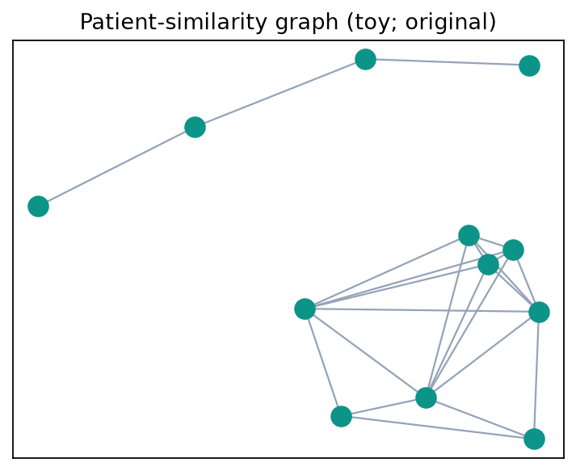

# Chapter 15. Graph Mining Algorithms

## Opening


*Toy patient-similarity graph.*


A network analysis links hospitals, transfer patterns, and outcome codes. Graph methods can reveal systems structure; they can also launder confounding through edges. Literacy here protects both science and equity claims.


*Graph/embedding geometry can drift across sites.*
## 15.1 What Is a Graph?

A graph G = (V, E) consists of a set of nodes (vertices) V and a set of edges E connecting pairs of nodes. Edges may be undirected {i, j} or directed (i -> j). They may be unweighted or carry weights w_ij (travel time, correlation, number of shared patients, synaptic density proxies). Multigraphs allow multiple edges; simple graphs do not. A path is a sequence of distinct nodes joined by edges; a cycle returns to its start; a connected component is a maximal set of nodes mutually reachable when ignoring direction (weak connectivity) or respecting direction (strong connectivity).

Graphs are the natural data type whenever relations—not only feature vectors—carry the signal. In clinical and epidemiologic work those relations include who refers to whom, which diagnoses co-occur, which brain regions connect, which papers cite which concepts, and who contacted whom during an outbreak investigation. Graph mining extracts important nodes, dense communities, missing likely edges, and representations for downstream learning. Core methods span spanning trees, shortest paths, matching, centrality, PageRank/HITS, community detection, graph neural networks, and high-dimensional graph search (HNSW), with clinical interpretation bounded by privacy and causal limits.

Nodes: patients, physicians, hospitals, ICD codes, brain ROIs, papers, hosts.

Edges: referrals, co-occurrence, white-matter tracts, citations, contacts.

Attributes: node features (age, specialty), edge features (date, strength).

Tasks: ranking, clustering, matching, link prediction, graph classification, ANN search.

## 15.2 Adjacency and Algebraic Representations

Number nodes 1…n. The adjacency matrix A is n x n with A_ij = 1 (or w_ij) if an edge exists from i to j (convention: rows = sources, columns = targets for directed graphs; A is symmetric for undirected simple graphs). The degree of node i in an undirected graph is d_i = sum_j A_ij. The degree matrix D is diagonal with D_ii = d_i. The combinatorial Laplacian L = D - A appears in spectral clustering; random-walk and symmetric normalized Laplacians are common variants. Powers of A count walks: (A^k)_ij is the number of length-k walks from i to j in an unweighted graph.

Adjacency lists store, for each node, a list of neighbors—memory O(n + m) for m edges, far better than O(n^2) dense matrices when graphs are sparse (as most clinical networks are). Edge lists are convenient for I/O. Choose representation for algorithm and scale: spectral methods like sparse matrix ops on A or L; streaming algorithms may never materialize A.

```python
edges = [(0, 1), (0, 2), (1, 2), (2, 3)]
n = 4

adj = {i: set() for i in range(n)}
for u, v in edges:
    adj[u].add(v)
    adj[v].add(u)

A = [[0] * n for _ in range(n)]
for u, v in edges:
    A[u][v] = A[v][u] = 1

degrees = [sum(row) for row in A]
print(adj, degrees)
```

## 15.3 Minimum Spanning Trees: Prim and Kruskal

A spanning tree of a connected undirected weighted graph is a subset of edges that connects all vertices without cycles. A minimum spanning tree (MST) minimizes the total edge weight. MSTs appear in network design (cheapest backbone linking hospitals), hierarchical clustering sketches, and approximation algorithms.

Kruskal’s algorithm. Sort all edges by increasing weight. Initialize a forest of single-node trees. Add the next lightest edge if it connects different components (union-find / disjoint set structure); skip if it would form a cycle. Runtime O(m log m) dominated by sorting (or better with sophisticated unions). Correctness follows from the cut property: the lightest edge across any cut is safe for some MST.

Prim’s algorithm. Grow a single tree from a start node. Repeatedly add the lightest edge that connects a tree node to a non-tree node (priority queue of candidate edges). With a binary heap, runtime is O(m log n); with Fibonacci heaps, O(m + n log n). Prim resembles Dijkstra but optimizes edge weight to the tree rather than path length from a source.

Worked Kruskal sketch. Nodes {A,B,C,D}, edges AB:1, BC:2, AC:3, BD:4, CD:5. Add AB (1), BC (2); skip AC (cycle); add BD (4); total weight 1+2+4=7. The MST connects all four nodes. Clinical analogy: linking regional stroke centers with minimum total transfer-agreement “cost” while avoiding redundant cycles in a backbone plan—though real systems optimize multi-criteria objectives beyond a single weight.

```python
def kruskal(n, edges):
    """Return an MST from (weight, u, v) edges using union-find."""
    parent = list(range(n))

    def find(x):
        while parent[x] != x:
            parent[x] = parent[parent[x]]
            x = parent[x]
        return x

    mst, total = [], 0
    for weight, u, v in sorted(edges):
        root_u, root_v = find(u), find(v)
        if root_u != root_v:
            parent[root_u] = root_v
            mst.append((u, v, weight))
            total += weight
    return mst, total
```

## 15.4 Shortest Paths: Dijkstra and A\*

Shortest-path problems seek a minimum-weight path from a source s to a target t (or to all nodes). Edge weights must be carefully defined: travel time, risk, or 1 for hop count. Negative weights require Bellman-Ford; Dijkstra requires nonnegative weights.

Dijkstra’s algorithm. Maintain tentative distances d(v), initially 0 at s and infinity elsewhere. Use a priority queue to repeatedly extract the node u with smallest d(u) and relax its outgoing edges: if d(u)+w(u,v) < d(v), update d(v) and predecessor. With a binary heap, time is O(m log n). Dijkstra is optimal for nonnegative weights and underpins routing in transfer networks and many map services.

A\* search. A\* augments Dijkstra with a heuristic h(v) estimating remaining cost to the goal. Nodes are prioritized by f(v)=g(v)+h(v), where g is the cost from the start. If h is admissible (never overestimates) and consistent, A\* finds optimal paths while expanding fewer nodes than Dijkstra when the heuristic is informative. Euclidean distance is a classic admissible heuristic for spatial graphs; in hospital routing, estimated ambulance time from population centroids can serve as h if carefully calibrated not to overestimate.

Clinical mapping: prehospital routing to the nearest EVT-capable center is a shortest-path problem on a road network with time-dependent weights; do not confuse network distance with clinical appropriateness when bypass rules depend on last-known-well and severity.

```python
import heapq

def dijkstra(adjacency, source):
    """Compute shortest distances for a graph with nonnegative weights."""
    distance = {source: 0.0}
    queue = [(0.0, source)]
    while queue:
        current, u = heapq.heappop(queue)
        if current != distance.get(u):
            continue
        for v, weight in adjacency[u]:
            candidate = current + weight
            if candidate < distance.get(v, float("inf")):
                distance[v] = candidate
                heapq.heappush(queue, (candidate, v))
    return distance
```

## 15.5 Matching Algorithms: Hungarian and Hopcroft-Karp

Matching problems select edges without shared endpoints. A maximum matching has maximum cardinality; a maximum weight matching maximizes sum of edge weights. Applications include assigning residents to clinics, pairing samples, and bipartite linking of records.

Hungarian algorithm (Kuhn-Munkres). Solves the assignment problem: bipartite matching with costs, finding a perfect matching of minimum total cost (or maximum weight via sign flip) in polynomial time—classically O(n^3) for n x n cost matrices. The algorithm maintains dual variables (labels) and explores equality subgraphs, adjusting labels until a perfect matching appears. For small n (tens of jobs and workers), Hungarian is a standard library call; for large sparse bipartite graphs, other solvers are preferred.

Hopcroft-Karp algorithm. Computes maximum cardinality matching in bipartite graphs in O(E sqrt(V)) time via layered BFS building multiple shortest augmenting paths, then DFS to augment along a maximal set of them. Faster than repeatedly finding one augmenting path. Use when you need maximum number of assignments without weights—e.g., matching as many patients as possible to available tele-neurology slots under bipartite constraints.

Worked assignment intuition. Three patients and three slots with cost matrix rows [2,3,3], [3,2,3], [3,3,2]. The diagonal assignment cost 2+2+2=6 is optimal. Hungarian systematically finds such assignments without brute force n! enumeration.

## 15.6 Centrality Measurement Algorithms

Centrality scores try to quantify importance. Degree centrality is simply d_i (or d_i/(n-1) normalized): nodes with many ties are locally busy. In a hospital referral network, high degree may mark a general neurologist who both sends and receives many consults—or a data artifact of a large clinic.

Closeness centrality of i is often (n-1) / sum_j dist(i, j) for nodes in a connected component: how many hops on average to everyone else. High closeness means efficient reach across the network.

Betweenness centrality sums, over pairs s, t, the fraction of shortest paths that pass through i—identifying bridges between communities (e.g., a tertiary coordinator linking community EDs to endovascular services). Exact Brandes algorithm is O(n m) on unweighted graphs; large networks need approximation.

Eigenvector centrality scores nodes highly when they connect to other high-scoring nodes; it solves A x = lambda x for the leading eigenvector with nonnegative entries (Perron-Frobenius for strongly connected positive cases). Unlike degree, a node with few but elite neighbors can rank high.

Small numerical sketch. Undirected path 1—2—3 plus edge 2—4. Degrees: d1=1, d2=3, d3=1, d4=1. Node 2 is the unique degree center and has high betweenness: shortest paths among {1,3,4} pass through 2. Eigenvector centrality also peaks at 2. No single centrality is “correct”—choose based on the scientific question and report sensitivity to edge definition.

## 15.7 Link Analysis: PageRank (Worked) and HITS

PageRank models a random surfer who, with probability alpha (damping, typically 0.85), follows a random outgoing link, and with probability 1-alpha teleports to a random node. If P is the row-stochastic transition matrix, the PageRank vector r satisfies r = alpha P^T r + (1-alpha) v, where v is a personalization distribution (uniform by default). Damping guarantees a unique solution even if the graph is not strongly connected. Dangling nodes (out-degree 0) need a convention: usually distribute their mass uniformly.

### Worked Example: PageRank on a Tiny 4-Node Directed Graph

Take nodes {A, B, C, D} with directed edges A→B, A→C, B→C, C→A, D→C. Out-degrees are d(A)=2, d(B)=1, d(C)=1, d(D)=1, so no node is dangling (each has at least one out-link). Spreading each node’s out-mass equally over its targets gives the row-stochastic transition matrix P (rows = source), order A, B, C, D:

Row A: 0, 1/2, 1/2, 0
Row B: 0, 0, 1, 0
Row C: 1, 0, 0, 0
Row D: 0, 0, 1, 0

PageRank pushes mass backward along links, so the iteration uses the transpose P^T (row i of P^T lists who points into i):

Row A: 0, 0, 1, 0 (from C→A)
Row B: 1/2, 0, 0, 0 (from A→B, carrying half of A’s mass)
Row C: 1/2, 1, 0, 1 (from A→C, B→C, D→C)
Row D: 0, 0, 0, 0 (nothing points to D)

The all-zero D-row is diagnostic: no link feeds D, so its only score is teleport. Fix alpha = 0.85 and a uniform teleport v = (1/4, 1/4, 1/4, 1/4); the additive teleport term is (1 - alpha)v = 0.15 x 0.25 = 0.0375 for every node at every step. Iterate r_{k+1} = alpha P^T r_k + (1 - alpha)v starting from r_0 = (0.25, 0.25, 0.25, 0.25).

Iteration 1. Form P^T r_0 entry by entry:
A-entry = 1(0.25) = 0.2500
B-entry = 0.5(0.25) = 0.1250
C-entry = 0.5(0.25) + 1(0.25) + 1(0.25) = 0.6250
D-entry = 0

Scale each by alpha and add 0.0375:
r_1(A) = 0.85(0.2500) + 0.0375 = 0.25000
r_1(B) = 0.85(0.1250) + 0.0375 = 0.14375
r_1(C) = 0.85(0.6250) + 0.0375 = 0.56875
r_1(D) = 0.85(0) + 0.0375 = 0.03750

r_1 = (0.25000, 0.14375, 0.56875, 0.03750), and 0.25000 + 0.14375 + 0.56875 + 0.03750 = 1.00000. Mass is conserved because P is row-stochastic with no dangling nodes: the alpha-scaled flow retains exactly the fraction alpha, and teleport restores the remaining 1 - alpha.

Iteration 2. P^T r_1:
A-entry = r_1(C) = 0.56875
B-entry = 0.5 r_1(A) = 0.12500
C-entry = 0.5 r_1(A) + r_1(B) + r_1(D) = 0.12500 + 0.14375 + 0.03750 = 0.30625
D-entry = 0

r_2(A) = 0.85(0.56875) + 0.0375 = 0.52094
r_2(B) = 0.85(0.12500) + 0.0375 = 0.14375
r_2(C) = 0.85(0.30625) + 0.0375 = 0.29781
r_2(D) = 0.03750

r_2 = (0.5209, 0.1438, 0.2978, 0.0375), sum = 1.0000.

Iteration 3. Using the unrounded r_2 values in P^T r_2:
A-entry = r_2(C) = 0.29781
B-entry = 0.5 r_2(A) = 0.26047
C-entry = 0.5 r_2(A) + r_2(B) + r_2(D) = 0.26047 + 0.14375 + 0.03750 = 0.44172
D-entry = 0

r_3(A) = 0.85(0.29781) + 0.0375 = 0.29064
r_3(B) = 0.85(0.26047) + 0.0375 = 0.25890
r_3(C) = 0.85(0.44172) + 0.0375 = 0.41296
r_3(D) = 0.03750

r_3 = (0.2906, 0.2589, 0.4130, 0.0375), sum = 1.0000.

Notice A and C trade places: r_1 and r_3 rank C > A, but r_2 ranks A > C. The swing is genuine, not an arithmetic error — the edges A→C and C→A form a length-2 cycle, so the undamped walk is nearly period-2 and damping shrinks the wobble by only a factor alpha per step. The practical lesson: never read final ranks off two or three iterations of a cyclic graph. Iterate until the L1 change ||r_{k+1} - r_k|| falls below a tolerance (say 1e-8), or solve the fixed point directly.

Exact fixed point. Because P^T’s D-row is zero, r(D) = alpha(0) + 0.0375 = 0.0375 exactly at any solution. Solving the linear system (I - alpha P^T) r = (1 - alpha)v (four equations in four unknowns) yields

r* = (0.3725, 0.1958, 0.3941, 0.0375), sum = 1.0000,

so the converged ranking is C > A > B > D. C leads because it is the only triple-target (A, B, and D all point to it) and it recycles mass back to A through C→A; D trails because no in-link ever reaches it and it survives on teleport alone. Running the power-iteration snippet below to convergence reproduces r* to four decimals — implement it and confirm both the ranking and sum(r) = 1.

HITS (Hyperlink-Induced Topic Search). HITS assigns each node an authority score (quality of content pointed to) and a hub score (quality as a pointer). Iteratively, authority a proportional to A^T h, hub h proportional to A a, with normalization. Authorities are nodes many good hubs point to; hubs point to many good authorities. On citation or referral graphs, authorities may be definitive guidelines or comprehensive stroke centers; hubs may be review articles or referring networks. HITS is query-dependent in its original web formulation (run on a subgraph); PageRank is typically global (or personalized).

```python
import numpy as np

# PageRank power iteration on the four-node example.
P = np.array([
    [0, 0.5, 0.5, 0],
    [0, 0, 1, 0],
    [1, 0, 0, 0],
    [0, 0, 1, 0],
], dtype=float)
alpha, n = 0.85, 4
rank = np.ones(n) / n
teleport = np.ones(n) / n
for _ in range(100):
    rank = alpha * P.T @ rank + (1 - alpha) * teleport
print(np.round(rank, 4), rank.sum())
```

## 15.8 Community Detection: Spectral, Louvain, and Leiden

Communities are groups of nodes more densely connected internally than externally. Detecting them reveals modules in brain networks, clusters of co-morbid codes, or regional care patterns.

Spectral clustering. Form Laplacian L (or normalized variant), compute the k eigenvectors with smallest eigenvalues, row-normalize embeddings, and run k-means. The spectral gap suggests the number of clusters. Works well for well-separated communities; costs depend on eigen-solves for large n.

Louvain algorithm. Greedy modularity maximization: modularity Q compares within-community edges to a null model with the same degrees. Louvain repeatedly (1) moves individual nodes to neighbor communities to raise Q, then (2) aggregates communities into super-nodes, iterating until Q stalls. It is fast on large networks and widely used, but can find arbitrarily poorly connected communities in some cases and is resolution-limit sensitive (may miss small communities).

Leiden algorithm. Adds a refinement phase intended to avoid Louvain’s disconnected or badly connected communities. Its formal connectivity guarantees depend on the quality function, algorithm variant, and convergence conditions; they do not make the resulting partition clinically meaningful. Leiden is an important comparator when Louvain is used, but runtime and partition quality remain graph- and implementation-dependent. Validate stability and substantive meaning: an optimized graph objective can still reflect billing or referral artifacts rather than biology or care quality.

## 15.9 Graph Neural Networks: Challenges, Message Passing, Pooling, Spectral vs Spatial

Graph neural networks (GNNs) learn representations for nodes, edges, or whole graphs by propagating information along structure. Challenges of graphs for neural nets include: variable size and isomorphism (no canonical node order); heterogeneity of node/edge types; scalability to millions of edges; over-smoothing (node features become indistinguishable after many layers); over-squashing (long-range signals bottlenecked through narrow cuts); and distribution shift when deployment graphs differ from training graphs.

Message passing layer (propagation). A generic layer updates node embeddings h_i by aggregating messages from neighbors:

m_i^{(l)} = AGGREGATE({ MSG(h_i^{(l)}, h_j^{(l)}, e_{ij}) : j in N(i) })

h_i^{(l+1)} = UPDATE(h_i^{(l)}, m_i^{(l)})

AGGREGATE may be sum, mean, max, or attention-weighted sum. Stacking L layers mixes information from L-hop neighborhoods.

Graph pooling coarsens graphs for graph-level prediction: cluster-based pooling (learn assignments), top-k node selection, or hierarchical coarsening. DiffPool and SAGPool are examples; naive global mean/sum pooling is often a strong baseline.

Spectral versus spatial. Spectral methods define convolution via graph Fourier transforms using Laplacian eigenvectors; exact eigendecompositions can be expensive, and some formulations do not transfer directly across graphs of different sizes. Spatial methods define convolution as neighborhood aggregation in the vertex domain and are common in current GNN practice (GCN, GAT, GraphSAGE).

## 15.10 GCN, GAT, and GraphSAGE

Graph Convolutional Network (GCN). Kipf-style GCN uses a renormalized adjacency:

H^{(l+1)} = sigma( D_hat^{-1/2} A_hat D_hat^{-1/2} H^{(l)} W^{(l)} )

where A_hat = A + I (self-loops) and D_hat is the corresponding degree matrix. Each layer averages neighbor features (including self) then applies a linear map and nonlinearity. GCNs are strong baselines for node classification on citation-like graphs and for some biomedical graphs when labels are at nodes.

Graph Attention Network (GAT). GAT replaces uniform neighbor averaging with learned attention coefficients alpha_{ij}, computing weighted sums of neighbor transformations. Multiple heads can improve optimization or representation diversity in some settings. Attention weights identify neighbors emphasized by the fitted model, not causal or clinically authoritative relationships, and the added parameters can overfit small graphs.

GraphSAGE. GraphSAGE samples neighborhoods and aggregates with mean, LSTM, or pooling functions, enabling inductive inference for previously unseen nodes when the required features and neighborhood construction are available. Sampling can make large graphs tractable but introduces variance and may miss rare neighbors. For networks where new facilities appear, compare inductive methods with transductive and features-only baselines rather than assuming one family is preferable.

Training tips: use early stopping against over-smoothing; try 2-3 layers before going deep; regularize; evaluate on held-out nodes or temporal splits; beware label leakage through edges constructed with future information.

```python
import numpy as np

def gcn_layer(adjacency, features, weights):
    """One dense GCN layer with self-loops and a ReLU activation."""
    adjacency_hat = adjacency + np.eye(adjacency.shape[0])
    degree = adjacency_hat.sum(axis=1)
    degree_inv_sqrt = np.diag(1.0 / np.sqrt(np.clip(degree, 1e-8, None)))
    support = degree_inv_sqrt @ adjacency_hat @ degree_inv_sqrt @ features @ weights
    return np.maximum(support, 0)
```

## 15.11 High-Dimensional Search with Graphs: HNSW

Approximate nearest neighbor (ANN) search finds vectors close to a query in high dimension—central to embedding retrieval, RAG (Chapter 16), and image search. Hierarchical Navigable Small World (HNSW) graphs build multi-layer proximity graphs: upper layers are sparse for long-range greedy routing; the bottom layer is dense for refined search. Insertion connects each new point to M neighbors using a heuristic that maintains small-world navigability; search greedily walks toward the query starting from an entry point at the top layer, descending layers as it goes.

HNSW is a widely used approximate-nearest-neighbor method whose recall, latency, build time, and memory depend on data geometry, implementation, and parameters such as M and efConstruction/efSearch. Clinical embedding-search studies may compare HNSW with graph or quantization indexes such as DiskANN or IVF-PQ. Measure recall@k and latency on a domain-labeled neighbor set and the target hardware; generic benchmark rankings do not establish a local winner.

## 15.12 Clinical and Epidemiologic Applications

Referral and care networks. Nodes are clinicians or facilities; edges are referrals or transfers. Centrality identifies brokers; communities reveal regional patterns; shortest paths inform access. Privacy: networks of named clinicians are sensitive; aggregate and audit re-identification risk.

Comorbidity graphs. Nodes are diagnoses or medications; edges are co-occurrence or partial correlation after adjustment. Communities suggest multi-morbidity modules. Causal caution: co-occurrence is not causation; billing intensity confounds edges.

Connectomics. Nodes are brain regions; edges are structural or functional connectivity. Graph metrics and GNNs explore disease-related reorganization (stroke disconnection syndromes, epilepsy networks). Reproducibility across scanners and parcellations is a major methodologic challenge; treat single-study “biomarker graphs” skeptically until external validation.

Epidemiologic contact and transmission networks. Matching and path algorithms can support outbreak investigation, but missing edges such as unreported contacts can be a major source of error. Evaluate sensitivity to incomplete observation and integrate graph analyses with the relevant epidemiologic models rather than treating the observed graph as complete.

Knowledge graphs for literature and guidelines link entities (diseases, drugs, trials). PageRank/HITS-like scores can surface authoritative nodes; GNN link prediction can suggest missing relations for curation—not for automatic clinical action without review.

Define edges with the same care as define labels—artifacts become communities.

Prefer longitudinal and multi-site validation for GNN claims.

Do not equate high centrality with clinical quality without outcomes data.

HNSW powers retrieval; retrieval quality still depends on embedding training.

### Privacy on Relational Data

Relational data resists the de-identification playbook that works for tabular records, and a neurologist-epidemiologist who publishes clinician or patient graphs must understand why.

Definition and why it is hard. In a table you can suppress or generalize identifiers until each record is indistinguishable from k - 1 others (k-anonymity). A graph leaks through its structure: even after stripping names, a node’s degree, its triangle count, or the shape of its 2-hop neighborhood can be near-unique. An adversary who knows a few edges around a target — a patient’s handful of known contacts, a physician’s known referral partners — can locate that target in a “de-identified” graph and then read off the edges they did not know. This is a structural re-identification attack. Two disclosure targets matter: node disclosure (learning which real entity a node is) and edge disclosure (learning that a specific relationship exists, e.g., that patient X was seen by a named HIV or psychiatric clinician).

Mechanisms for protection. (1) Aggregation and suppression can release community-level counts or summaries rather than a raw edge list, but small-cell and differencing risks still need assessment. (2) Graph differential privacy adds calibrated randomness so an output distribution changes only within a defined privacy bound when an edge (edge-DP) or a node and its incident edges (node-DP) changes. Node-DP usually has higher sensitivity and utility cost; the privacy unit, adjacency definition, epsilon/delta, composition, and released queries must be stated. (3) Synthetic graphs can reduce direct exposure, but non-DP generators may memorize or reproduce sensitive structure and still require disclosure testing. (4) Secure multiparty computation, secure aggregation, or federated protocols can reduce raw-edge exchange under explicit trust and threat models; updates or outputs may still leak information. None of these mechanisms is a blanket authorization to release or share relational health data.

When to use / when not. Population-level claims may be answerable with aggregation, carefully specified privacy mechanisms, or enclave-based analysis rather than named nodes or raw edges. When nodes are people or a graph may leave a trusted environment, involve the responsible privacy, security, legal, and data-governance authorities in selecting the unit of protection and release mechanism. Stripping names from a clinician-referral or patient-contact edge list is not sufficient de-identification: degree and neighborhood signatures can enable linkage, especially in small subpopulations. Any proposed release requires a data-specific re-identification and utility assessment; node-DP or secure computation is not automatically sufficient.

## 15.13 Synthesis

Classical graph algorithms answer precise structural questions: MSTs for cheap connectors, Dijkstra/A\* for routes, Hungarian/Hopcroft-Karp for assignments, centrality and PageRank/HITS for importance, spectral/Louvain/Leiden for modules. GNNs extend learning to relational data via message passing, with GCN, GAT, and GraphSAGE as canonical models. HNSW brings graph ideas to high-dimensional search. For neurologist-epidemiologists, the highest value is often careful graph construction and classical metrics, with deep models reserved for settings with sufficient data, clear inductive tasks, and rigorous external validation.

## 15.14 Worked Dijkstra and A\* on a Transfer Graph

Five hospitals: Community A, B, C; Primary Stroke Center P; Comprehensive Center Z. Undirected road-time weights (minutes): A-P 25, B-P 30, C-P 40, P-Z 35, A-Z 70, B-Z 80, C-Z 50, A-B 20, B-C 25. A synthetic routing query asks for the shortest travel-time path from A to Z. Dijkstra from A: initialize d(A)=0. Expand A: d(P)=25, d(Z)=70, d(B)=20. Expand B: d(P)=min(25,20+30)=25, d(C)=45, d(Z)=min(70,20+80)=70. Expand P: d(Z)=min(70,25+35)=60. Expand C: d(Z)=min(60,45+50)=60. The unique shortest path under these fixed weights is A->P->Z at 60 minutes. Routing through C instead costs 45 + 50 = 95 minutes; there is no direct A-C edge, so A reaches C through B at cost 20 + 25 = 45.

A\* with heuristic h = straight-line lower bound: suppose h(Z)=0, h(P)=30, h(C)=45, h(B)=55, h(A)=50, all admissible if never above true remaining time. f=g+h prioritizes expanding P earlier than exploring long detours toward B, reducing expansions on larger maps. If h overestimates (inadmissible), A\* may return suboptimal routes—dangerous when used for clinical logistics recommendations. Always separate routing suggestion tools from clinical eligibility rules (time last known well, severity).

## 15.15 Worked Centrality and Community on a Small Referral Network

Consider a synthetic directed referral graph on six unlabeled nodes {1..6}: edges 1->3, 2->3, 3->4, 3->5, 4->6, 5->6, 2->5, 1->4. Nodes 3 and 6 each have in-degree 2, while node 6 has out-degree 0 under the stated edges. Those facts do not establish that either node is an authority, bottleneck, or appropriate clinical destination. Compute betweenness and PageRank only after specifying direction, weights, damping, personalization, and dangling-node handling. Louvain on the undirected projection may return different partitions as resolution, random initialization, or implementation changes; any substantive label such as “front-line” or “intervention” requires external evidence.

Add a comorbidity undirected graph on ICD nodes with weights as partial correlations after age/sex adjustment. Leiden communities might group cardioembolic-related codes separately from small-vessel codes. Validate against clinical taxonomy; administrative graphs can invent communities of coding convenience (same order set) rather than biology.

## 15.16 GNN Training Recipe and Pitfalls

Example research evaluation plan for node classification on a hospital graph: (1) define nodes, edges, index time, and labels without future leakage; (2) choose splits that respect the dependence and transportability claim, such as temporal or site-held-out evaluation; (3) compare a features-only baseline with prespecified GCN, GAT, GraphSAGE, or other justified candidates under a common tuning budget; (4) select stopping and tuning metrics appropriate to the task without exposing the final test set; (5) ablate edges and features separately; (6) assess over-smoothing and sensitivity to graph construction; and (7) test transportability in data independent of development. An MLP outperforming one GNN does not prove that all edge information is useless; the graph definition, architecture, optimization, and uncertainty also require examination.

Pitfalls: edges built from the label (connecting patients who share an outcome) leak; degree features can proxy hospital size and socioeconomic patterns; message passing can amplify majority site styles; explainability is harder than tabular SHAP. For connectomes, site effects and motion artifacts can dominate disease signal—graph metrics need the same harmonization discipline as any imaging biomarker.

HNSW ops note: when the embedding model or preprocessing changes, rebuild or otherwise migrate indexes under version control; querying vectors against an incompatible space can return invalid neighbors without an obvious runtime error. Track recall@k and critical retrieval failures on a domain-labeled set at a prespecified cadence tied to risk, data volume, and change events rather than assuming quarterly review is adequate.

Ablate features-only baselines before claiming GNN value.

Consider inductive models such as GraphSAGE when new nodes appear, and compare them with features-only and other inductive baselines.

Guard against leakage in edge construction.

Re-evaluate communities and ranks after any edge definition change.

## 15.17 Matching in Operational Neurology

Assignment algorithms can be studied for scheduling scarce EEG or tele-stroke capacity, but the cost matrix must not silently encode a clinical priority rule. Eligibility, urgency, protected-class impacts, access goals, and override authority require institutionally governed criteria and prospective workflow evaluation; an optimizer should not infer them from convenience variables. Hungarian methods minimize a specified total assignment cost, while Hopcroft-Karp maximizes cardinality in an unweighted bipartite formulation. Neither objective alone establishes a safe or equitable allocation.

Record linkage matching between registry and claims is a different “matching” problem (probabilistic record linkage) sometimes confused with graph matching; use dedicated linkage methods and privacy-preserving join designs. Clarify vocabulary in multi-disciplinary teams.

## 15.18 Prim vs Kruskal Complexity and Implementation Notes

Prim and Kruskal return a minimum total weight on connected undirected graphs; when all edge weights are distinct, the MST itself is unique, while ties can yield different trees with the same optimum weight. Kruskal is convenient when edges are easily sorted; union-find with path compression and union by rank makes each operation nearly constant amortized time. Prim is convenient with adjacency representations and priority queues and can be attractive on dense graphs with an appropriate implementation. Stopping Prim early does not in general solve a minimum connector for a prespecified subset of facilities; subset-connection or Steiner variants require their own formulation.

Directed graphs do not have MSTs in the undirected sense; the related optimum branching problems (Edmonds’ algorithm) are beyond our scope but matter for directed transfer networks with one-way constraints. Multigraphs with parallel edges keep only the lightest edge between a pair before MST. Negative weights are allowed for MST (unlike Dijkstra) because there are no path-sum interpretations—only sum of selected edges.

Engineering checklist: validate connectivity first; handle disconnected graphs by computing a minimum spanning forest; store predecessor edges for reconstruction; unit-test on a triangle and on a path where the MST is unique.

## 15.19 HITS Iteration Detail and Comparison to PageRank

Initialize hub and authority vectors to 1 for each node (or 1/n). Repeat: a <- A^T h; h <- A a; normalize a and h (L2 or L1). On the four-node graph of Section 15.7, authorities concentrate on nodes with rich in-links from hubs; hubs concentrate on nodes that point to authorities. Unlike PageRank’s single score and teleport, HITS can surface complementary roles: a referring network (hub) versus a definitive intervention center (authority).

Stability: HITS on the full web without topic subgraphs can be dominated by tightly knit communities unrelated to the query—hence the historical use of query-based base sets. PageRank’s damping is more globally stable. Personalized PageRank (teleport concentrated on a seed set) recovers a middle ground useful for “importance relative to this hospital” rankings.

When publishing centrality results, always state the algorithm, damping/personalization, dangling-node policy, and edge definition. Rankings are not intrinsic properties of physicians independent of data construction.

## 15.20 Spectral Clustering Walk-Through

Given an undirected similarity graph, form the normalized Laplacian L_sym = I - D^{-1/2} A D^{-1/2}. Compute the eigenvectors u1,…,uk corresponding to the k smallest eigenvalues; form matrix U with those columns; cluster rows of U with k-means. For k=2, the Fiedler vector (second-smallest eigenvalue’s eigenvector) already bipartitions the graph by sign pattern in simple cases.

Choosing k: inspect eigenvalue gaps; domain knowledge (expected number of care regions); stability across bootstrap edge subsamples. Spectral methods assume the similarity graph is meaningful—garbage k-NN graphs in high-dimensional noise yield garbage clusters. Compared with Louvain/Leiden, spectral clustering requires choosing k up front and costs eigen-decomposition, but connects cleanly to theoretical graph cuts (RatioCut, NCut).

Clinical connectomes often use partial correlation or streamline counts as weights; thresholding to build A can create or destroy communities. Report sensitivity to threshold and parcellation atlas.

## 15.21 Message Passing Expressive Power and Limitations

1-WL (Weisfeiler-Lehman) tests relate to the discriminative power of standard message-passing GNNs: graph structures that 1-WL cannot distinguish also cannot generally be distinguished by standard MPNNs with permutation-invariant aggregation under the corresponding assumptions. Higher-order networks, graph transformers, or carefully justified structural features may help on harder tasks. In feature-rich clinical node classification, shallow MPNNs are a useful comparator, but no fixed depth is known to suffice across graphs or labels.

Over-squashing: information from distant nodes compressed through narrow bottlenecks fails to arrive. Residual connections, jumping knowledge (concat multi-layer states), and graph rewiring are active research mitigations. For epidemiology contact networks with long chains, shallow models plus classical path analysis may beat deep GNNs.

Pooling for graph classification: global mean pool is a strong baseline; hierarchical pooling must preserve task-relevant subgraphs (e.g., seizure onset zones) rather than arbitrary clusters. Always compare against set models that ignore edges.

## Connections

Graph mining sits at the crossroads of several threads in this book; seeing the links keeps it from feeling like an isolated toolbox.

### Linear algebra and spectral methods

Adjacency and Laplacian matrices turn graph questions into eigenproblems. Eigenvector centrality is the leading eigenvector of A; PageRank is the stationary distribution of a damped Markov chain (the leading eigenvector of the “Google matrix”); spectral clustering partitions using the smallest Laplacian eigenvectors. The same eigen-decomposition machinery behind PCA and kernel methods reappears here — a graph is just another matrix to factor.

### Markov chains and probability

PageRank is a random walk with teleportation. With the convention used in Section 15.7, α is the probability of following an outgoing link and 1 − α is the restart or teleport probability. With α < 1 and a positive teleport distribution, the process has a unique stationary ranking that sums to one. Personalized PageRank changes the teleport distribution; random-walk graph kernels and GraphSAGE neighbor sampling are related constructions but are not identical to PageRank.

### Optimization

MST algorithms such as Prim and Kruskal are greedy methods whose correctness connects to graphic matroids. The linear-assignment formulation has a totally unimodular constraint matrix, so an optimum exists at an integral extreme point. Bipartite maximum matching can be reduced to a maximum-flow problem, while its LP dual connects to minimum vertex cover (Kőnig’s theorem); matching and max-flow are not simply each other’s duals. Modularity optimization and spectral graph partitioning illustrate combinatorial objectives and relaxations, though spectral clustering is not one universal relaxation of every modularity objective.

### Deep learning and embeddings

GNNs generalize the convolutions used for images from a fixed pixel grid to arbitrary neighborhoods: a 3x3 stencil becomes a variable neighbor set aggregated by message passing, which is why over-smoothing is the graph analogue of an over-deep CNN washing out detail. HNSW ties graph search to the embedding-and-retrieval pipeline: vectors from any model (including GNNs) are indexed as a navigable small-world graph to power the approximate nearest-neighbor lookups behind retrieval-augmented generation (Chapter 16).

### Causal inference and epidemiology

Networks break the independence assumption most models rest on: outcomes spill over along edges (interference), and shared network position confounds associations. Contact graphs feed transmission models; comorbidity graphs are descriptive, not causal. Here graph structure is often the mechanism of confounding and interference you must reason about explicitly, not a nuisance to average away — the same causal humility this book applies to observational tabular data.

## Chapter Summary

Graph mining extracts structure from relational data. Classical algorithms include minimum spanning trees (Prim, Kruskal), shortest paths (Dijkstra, A\*), matching (Hungarian, Hopcroft-Karp), centrality measures, PageRank and HITS link analysis, and community detection (spectral, Louvain, Leiden). Graph neural networks address learning on graphs via message passing, with GCN, GAT, and GraphSAGE as core architectures, facing challenges of over-smoothing, scalability, and shift. HNSW enables fast approximate nearest-neighbor search on embedding graphs. Clinical applications span referral networks, comorbidity and connectomics, and outbreak contact graphs—always with careful edge definition, privacy, and causal humility.

## Practice and Reflection

(1) Run Kruskal by hand on a 5-node complete graph with distinct edge weights of your choosing; verify the MST weight with Prim from two different starts.

(2) Execute Dijkstra on a small directed graph; then design an admissible heuristic and discuss which nodes A\* would skip.

(3) Implement the four-node PageRank example; report ranks for alpha in {0.5, 0.85, 0.99} and explain the trend.

(4) Compute degree, closeness, and betweenness on a path of five nodes; which node maximizes each?

(5) Explain over-smoothing in a 10-layer GCN and one mitigation strategy.

(6) Compare Louvain and Leiden: what failure mode of Louvain does Leiden address?

(7) Clinical design: define nodes/edges for a multi-hospital transfer network. Which centrality would you use to find bottleneck coordinators and why?

(8) Why might a comorbidity graph built from billing codes overstate edges in tertiary centers? Propose a normalization.

(9) For the four-node PageRank example, verify the exact fixed point by hand: write the four equations of (I - alpha P^T) r = (1 - alpha)v, solve them, and confirm r(D) = 0.0375 and sum(r) = 1. Explain in one sentence why r(D) never changes across iterations.

(10) Run two HITS iterations on the same four-node graph (initialize hubs and authorities to 1, alternate a <- A^T h and h <- A a with L1 normalization). Compare the top authority to the PageRank winner and explain why the two rankings can disagree.

(11) A colleague proposes publishing a “de-identified” physician referral graph as a raw edge list. Name two structural features that enable re-identification and give one differentially private or aggregated alternative that still answers a population-level question.

(12) In the Dijkstra transfer example, add a new edge P-C of weight 10 and recompute the shortest A->Z path. Does the given A\* heuristic remain admissible after this change? Justify by comparing each h-value to the new true remaining cost.
