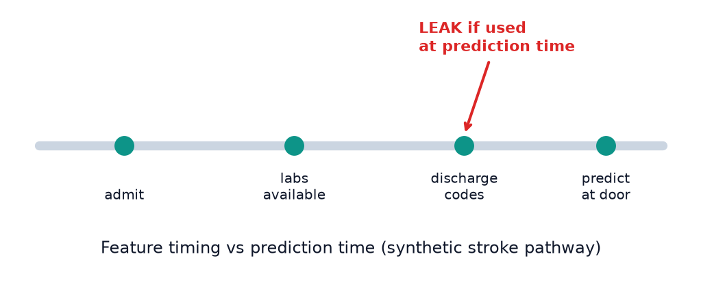
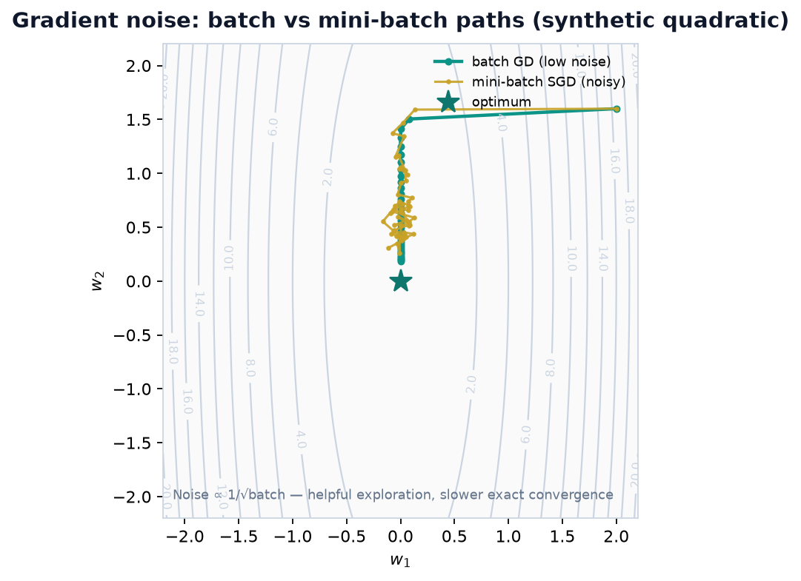
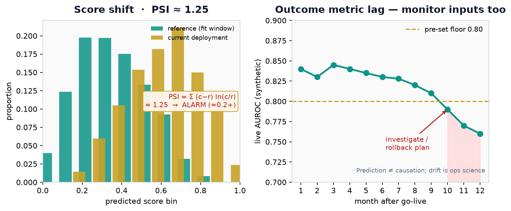

# Chapter 16. Concepts and Challenges of Working with Data


## Opening

Missing NIHSS, duplicated MRNs, and label drift after a documentation change are central problems in clinical ML. Many failures begin in the data and measurement pipeline rather than in the architecture.




*Data challenges often reduce to time and shift.*


*Distribution shift between cohorts.*
## 16.1 Why Data and Study Design Often Constrain Outcomes

Across this textbook we have studied models: linear predictors, trees, neural networks, reinforcement learners, compressed edge models, and graph algorithms. In clinical and epidemiologic practice, data quality and study design are often binding constraints. Labels are delayed, partial, and disputed; cohorts are selected by who arrives where with which insurance; scanners and coding systems change mid-study; the distribution at deployment is not the distribution in last year’s export. A modest model on carefully defined, well-labeled, prospectively monitored data can outperform a higher-capacity architecture trained on a poorly characterized extract, but that comparison must still be made empirically.

Treat data work as scientific measurement, not janitorial prelude. Every extract embodies inclusion criteria, timestamps, join keys, and operational quirks (a code that means “rule out” in one clinic and confirmed disease in another). Document those choices with the same care used for statistical estimators. This capstone chapter organizes problem complexity, sampling, noise, imbalance, missingness, anomalies, drift, rater agreement, LLM utilization, fairness, and interpretability—with worked numerical examples you can reuse in protocols.

## 16.2 Problem Complexity

Not every analytic task has the same inherent difficulty. Problem complexity combines statistical complexity (how much data are needed to estimate a target under noise), computational complexity (time and memory as functions of sample size and dimension), and scientific complexity (causal vs predictive goals, non-stationarity, feedback loops). A linear risk score with a clear index time and a frequent binary endpoint is low complexity relative to estimating individualized dynamic treatment regimes from confounded EHR streams.

Practical diagnostics of complexity include: effective sample size after rare outcomes and missingness; dimensionality relative to n; label quality and inter-rater agreement (for example, kappa); shift between sites; and whether the decision requires counterfactuals. Match method ambition to complexity: deep sequence models on n=80 with noisy labels are usually the wrong response. Conversely, when n is huge and the signal is perceptual (imaging), expressive models may be justified if validation is rigorous.

Computational complexity still matters at scale: naive pairwise distances are O(n^2); full attention is O(N^2) in sequence length; exact betweenness is expensive on large care networks. Use the earlier chapters’ efficient algorithms when the data volume demands it, but never let big-O cleverness substitute for a well-posed cohort definition.

## 16.3 Sampling from Complex Data: Stratified, Cluster, Monte Carlo, and MCMC

Sampling determines who enters the analysis and which uncertainties we can claim to represent. Stratified sampling draws within predefined strata (site, age band, stroke subtype) to target allocated representation and, when strata are internally homogeneous and estimates are correctly weighted, can improve precision. Nonresponse, ineligibility, or missing outcomes can still change the achieved analytic representation. Cluster sampling draws groups (hospitals, households) then individuals within clusters—often cheaper operationally but requiring variance estimation that accounts for clustering; treating clustered draws as i.i.d. can understate uncertainty.

Monte Carlo (MC) sampling estimates expectations by drawing independent samples from a distribution p and averaging f(x). The law of large numbers justifies convergence; variance of the estimator is Var(f(X))/n. Crude MC fails when p is hard to sample or when rare regions dominate f.

Markov Chain Monte Carlo (MCMC) constructs a Markov chain whose stationary distribution is the target posterior p(theta|data) when direct sampling is impractical. If the chain is ergodic and has reached its stationary regime, averages of dependent draws approximate posterior expectations. Discarding a fixed warmup length does not establish convergence; assess multiple chains with rank-normalized R-hat, effective sample size, and trace or rank plots.

Metropolis-Hastings (MH). Propose theta’ ~ q(.|theta); accept with probability min(1, [p(theta’) q(theta|theta’)] / [p(theta) q(theta’|theta)]). Symmetric proposals (random walk) cancel q terms. Tune and diagnose the chain using mixing, autocorrelation, effective sample size, convergence across chains, and target geometry. A single universal acceptance-rate interval is not a validity criterion.

Gibbs sampling. When conditional distributions p(theta_j | theta_{-j}, data) are available, sample each coordinate from its full conditional. Gibbs is a special MH case with acceptance probability 1. Hierarchical Bayesian models in epidemiology may use Gibbs or Hamiltonian Monte Carlo. Hamiltonian methods can explore some correlated, differentiable continuous posteriors more efficiently than a simple random walk, but performance depends on parameterization, geometry, implementation, and diagnostics.

Importance sampling. Draw from a proposal q, reweight by w = p/q, and form weighted averages. Effective sample size ESS = (sum w)^2 / sum w^2 collapses when q poorly matches p—the same pathology as off-policy RL importance ratios. Use for rare-event simulation and as a teaching bridge to sequential Monte Carlo.

Clinical sampling ethics: convenience samples of tertiary EHR data are not simple random samples of the disease population; report design and use design-based or model-based adjustments deliberately.

```python
import math, random

# Metropolis-Hastings for a 1D standard-normal target (educational)
def mh_normal(n=5000, step=2.4, warmup=1000, seed=0, x0=6.0):
    rng = random.Random(seed)
    x, draws, accepted = float(x0), [], 0
    for _ in range(n + warmup):
        proposal = x + rng.gauss(0, step)
        log_alpha = -0.5 * (proposal * proposal - x * x)
        if log_alpha >= 0 or rng.random() < math.exp(log_alpha):
            x = proposal
            accepted += 1
        draws.append(x)
    return draws[warmup:], accepted / (n + warmup)
```

## 16.4 Noise Types and Noise Reduction

Noise corrupts measurements, labels, and images. Types by statistical structure: ideal white noise has a flat power spectral density and uncorrelated samples; Gaussian noise refers to normally distributed noise (often modeled additively); Poisson counting noise arises in photon-limited imaging; salt-and-pepper noise replaces some samples with extremes; speckle is a multiplicative interference pattern in coherent modalities such as ultrasound; gradient noise in optimization is the stochasticity of minibatch gradient estimates. Actual devices may combine several signal-dependent and correlated noise sources.



*Figure — Optimization noise is not measurement noise. Mini-batch gradient estimates inject controlled stochasticity into parameter updates; batch size and learning rate set the amplitude. Treat it as a training hyperparameter, not as sensor artifact to filter out of the data.*

Noise reduction. Machine learning denoisers learn mappings from noisy to clean examples (or self-supervised variants). Classical signal filters remain essential baselines and real-time tools:

Butterworth filter. A low-pass, high-pass, or band-pass design with a maximally flat magnitude response in the passband; order affects transition steepness and phase. It can attenuate selected frequency content in EEG/ECG, but whether signal and artifact occupy separable bands must be checked. Forward–backward filtering gives zero-phase response only by using future samples and is therefore appropriate only for offline analyses that permit noncausal processing; it cannot be copied into real-time detection or forecasting. Inspect edge, ringing, and transient distortion.

Wiener filter. Optimal linear filter under stationary signal and noise spectra: minimizes mean squared error using power spectral densities. Adaptive Wiener variants estimate local statistics in images.

Kalman filter. Recursive Bayesian estimator for linear-Gaussian state-space models: predict step propagates state mean/covariance; update step assimilates the next measurement. Extended and unscented Kalman filters approximate some nonlinear systems; particle filters provide a sampling-based alternative. For tracking physiologic states or fusing multi-sensor streams, an explicit state-space model of process and measurement noise is a principled comparator to ad hoc smoothing when its assumptions are plausible.

Always separate measurement noise from biological variability and from label noise; each demands different remedies.

White/Gaussian/Poisson: probabilistic sensor models.

Salt-and-pepper and speckle: structured imaging artifacts.

Butterworth: frequency-domain band limiting.

Wiener: MSE-optimal linear filter under stationarity.

Kalman: sequential state estimation with process vs measurement noise.

## 16.5 Imbalanced Data and Augmentation

Class imbalance is common in serious neurologic outcomes: large-vessel occlusion among all ED headache presentations, aneurysm rupture among surveillance cohorts, and rare adverse drug events. Evaluation should include metrics and uncertainty matched to the decision, such as precision-recall summaries, calibrated probabilities, and decision-curve analysis rather than accuracy alone. Candidate training responses include class weights and resampling; target-setting should use representative validation data and prespecified error costs or utility, because matching prevalence alone does not determine an appropriate threshold.

Data augmentation expands effective sample size by transforming examples without changing labels (when transformations preserve semantics).

Tabular: careful jitter of continuous features within clinical plausibility; SMOTE-style synthetic minorities (watch leakage and unrealistic combinations); mixup (training on convex combinations of two examples and their labels) on standardized features. Avoid random noise that creates impossible vitals.

Image: flips, rotations, elastic deformations, intensity shifts, simulated bias fields—matched to acquisition physics. For stroke CT, aggressive geometric warps may break anatomy; prefer validated medical augmentation libraries and radiologist spot checks.

Text: synonym replacement, back-translation, controlled paraphrasing; for clinical text, protect negation and dosages from corruption. LLM-based paraphrase needs PHI governance.

Signal/time series: time warping, channel dropout, additive noise at measured SNR, window slicing. Preserve temporal causality for forecasting tasks (no future peeking).

Augmentation is not a substitute for external data or better labels; it regularizes within the support of observed variation.

## 16.6 Reconstructing Missing Data: Imputation and Interpolation

Missingness mechanisms: MCAR (missing completely at random), MAR (missing at random given observed variables), MNAR (depends on unobserved values). Clinical data are saturated with MNAR: NIHSS more complete when stroke codes activate; advanced labs missing in comfort-care pathways; 90-day mRS missing when disabled patients are lost to follow-up.

Imputation methods. Mean/median/mode: simple baselines; distort variances and correlations. k-NN imputation: fill from similar rows; needs a distance metric and careful scaling. Hot-deck: fill from a random similar donor record; cold-deck: from an external reference source. Regression imputation: predict missing feature from others; can be iterated (MICE). Multiple imputation propagates uncertainty for epidemiologic estimands. Griffin-Lim algorithm reconstructs signals (classic for spectrograms) from magnitude constraints via iterative projection—example of domain-specific reconstruction. Customized clinical rules (carry-forward last vitals within a short window only) encode workflow knowledge but can leak if windows cross index time improperly.

Interpolation methods (often for ordered domains). Linear and bilinear interpolation fill between grids (images, spatial maps). Polynomial interpolation fits higher-order curves—can overshoot (Runge). Splines use piecewise polynomials with smoothness constraints—workhorses for curves. Kriging (Gaussian process regression in geostatistics) provides spatial interpolation with uncertainty, used in environmental epi and some imaging contexts. Radial basis function interpolation (RBFI) reconstructs surfaces from scattered points using kernels centered at data locations.

Do not impute labels with downstream information or contaminate evaluation through outcome handling. In some epidemiologic analyses, multiple imputation or explicit models for missing outcomes can be valid under stated assumptions; prespecify the estimand and missingness model, keep the final evaluation independent, and propagate uncertainty. For prediction, compare feature-missingness strategies under realistic target-setting patterns, not only on artificially complete rows. A missingness indicator can itself be predictive because measurement reflects clinical workflow, so examine its transportability and fairness implications.

## 16.7 Anomaly and Outlier Detection

Anomalies are rare points that differ from a notion of normal. In clinical data they may be errors (wrong units), rare diseases, or adversarial inputs. Unsupervised methods learn normal structure without anomaly labels.

Isolation Forest (iForest). Randomly partitions features; points isolated in fewer splits receive higher anomaly scores. It scales well computationally in many tabular settings, but irrelevant high-dimensional features, clustered anomalies, and the chosen contamination/threshold can degrade detection.

One-Class SVM. Learns a boundary around training data in a kernel feature space (or a half-space in that space), flagging points outside. Sensitive to kernel and nu parameters; can be heavy for large n.

Local Outlier Factor (LOF). Compares local density of a point to densities of neighbors; points in sparser regions than their neighbors score as outliers. Captures local anomalies missed by global methods.

RANSAC (Random Sample Consensus). Robust model fitting: repeatedly sample a minimal subset, fit a model (e.g., line or transformation), count inliers within a threshold, and retain a high-consensus model. It is used for regression with contamination and imaging registration with mismatched keypoints. With 30% corrupted points, least squares can be badly distorted, while RANSAC may recover a dominant structure only if the inlier model is appropriate, enough all-inlier subsets are sampled, and the residual threshold separates inliers from outliers.

Use anomaly detectors as data-quality tools and as rare-event screens, not as automatic diagnoses. Tune alert rates to human review capacity.

```python
# RANSAC line fit sketch (2D)
import random

def ransac_line(points, n_iter=200, thresh=1.0):
    best_inliers, best_model = [], None
    for _ in range(n_iter):
        (x1, y1), (x2, y2) = random.sample(points, 2)
        if x1 == x2:
            continue
        m = (y2 - y1) / (x2 - x1)
        b = y1 - m * x1
        inliers = [(x, y) for x, y in points if abs(y - (m * x + b)) <= thresh]
        if len(inliers) > len(best_inliers):
            best_inliers, best_model = inliers, (m, b)
    return best_model, len(best_inliers)
```

## 16.8 Drift, Concept Change, and the Cold Start Problem

Dataset shift occurs when training and target distributions differ. Covariate shift changes P(X); label shift changes P(Y); concept drift changes P(Y|X)—the relationship itself. Scanner upgrades, ICD-9 to ICD-10 transitions, new order sets, earlier thrombectomy eligibility, and tele-stroke routing all induce shift. Model performance can collapse silently if only average AUC on last year’s holdout is tracked.



*Figure — Monitoring is ops science, not a dashboard ornament. Left: reference vs current predicted-score histograms; PSI quantifies binned mass shift. Its magnitude depends on binning, window size, and zero-cell handling, so historical fixed cutoffs are heuristics rather than universal statistical thresholds. Right: synthetic monthly live AUROC with a pre-specified performance floor; a breach prompts investigation of train–serve skew, case mix, or scanner change and a versioned rollback decision—not silent auto-retraining. Drift detection does not prove a causal pathway or authorize a new treatment claim.*

Tackling drift: monitor input quantiles, embedding distances, prediction-score distributions, and calibrated outcome rates as labels arrive. PSI is the binned Jeffreys divergence Σᵢ(cᵢ−rᵢ)ln(cᵢ/rᵢ). Pre-specify its binning and calibrate an alert threshold from reference-window variability, sample size, and operational false-alarm costs; use it to start an investigation, not to authorize retraining. For high-dimensional imaging, maximum mean discrepancy can compare reference and current embedding distributions, but it too requires a specified kernel and calibrated decision rule. Retrain under version control with prospective evaluation. Do not auto-retrain without governance—new inequitable workflows can be baked into an “updated” model.

Cold start problem. New users, hospitals, devices, or interventions lack history for personalized or site-adapted models. Candidate mitigations include content-based features, evaluation of a locked shared model, transfer from relevant sites, hierarchical partial pooling, and collection of a precision-justified local labeled set before adaptation. Bandit exploration is not a routine mitigation in care: it is prospective experimentation requiring genuine equipoise and the applicable ethical, regulatory, and institutional oversight. Cold start is acute when an MSU joins a network with different demographics and imaging vendors.

Worked site-drift PPV numbers. Suppose a large-vessel occlusion alert model uses a fixed score threshold chosen at Site A where prevalence p_A = 0.20 among all patients scored before thresholding, sensitivity Se=0.90, specificity Sp=0.80. Positive predictive value PPV = Se×p / (Se×p + (1−Sp)×(1−p)).

At Site A: PPV_A = 0.90×0.20 / (0.90×0.20 + 0.20×0.80) = 0.18 / (0.18+0.16) = 0.18/0.34 ≈ 0.529 (52.9%).

At Site B with lower prevalence p_B = 0.05 among those scored (broader alerting), same Se/Sp: PPV_B = 0.90×0.05 / (0.90×0.05 + 0.20×0.95) = 0.045 / (0.045+0.19) = 0.045/0.235 ≈ 0.191 (19.1%).

The same model and threshold yields a substantially different false-positive burden in this example. If concept drift also reduces Sp to 0.70 at Site B (different scanners/artifacts), PPV_B’ = 0.045 / (0.045 + 0.30×0.95) = 0.045/0.330 ≈ 0.136 (13.6%). Evaluate calibration, PPV, and other decision-relevant operating characteristics in each intended setting with adequate data; do not export a threshold on the basis of development-site estimates alone.

```python
def ppv(se, sp, p):
 return se * p / (se * p + (1 - sp) * (1 - p))

print(round(ppv(0.90, 0.80, 0.20), 3)) # 0.529 (Site A)
print(round(ppv(0.90, 0.80, 0.05), 3)) # 0.191 (Site B, lower prevalence)
print(round(ppv(0.90, 0.70, 0.05), 3)) # 0.136 (Site B, specificity also drops)
```

## 16.9 Rater Agreement Methods

Labels in EHR and imaging research are rarely pure gold. Even expert review is noisy: two vascular neurologists may differ on TIA versus minor stroke or hemorrhagic transformation grades.

Percentage agreement. Simply the fraction of items with identical ratings. Easy to communicate but inflated by chance when one class dominates.

Cohen’s κ. Chance-adjusted agreement for two raters on categorical labels: κ = (p_o − p_e) / (1 − p_e), where p_o is observed agreement and p_e is agreement expected from the marginal rates. Weighted κ handles ordinal scales (e.g., mRS) by penalizing distant disagreements more.

Worked Cohen’s κ. Two reviewers (A and B) independently label n = 100 non-contrast head CTs as ICH present or absent, giving this 2×2 agreement table:

| Rater A / Rater B | B present | B absent | A total |
| --- | --- | --- | --- |
| A present | 40 | 10 | 50 |
| A absent | 5 | 45 | 50 |
| B total | 45 | 55 | 100 |

The diagonal cells (40 both-present, 45 both-absent) are agreement. Observed agreement p_o = (40 + 45)/100 = 0.85. Expected (chance) agreement multiplies the two raters’ marginal proportions within each category and sums them: by chance both call “present” with probability (50/100)·(45/100) = 0.225, and both call “absent” with (50/100)·(55/100) = 0.275, so p_e = 0.225 + 0.275 = 0.50. Therefore

κ = (p_o − p_e)/(1 − p_e) = (0.85 − 0.50)/(1 − 0.50) = 0.35/0.50 = 0.70,

Here κ = 0.70 is below perfect agreement, but its substantive importance depends on prevalence, uncertainty, category definitions, and the consequences of disagreement; it is not “70% agreement.” Verbal bands such as the Landis–Koch labels are heuristic and should not replace uncertainty intervals or domain interpretation. Report human agreement beside model performance, but do not treat κ as a numerical AUROC ceiling. Where label error matters, consider adjudication, repeated ratings, or sensitivity analyses.

Fleiss’ κ. Extends chance-adjusted agreement beyond two raters when a fixed number of raters scores each item—though not necessarily the same raters across items. Use it for multi-panel adjudication, say five neuroradiologists each grading every scan for hemorrhagic transformation. It assumes complete data and unordered categories.

Krippendorff’s α supports varying numbers of raters, missing ratings, and nominal, ordinal, interval, or ratio disagreement functions. With two complete nominal raters, α and Cohen’s κ answer related questions but use different expected-agreement constructions and can differ; neither should be substituted for the other without naming the estimator and assumptions.

Risk-appropriate practices include written label protocols, adjudication when justified, reliability audits at a cadence tied to change and uncertainty, and modeling approaches robust to noise when appropriate.

```python
# Cohen's kappa for 2x2 counts: a=both yes, b=A yes/B no, c=A no/B yes, d=both no
def cohen_kappa_2x2(a, b, c, d):
 n = a + b + c + d
 p_o = (a + d) / n
 p_yes = ((a + b) / n) * ((a + c) / n) # both say "yes" by chance
 p_no = ((c + d) / n) * ((b + d) / n) # both say "no" by chance
 p_e = p_yes + p_no
 return (p_o - p_e) / (1 - p_e)

print(round(cohen_kappa_2x2(40, 10, 5, 45), 3)) # 0.70
```

## 16.10 Utilizing LLMs: RAG and Prompt Engineering

Large language models (LLMs) enter clinical research workflows for drafting, coding assistance, literature triage, and retrieval—but they hallucinate, leak training biases, and mishandle PHI if misconfigured. Two pillars of safer utilization are retrieval-augmented generation and disciplined prompting.

Retrieval-Augmented Generation (RAG). Instead of relying only on parametric memory, retrieve external documents and condition generation on them. Pipeline: (1) index external data (guidelines, local protocols, curated notes) by chunking and embedding; (2) store vectors in an ANN index (e.g., HNSW from Chapter 15); (3) at query time retrieve top-k chunks; (4) prompt the LLM with the chunks plus the question; (5) cite sources for human verification. Fine-tuning the LLM on external data is an alternative or complement but is heavier to update; RAG keeps knowledge editable by re-indexing. Failure modes: retrieval misses the right chunk; contradictory chunks; prompt injection in retrieved text; outdated indexes. Evaluate RAG with answer faithfulness and retrieval recall, not chat fluency alone.

Prompt engineering. Zero-shot prompting asks the model to perform a task without examples. Few-shot prompting provides input-output exemplars and can improve format adherence on some tasks; examples can also introduce anchoring, leakage, or spurious patterns. Requests for stepwise reasoning may help some arithmetic or logic evaluations but can also elaborate confabulations, and exposed rationales are not proof of faithful reasoning. Self-consistency samples multiple outputs and aggregates their final answers; correlated errors can survive a vote. Tree-style search explores branching intermediate states with search or backtracking. Each method trades compute against task-specific behavior and remains subordinate to source verification and validated clinical algorithms.

Governance: do not enter PHI into any model or service unless the specific intended use, vendor/service configuration, data flow, contract (including a BAA when applicable), minimum-necessary use, retention/training terms, and security controls are institutionally authorized. “Local” deployment is not automatically private. Protect any required prompts and outputs under the same lifecycle controls as source records, and treat generated clinical text as a draft requiring accountable human review unless a separately validated and authorized workflow says otherwise.

RAG: editable external knowledge + citations; watch retrieval errors.

Zero/few-shot: control task format with exemplars.

CoT / self-consistency / ToT: structured reasoning trade compute for reliability.

Never confuse fluent prose with verified medical fact.

## 16.11 Fairness, Bias, and Transparency: Metrics, Mitigation, SHAP, and LIME

Fairness and transparency are not optional add-ons for clinical ML; they are part of validity. Bias can enter via selection, labels, features, optimization, and deployment thresholds. Concepts include disparate treatment versus disparate impact and group versus individual fairness. When base rates differ and prediction is imperfect, commonly requested conditions such as equalized odds, predictive parity, and group calibration generally cannot all hold simultaneously; the exact incompatibility depends on definitions and assumptions.

Fairness parity metrics (examples). Demographic parity: equal positive prediction rates across groups. Equalized odds: equal TPR and FPR across groups. Equal opportunity: equal TPR. Predictive parity: equal PPV. Calibration within groups: predicted probabilities match event rates inside each group. Different metrics encode different ethical choices; equalized odds and predictive parity can conflict. Report multiple metrics with clinical context (who is harmed by false negatives vs false positives in stroke triage?).

Mitigation methods. Pre-processing candidates include reweighting or resampling; simply removing a protected feature rarely removes its proxies. In-processing can impose a specified fairness constraint or use adversarial objectives. Post-processing may include group-aware threshold policies, but these can create clinical, ethical, operational, and legal concerns and require authorized review rather than automatic adoption. Process interventions include improving data collection, access, imaging consistency, and label quality. Every mitigation changes an estimand or error distribution; evaluate benefits, harms, uncertainty, and relevant law instead of assuming a technical parity target fixes an unjust pathway.

Interpretability. Global methods summarize overall model behavior; local methods attribute one prediction. SHAP borrows Shapley values from cooperative game theory and, for a specified value function, background distribution, feature-dependence convention, and output/link scale, decomposes the explained output as base value + Σ φᵢ. Its axioms concern attribution accounting, not social fairness or causal responsibility. TreeSHAP can compute exact Shapley values for tree models under specified semantics; KernelSHAP is a sampling/weighted-regression approximation. In a hypothetical LVO model, an attribution might assign positive contribution to NIHSS and a vessel sign, while a global mean |φ| summarizes contribution magnitude across a sample. Three misuse traps recur. (1) Causal misreading: a large SHAP value for “prior thrombolysis” does not mean thrombolysis caused the outcome; SHAP explains the fitted model under an attribution definition, not the world. (2) Correlated features: credit depends on the background data and feature-dependence convention, so a small value is not proof of irrelevance. (3) Leakage detection: a large attribution for a post-index procedure can flag a feature-timing problem, but timing and data provenance—not the attribution alone—establish leakage. Explaining a biased model does not debias it.

LIME (Local Interpretable Model-agnostic Explanations) takes a different route: to explain one instance it samples perturbations around that instance, weights them by proximity, records the black-box model’s outputs, and fits a simple sparse linear surrogate to that local neighborhood; the surrogate’s coefficients are the explanation. Concretely, for a note-based stroke-mimic classifier, LIME on one synthetic record might highlight the tokens “hypoglycemia” and “witnessed seizure” as pushing the prediction toward mimic. Its meaning is strictly local and approximate: LIME says nothing about global behavior, and rerunning with a different random seed, kernel width, or superpixel segmentation can reorder the top features. Never present a single LIME map as ground truth. Stability checks across seeds and perturbation choices are useful diagnostics, but stability does not establish causality, clinical validity, or fairness. For imaging models, gradient saliency, Grad-CAM, and occlusion maps play analogous local roles and carry related caveats. Both SHAP and LIME are debugging and audit instruments; neither licenses deploying an unfair or leaky model, and neither substitutes for a prospective causal study.

Transparency practice: model cards and datasheets spirit, documented intended use, versioned artifacts, and pathways for contesting automated recommendations.

## 16.12 Privacy, Integrity, Reproducibility, and Train-Serve Skew

Protected health information demands administrative, physical, and technical safeguards selected for the applicable setting: minimum-necessary data, access control, encryption, de-identification when appropriate, and governance for sharing. Models, embeddings, logs, and derived artifacts can leak information through several attacks, including membership inference; rare or distinctive records may face elevated linkage or memorization risk, but risk is system- and threat-model-specific.

Integrity failures include mis-joined IDs, clock skew, duplicated encounters, and data poisoning (injecting training points to manipulate parameters). Schema validation, provenance hashes, and anomaly detection on feature space are practical defenses.

Reproducibility is supported by fixed data versions, code commits, seeds where possible, environment locks, and enough procedural detail to rerun the analysis; these controls do not eliminate platform nondeterminism or data-access differences. The datasheet spirit is to travel a dataset with its provenance: who collected it and how, the sampling frame and inclusion criteria, label definitions and adjudication, known gaps, consent basis, and a maintenance plan—so a future reader can judge transportability. A stroke-imaging datasheet that discloses “posterior-circulation and wake-up strokes were excluded; scans are 3T Siemens only” tells a downstream user more about external validity than any single AUC. Model cards do the same for models: intended use, out-of-scope use, subgroup metrics, and failure modes.

Train-serve skew arises when the research feature pipeline differs from the production service, so the model silently sees different inputs at deployment than it saw in training. Research code may compute NIHSS from a curated structured field, while a live service parses it from free text with different missingness and errors. A units mismatch can be larger: glucose values expressed in mg/dL are approximately 18 times the numerical value in mmol/L, so an unhandled unit change invalidates downstream transforms and thresholds. Defenses include sharing or equivalence-testing feature logic, explicit unit/schema contracts, end-to-end reference cases, and live integrity monitoring. A distribution alarm should trigger investigation or a prespecified safe state; it cannot prevent every bad prediction.

## 16.13 Multi-Site Harmonization and Reporting Discipline

Multi-site studies amplify every data pathology: different EHRs, coding cultures, scanner fleets, and outcome ascertainment. Harmonization strategies include common data models, centralized data dictionaries, and imaging-protocol standardization. ComBat-style adjustment models feature-wise site location and scale effects and may use empirical-Bayes shrinkage before adjustment. Under its model and adequate covariate overlap, it can reduce measured scanner/site effects; it cannot identify a scanner effect separately from disease or population differences when those are confounded. Prespecifying biological covariates to preserve helps only when the design contains enough information to estimate them. Hierarchical site models answer a different question and also rely on exchangeability/model assumptions. Outcomes require harmonization too: an mRS from a structured interview is not automatically interchangeable with one abstracted from a chart note.

Reporting spirit (TRIPOD and related guidance): define the prediction goal, population, index time, features available at prediction, outcome definitions, handling of missing data, validation design (internal vs external), calibration, and clinical utility. Pre-register analysis plans when possible. Distinguish prediction from causal claims. These threats are grounds for rejecting papers or vendor demos when the design cannot support the claim.

## 16.14 Worked Capstone Scenario: Imbalance Meets Site Drift

Combine threads. You train a rare-outcome classifier at Site A and release it at Site B without recalibration; prevalence and specificity shift, so positive predictive value falls. A label-quality audit reports κ = 0.70 between chart reviewers, documenting non-perfect agreement whose importance requires uncertainty and domain interpretation. An isolation forest flags unit-conversion errors after an EHR update. A retrieval assistant cites an outdated protocol until its index is refreshed, and a fairness audit finds lower sensitivity in patients with limited English proficiency because of missing documentation. Each failure belongs to a different validation layer.

Illustrative incident response: place the affected model-influenced workflow into its preauthorized safe state rather than making an ad hoc threshold change; preserve evidence; assess whether outputs may have affected care; fix and verify the ETL defect; re-index and test retrieval; address documentation inequity; and route recalibration or retraining through change control and risk-appropriate revalidation. The exact containment, notification, and resumption decisions belong to accountable institutional owners.

## 16.15 A Capstone Checklist for Neurologist-Epidemiologists

Before trusting a model-influenced decision pathway, verify: (1) question and decision context are explicit; (2) cohort and index time are defensible; (3) features are leakage-free; (4) labels have measured reliability; (5) missingness is profiled; (6) imbalance metrics match utility; (7) transportability evidence matches the claim; (8) calibration and predictive values are reported in the target-setting case spectrum; (9) drift monitoring is funded; (10) fairness metrics and mitigations are documented; (11) explanations were used to debug, not to claim causality; (12) privacy and integrity controls are in place; (13) LLM components have retrieval evaluation and an authorized PHI policy; (14) train-serve parity is tested; and (15) a human accountability path remains. Algorithms from earlier chapters are tools; this checklist supports disciplined appraisal but does not itself authorize use.

Data definition is often a binding constraint; compare model complexity only after the measurement process is defensible.

Measure label reliability (kappa/alpha) before celebrating AUC.

Export thresholds with prevalence and drift in mind.

Govern LLMs with RAG evaluation and PHI controls.

Fairness and interpretability are part of validation, not marketing.

## 16.16 Extended Worked Example: Kappa, Prevalence, and Threshold Choice

**Synthetic threshold example.** Three raters label 50 angiograms for LVO yes/no. Pairwise Cohen kappas are 0.62, 0.58, and 0.70; Fleiss’ kappa is 0.60. A model trained on majority-vote labels reports AUROC 0.88. Interpretation: disagreement is material; some “errors” are irresolvable ambiguity (borderline occlusions). Report human agreement beside model metrics. If studying a high-sensitivity alert, estimate PPV and missed-event burden in each intended setting and choose candidate thresholds from explicit decision consequences, uncertainty, and review capacity. A minimum PPV such as 0.25 could be used in a worked calculation, but it is not a transferable clinical target or authorization threshold.

**Illustrative cold-start extension.** Suppose a new spoke hospital has only 40 historical alerts. The number 40 is a synthetic teaching value, not a sample-size cutoff: outcome count, label reliability, predictor dimension, shift, and the precision required for calibration matter more than a raw row count. A local high-capacity fine-tune would be difficult to justify from such sparse evidence. Candidate strategies include evaluating the locked shared model, estimating local uncertainty, and using hierarchical partial pooling rather than an unstable local fit. Revisit adaptation when prespecified precision, performance, and workflow criteria are met; “200 labeled alerts” or any other fixed count is not a universal authorization threshold.

## 16.17 MCMC Diagnostics and Importance Sampling Caution

After running Metropolis-Hastings or Gibbs, inspect trace or rank plots, autocorrelation, rank-normalized R-hat, and effective sample size across multiple chains. These diagnostics can reveal important failures but do not prove convergence. Poor mixing or a small effective sample size can make Monte Carlo error large enough that posterior summaries are unreliable. Candidate responses include reparameterizing a hierarchical model, improving the proposal, running longer after fixing the geometry, or using Hamiltonian Monte Carlo for suitable differentiable targets. For importance sampling, report weight concentration and ESS relative to the estimand and required precision. In a synthetic example, ESS = 12 from 10,000 proposal draws would be a conspicuous warning that a few weights dominate; there is no universal ESS stop value that replaces examining Monte Carlo error and redesigning \(q\). The parallel to offline RL is deliberate: reweighting historical data is fragile when the proposal or behavior distribution poorly covers the target.

In epidemiologic Bayesian disease-mapping, MCMC is standard; in deep learning, stochastic optimization noise is not MCMC without careful theory. Do not claim “Bayesian uncertainty” from dropout samples alone without stating approximations.

## 16.18 Signal Filtering Worked Sketch

**Synthetic filtering sketch—not a clinical signal-processing prescription.** Consider EEG sampled at 256 Hz with line noise and slow drift. A candidate offline pipeline might compare a fourth-order 0.5–40 Hz Butterworth band-pass with and without a line-frequency notch. Those values are illustrative: passband, order, notch frequency, causal versus forward–backward implementation, and edge handling must be chosen for the acquisition system, target phenomenon, latency, and jurisdictional or institutional requirements. Forward–backward filtering is noncausal and therefore cannot be copied unchanged into a live detector. Wiener filtering may suppress approximately stationary noise when its assumptions are plausible, and a state-space filter may track a defined latent quantity, but every pipeline must be tested for signal distortion and downstream performance.

For a synthetic blood-pressure stream with motion spikes, a median filter or rule-based outlier review could be evaluated as a data-quality step. An “80 mmHg in one second” delta is an example candidate flag, not a physiologic impossibility or a transferable cutoff; device behavior, sampling, arterial waveform context, and true acute change must be considered. Document and version every filter, test false rejection of real events, and keep research and production implementations aligned.

## 16.19 Fairness Mitigation Walkthrough

Suppose TPR for LVO detection is 0.92 in one language group and 0.78 in another, driven partly by missing NIHSS text features for the second group. Candidate responses operate at different layers: improve equitable documentation and access; evaluate features available with comparable quality; revise the model or data; and consider threshold policies only after clinical, ethical, legal, calibration, and workload review. There is no universal order independent of the causal mechanism and intended use. SHAP or LIME may point to features associated with errors, but they do not establish why the disparity exists. Report uncertainty and residual harms, and do not treat a narrower parity gap as sufficient evidence for deployment.

## 16.20 RAG Evaluation Mini-Protocol

**Illustrative RAG evaluation design—not a validated protocol.** Construct a locally governed question set sampled across the intended tasks, source types, urgency levels, and known failure modes. A 50-question pilot may expose obvious errors but is not a universal adequacy threshold; choose the sample and repetitions to estimate the prespecified metrics with useful precision and keep a sealed evaluation set. Label relevant source passages and measure retrieval recall at a value of \(k\) that matches the actual interface, answer support or faithfulness, clinically important omission and contradiction errors, latency, and user-rated usefulness. Compare only prompt or sampling variants that could plausibly ship, and report uncertainty rather than selecting the best prompt on the test set. Stress cases should include stale or conflicting documents, malicious prompt injection in retrieved content, unavailable sources, and attempts to disclose protected data. Advancement to a live evaluation requires risk-linked acceptance criteria, an escalation path, and human-factors testing; no generic faithfulness score authorizes clinical use.

Structured prompting may help decompose a synthetic logistics task, but a production system must obtain current travel times and operational status from authoritative tools rather than inventing them. Tool use plus retrieval can reduce some unsupported claims, but its reliability still depends on tool availability, data freshness, orchestration, and end-to-end evaluation.

## 16.21 Clinical and Epidemiologic Notes

Several threads in this chapter recur as clinical-epidemiologic principles worth stating on their own.

Know your denominator. EHR cohorts are prevalent-user, referral-filtered samples, not random draws from the disease population. A thrombectomy-outcome model trained at a comprehensive stroke center never observed the patients who died in transfer or were never referred; its estimates are conditional on surviving into that denominator. State the sampling frame explicitly and resist generalizing past it.

Guard the index time. The instant of prediction must precede every feature. “Last-known-well,” “door,” and “needle” are different clocks, and a feature measured after the intended prediction time (24-hour NIHSS, discharge disposition) can leak future information and inflate apparent discrimination. Leakage is one common reason a dazzling internal AUC evaporates on external validation.

Respect label uncertainty. Rater disagreement can limit validity and alter measured model performance, but no universal numerical mapping converts κ into an AUROC ceiling. Report agreement, adjudication procedures, and sensitivity analyses beside model metrics.

Re-evaluate each operating characteristic relevant to the intended decision in the target setting. At a fixed threshold, PPV and NPV change directly with prevalence. Sensitivity and specificity are not inherently transportable either: case spectrum, verification, measurement, workflow, threshold implementation, and concept drift can change them across sites. Estimate the relevant discrimination, calibration, predictive-value, and workload consequences with adequate precision in the intended population rather than exporting values from the development site (Section 16.8).

Treat missingness as data. In neurology, missingness is rarely random: NIHSS is documented when a stroke code fires, advanced labs vanish on comfort-care pathways, and 90-day mRS is lost precisely for the most disabled patients (MNAR). The missingness indicator can encode acuity or a care disparity, so complete-case analysis both biases estimates and can hide inequity.

Separate prediction from causation. Nothing in a well-calibrated predictor licenses a causal or treatment claim; SHAP and LIME explain the model, not the disease. Causal questions need designs from the causal-inference toolkit, not attribution plots.

## 16.22 Connections

This capstone reuses the whole book. The sampling and MCMC methods (Metropolis-Hastings, Gibbs, Hamiltonian Monte Carlo) are inference engines behind the Bayesian and probabilistic-modeling chapters; disease-mapping and hierarchical pooling for cold start apply related machinery to geography and sites. The importance-sampling ESS collapse in Section 16.17 parallels off-policy correction in reinforcement learning: reweighting is fragile when the sampling or behavior distribution poorly covers the target. RAG retrieval can use approximate-nearest-neighbor indexes such as HNSW from Chapter 15, and its embeddings continue the representation-learning thread. Anomaly detection and drift monitoring are the operational face of the deployment and edge-model chapters, where compressed models meet nonstationary inputs. Big-O reasoning about O(n^2) distances and O(N^2) attention helps determine what is computable at cohort scale. Fairness, calibration, and interpretability extend evaluation from average accuracy toward who is helped and who is harmed. The unifying point is that model architecture, data provenance, measurement, and governance can each become the binding constraint.

## Chapter Summary

Data quality and study design can be binding constraints in clinical ML. Sampling and MCMC methods support inference under complex distributions; noise models, imbalance strategies, and leakage-controlled missing-data methods address specific data problems. Anomaly methods can help detect integrity failures, while drift and cold start require monitoring and, when justified, controlled updating. Rater-agreement metrics characterize reference-label reliability and uncertainty. Retrieval-augmented language models require source governance and privacy controls. Fairness metrics, mitigation strategies, and explanation methods contribute to—but do not complete by themselves—a professional validation program.

## Practice and Reflection

(1) Recompute Cohen’s kappa if the off-diagonals double to 20 and 10 while keeping margins as feasible; interpret the change.

(2) Using Se=0.85 and Sp=0.90, compute PPV at prevalence 0.30 and 0.02. Explain why those calculations do not establish a transferable threshold, and list the site-specific calibration, error-cost, uncertainty, workflow, and governance evidence needed before threshold selection.

(3) Outline a Metropolis-Hastings sampler for a Beta-Binomial posterior; what proposal would you try first?

(4) Compare MAR vs MNAR for missing 90-day mRS. Which analyses remain credible under each assumption?

(5) Propose candidate tabular and imaging augmentations for a synthetic ICH-detection study. For each, state the label-preservation assumption, validation test, and a plausible failure mode; identify two transforms that should be rejected under the stated task.

(6) When would you prefer RANSAC over least squares for a calibration curve fit?

(7) Using only synthetic, non-PHI notes, write a few-shot prompt template that extracts candidate NIHSS mentions with source spans and abstains when evidence is absent or contradictory. Add a retrieval requirement for versioned citations, and explain why the prompt still requires task-specific evaluation and human review.

(8) Pick two fairness metrics for an LVO alert model and explain a clinical conflict between them.

(9) Use a SHAP summary plot narrative to diagnose potential label leakage from a post-arrival procedure code.

(10) Your LVO model was trained with NIHSS from a structured field, but production parses NIHSS from free-text notes. Describe two concrete ways train-serve skew could bias deployed predictions, and one contract test that would catch each.

(11) A multi-site DTI study spans 1.5T and 3T scanners, and the 3T site enrolls more severe patients. Explain why naive ComBat harmonization could erase real disease signal, and how covariate protection or a hierarchical site-intercept model avoids it.

(12) A mortality model shows a very large SHAP value for “ICU admission.” Argue why this is more likely evidence of label leakage than of a useful predictor, and state what you would check next.
