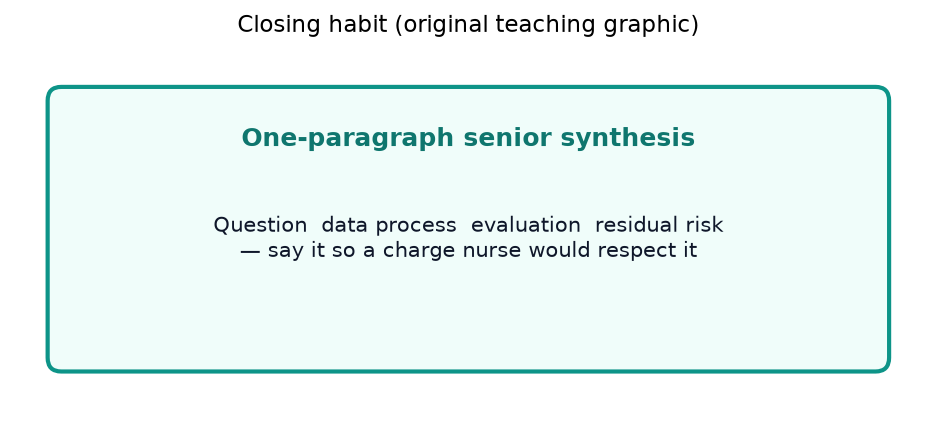
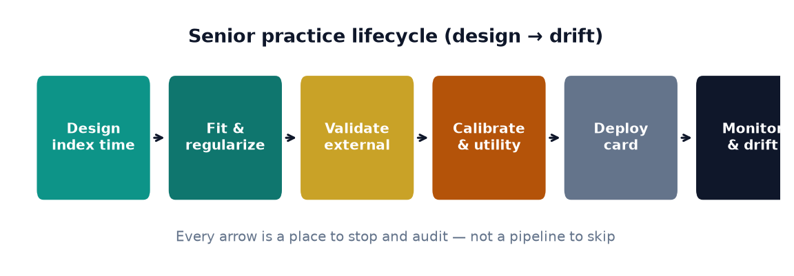
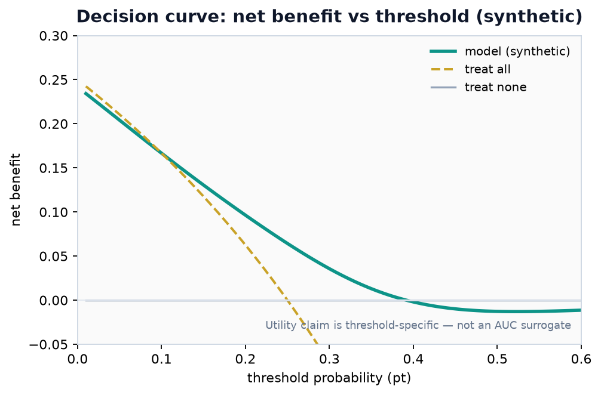
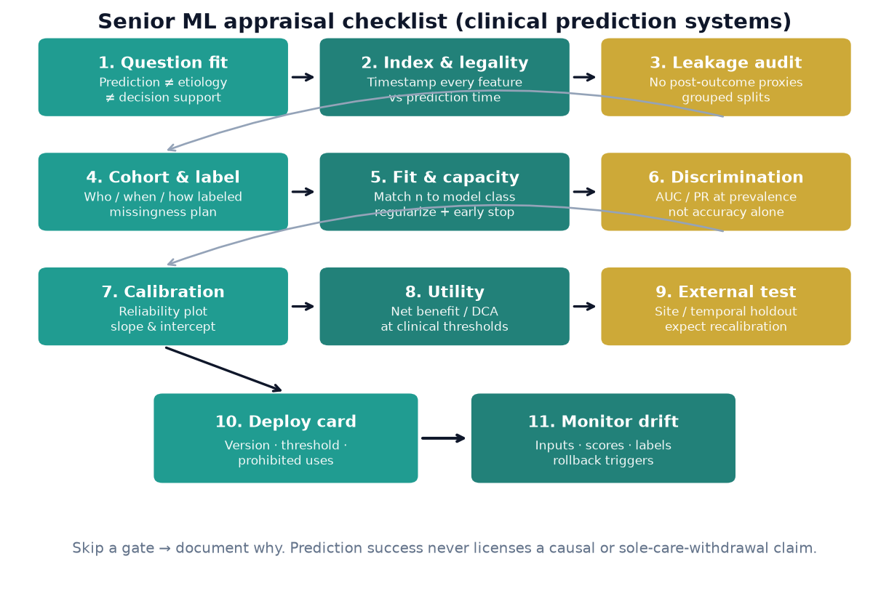

# Chapter 17. Closing Synthesis: Senior Practice in Clinical Neurology and Epidemiology

## Opening

*One-paragraph senior synthesis habit.*

*Three poles of model evaluation.*

You finish a model paper and a methods appendix in one sitting. Synthesis means you can state the decision, the data generation process, the evaluation design, and the residual risks in one paragraph a charge nurse would respect.

*Teaching scorecard for model appraisal.*

*Closing reminder: ranking, reliability, and decision value are distinct claims.*

*Lifecycle habit: design index time → fit → external validate → assess calibration and utility → complete governed prospective evaluation → authorize and monitor any release. A model card documents the claim; it does not authorize use.*

*Net benefit is threshold-specific. A model can dominate treat-all/none on a range and still fail outside it.*

*Figure — Eleven-gate appraisal flow for clinical prediction systems: question fit → index/feature eligibility → leakage → cohort/label → fit/capacity → discrimination → calibration → utility → external test → governed release decision and model card → drift monitor. Adapt the evidence plan to the claim and document the responsible authority; a model card or prediction success never licenses a causal claim, deployment, or sole-trigger withdrawal of care.*

The book has moved from describing data to deploying systems, but the through-argument was never really about algorithms. For a neurologist–epidemiologist, the machinery of gradient descent or attention is the tractable part; the demanding part is the reasoning that surrounds a model — what question it answers, when it is permitted to see each variable, and whether its numbers mean what a clinician assumes they mean. Senior competence is the habit of interrogating those surroundings before trusting any output. This chapter gathers the disciplines that outlived the chapters that introduced them, then walks a single clinical prediction study from raw data to post-deployment monitoring so the abstractions have somewhere concrete to land.

## Disciplines that recur across every chapter

**Index time and feature eligibility.** Every supervised problem carries a moment at which the prediction is made. A variable is eligible for that prediction only if it is knowable, for that patient, at or before that moment. The recurring failure is the retrospectively assembled table in which columns drawn from different points in a hospitalization sit side by side with no timestamp, so that a model quietly learns from the future. Fixing index time first — before touching a model — is one of the most protective acts in applied clinical ML.

**Leakage is the insidious cousin.** Beyond after-the-fact features, leakage hides in proxies of the outcome (a treatment ordered because the diagnosis was already obvious) and in contaminated splits (slices from one patient, or one scanner, appearing in both training and test). The defenses are grouped splits by patient and often by site, and suspicion whenever performance looks too good.

**Discrimination is not calibration, and neither is utility.** Under the usual tie convention, AUC is the probability that a random case receives a higher score than a random non-case plus half the probability of a tie. It says nothing about whether a predicted 0.20 corresponds to a 20% event rate. A model with lower AUC can still have higher net benefit for a specified decision if its probabilities and operating threshold better match that setting; this is an empirical, threshold-dependent comparison rather than a general ordering.

**Prevalence, imbalance, and predictive value.** If sensitivity and specificity were fixed, positive predictive value would still change with the base rate; in practice, case spectrum can change sensitivity and specificity too. Case enrichment, outcome-dependent sampling, or class rebalancing changes the relationship between training scores and target-population probabilities unless the sampling design is accounted for. Re-estimate or appropriately correct calibration in representative target data rather than assuming a resampled model’s probabilities transfer.

**External validation and dataset shift.** Internal cross-validation estimates reproducibility, not transportability. Scanners, coding systems (an ICD transition, a local phenotype definition), and case mix all differ between sites, so a model can be internally excellent and externally useless. Geographic and temporal external validation, not a tighter internal fold, is the real examination.

**Label noise.** In clinical work the recorded label is a measurement — a chart-review phenotype, billing code, or mRS obtained by telephone — rather than the latent clinical construct itself. Label error can bias learned patterns and measured performance, but no universal performance ceiling follows without specifying the target, error mechanism, and reference-standard process.

**Prediction is not causation.** A model that predicts an outcome well says nothing about what happens if one intervenes. A DAG makes the distinction explicit, separating confounders from mediators and colliders, and warns against reading a predictor’s coefficient as a treatment effect or adjusting for a collider and manufacturing bias.

**Reproducibility and governance.** A model is not a result; it is an artifact with a version, a training set, a preprocessing pipeline, and a decision threshold. Unless each is recorded, the model can be neither trusted nor safely retired.

## One study, from data to drift: A Synthetic Case Study

Consider a synthetic research proposal to estimate the probability of poor functional outcome — 90-day modified Rankin Scale 3–6 — for anterior-circulation large-vessel-occlusion patients treated with endovascular thrombectomy. The first intended use is evaluation of a prognostic model, not active family counseling and never a directive about treatment or withdrawal of life-sustaining therapy. Any later clinical use would be a separate, prospectively governed question. The estimand is prognostic, not causal.

### 1. Population and Index Time
The synthetic cohort includes patients who completed thrombectomy at a comprehensive stroke center. Index time is set at 24 hours after the procedure, so the research model may use the early trajectory. The prespecified predictor set excludes everything first known after hour 24 — day-5 exams, discharge disposition, and rehabilitation notes. A proposal to use any of those variables would define a different prediction time and require a different model and intended-use statement.

### 2. Features
Candidate inputs for this synthetic design include age, pre-stroke mRS, admission NIHSS, baseline ASPECTS, occlusion site, onset-to-recanalization time, final reperfusion grade, the 24-hour NIHSS, and 24-hour imaging for hemorrhage. The dangerous temptations are specific: withdrawal-of-life-sustaining-therapy status is downstream of a poor-prognosis expectation and a determinant of death, so admitting it as a feature — or letting deaths after withdrawal dominate the label without examining that care pathway — closes a self-fulfilling loop. Reperfusion grade read by the treating operator may embed optimism, a quiet source of measurement noise.

### 3. Label
The synthetic protocol plans a structured 90-day mRS telephone interview, which has inter-rater variability. Missingness may be informative: people with severe disability can be harder to interview, while death status may be available through a separate ascertainment source. Prespecify the source hierarchy, assessor training and blinding, how death is coded, and sensitivity analyses for missing outcomes; those choices bound what the model can honestly claim.

### 4. Model Selection and Tuning
Use penalized logistic regression (elastic net) as a transparent baseline with relatively few degrees of freedom, and compare it with a prespecified nonlinear challenger such as gradient-boosted trees. Coefficients are not automatically clinically interpretable when predictors are transformed or correlated, and logistic output is not a guarantee of calibration. Evaluate calibration and, when justified, estimate a recalibration function in data separate from final testing. Model capacity should be matched to outcome count, predictor dimension, label reliability, pretraining, and validation precision rather than to a universal sample-size rule. Report discrimination and calibration together — including a calibration plot with slope and intercept — plus decision-analytic measures over a clinically justified threshold range. The baseline form is: $$ P(Y=1\mid X) = \frac{1}{1 + e^{-(\beta_0 + \beta^\top X)}} $$ where the regularization path for $\lambda$ is chosen without exposing the final test set.

### 5. Evaluation Strategy
Split grouped by patient, then split temporally (train on earlier years, test on later), then validate externally at partner centers with different CT scanners, different ASPECTS-reading habits, and a different case mix of late-window and higher-baseline-disability patients. Assess whether discrimination and calibration change on transport. If recalibration is justified, estimate and evaluate it in data separate from the untouched final evaluation set rather than assuming the original model or a correction travels intact.

### 6. Deployment and Monitoring
Do not infer deployment readiness from retrospective performance. A candidate release packet would state population, index time, features, calibration, intended use, and prohibited uses — chief among them any use of the score as a sole trigger for withdrawal of care. It would version the preprocessing pipeline to detect train–serve skew and define monitoring for input integrity, prediction distributions, workflow effects, and, as outcomes mature, calibration and clinically important errors. A new thrombectomy device, expanded treatment window, coding change, or replaced scanner should trigger investigation under change control, not silent automatic retraining. Any live evaluation needs an accountable owner, stop rules, a safe fallback, and a rollback path.

## Synthetic Teaching Table: Evaluation and Release Checklist

| Phase | Key Question | Method of Verification | Potential Failure Mode |
|---|---|---|---|
| **Design** | Is the index time strictly defined? | Map every feature timestamp against the index time. | Looking into the future (leakage). |
| **Data** | Are labels uniformly adjudicated? | Blinded chart review or standard interview tools. | Label noise masking true signal. |
| **Model** | Is it well-calibrated? | Calibration plot (intercept & slope). | High discrimination but clinically misleading risk estimates. |
| **Validate** | Does it transport? | External geographical & temporal testing. | Overfitting to local site characteristics or specific scanners. |
| **Governed release** | Who authorizes it, and who is watching it? | Recorded authorization, risk-linked monitoring, accountable review, and rollback tests. | Silent failure as clinical practice, coding, or software changes. |

## From Evidence to Clinical Operation: A Bounded Capstone

This section is an educational framework, not patient-specific guidance, legal advice, a regulatory determination, or authorization to deploy software. Every scenario remains synthetic. Real decisions require the responsible institutional, privacy, security, research, quality, clinical, legal, and regulatory authorities. Because those requirements change, every operational record should name its jurisdiction and the date on which source guidance was checked.

### Freeze Intended Use Before Naming the Product

“A stroke AI model” is not a sufficiently specified object. Write an intended-use card before selecting a regulatory label or evidence plan:

| Field | Question the record must answer |
|---|---|
| Function | What does this exact software version compute or present? |
| User | Clinician, researcher, operational analyst, patient, or caregiver? |
| Population and setting | Which patients, sites, devices, languages, and care phase? |
| Inputs and timing | Which data are used, and what is the index time? |
| Output | Risk estimate, ranked options, alert, image interpretation, draft text, or directive? |
| Decision and consequence | What action could change because the output is seen? |
| Authority | Who may act, override, pause, investigate, and retire it? |
| Prohibited use | Which populations, decisions, and automation paths are out of scope? |
| Status label | Jurisdiction, assessment date, evidence stage, and responsible reviewer? |

Regulatory status is function-specific, jurisdiction-specific, version-specific, and time-specific. A useful label therefore looks like “United States; status reviewed against sources current 2026-07-30; confirm with the responsible regulatory and legal teams,” not simply “clinical,” “research,” or “FDA compliant.”

In the United States, the [FDA Clinical Decision Support Software guidance issued January 29, 2026, including its non-device and device examples](https://www.fda.gov/media/109618/download) describes four criteria that a health-care-professional CDS function must meet to be excluded from the device definition under the cited Cures Act provision: it is not intended to acquire, process, or analyze a medical image, a signal from an in vitro diagnostic device, or a pattern or signal from a signal-acquisition system; it is intended to display, analyze, or print patient medical information or other medical information; it is intended to support or provide recommendations to a health care professional about prevention, diagnosis, or treatment of a disease or condition; and it is intended to enable that professional to independently review the basis, rather than rely primarily on the recommendation, when making an individual-patient decision. The examples include evidence-based order-set options and matching patient information to current reference information, but only when the complete function meets all applicable criteria. An image classifier, signal-analysis function, directive, or patient-facing function cannot be relabeled non-device CDS merely by adding a human-review sentence. The guidance states FDA’s current, nonbinding interpretation; it is not a substitute for a product-specific determination.

Education, research, quality improvement, clinical operation, and medical-device status are related but different axes:

- An educational demonstration can use synthetic data and have no patient-specific output.
- Research asks a systematic question under the applicable human-subjects, privacy, data-use, and institutional review processes.
- Quality improvement usually targets a local care process under local governance; calling work “QI” does not by itself settle research oversight, privacy duties, or product regulation.
- Clinical operation places an output inside a real decision pathway and therefore introduces workflow, safety, accountability, availability, and monitoring obligations.
- Device status depends on the software function, intended use, users, inputs, outputs, and applicable law—not the filename, funding source, or whether the first evaluation is called a pilot.

The project team should not self-certify these boundaries; obtain and record determinations from the authorized institutional and regulatory functions. One artifact can move across these axes as its use changes. Reclassification and a new evidence review should occur before, not after, that change.

### Match the Evidence to the Claim and Consequence

Later evidence cannot repair an earlier category error. A polished impact study does not validate a corrupted label, and excellent AUROC does not prove a workflow helps patients.

| Evidence layer | Question | Illustrative evidence | What it cannot establish alone |
|---|---|---|---|
| Technical verification | Does the implemented system match its specification? | Unit and integration tests, locked preprocessing, reproducible build, input validation, latency and failure testing | Clinical validity or benefit |
| Analytical performance | Does it measure or predict the stated target in defined data? | Reference-standard process, leakage audit, discrimination, calibration, uncertainty, subgroup and error analysis | Transportability or workflow safety |
| Clinical validity and transportability | Does the relationship hold in intended populations, sites, devices, and time periods? | Temporal and geographic evaluation, representative test data, recalibration analysis | That showing the output improves care |
| Human and workflow performance | Can intended users understand and use it safely in the real environment? | Usability studies, simulated failures, silent evaluation, alert burden, override and discordance analysis | Patient or system benefit |
| Clinical or operational impact | Does use change decisions, processes, outcomes, harms, equity, or resource use as intended? | Prospective comparative study with prespecified endpoints and adverse-effect capture | Performance after unreviewed changes |

The joint [FDA, Health Canada, and MHRA Good Machine Learning Practice principles](https://www.fda.gov/medical-devices/software-medical-device-samd/good-machine-learning-practice-medical-device-development-guiding-principles) reinforce a total-product-lifecycle view: representative data, independent test sets, clinically relevant performance, attention to the human–AI team, clear user information, deployed monitoring, and controlled retraining risks. These principles guide thinking; they do not certify a particular system.

Select reporting guidance by the claim and stage. [TRIPOD+AI](https://www.bmj.com/content/385/bmj-2023-078378) addresses prediction-model studies. The [2024 CLAIM update](https://doi.org/10.1148/ryai.240300) addresses applicable medical-imaging AI model-development and evaluation reports; its stated scope does not extend to every imaging-AI study design, including radiomics or imaging-biomarker research. [DECIDE-AI](https://www.nature.com/articles/s41591-022-01772-9) addresses early live clinical evaluation, including human factors, while [CONSORT-AI](https://www.nature.com/articles/s41591-020-1034-x) extends randomized-trial reporting for AI interventions. Reporting completeness is necessary for appraisal but is not evidence by itself.

### Cross the Prospective Boundary Deliberately

A bounded progression for a consequential clinical function might be:

1. **Technical verification:** freeze the candidate model, preprocessing, user interface, dependencies, and data contracts; test malformed, missing, delayed, and adversarial inputs.
2. **Retrospective evaluation:** use data separated by patient and time, then evaluate at sites or periods that reflect intended use. Keep development and final evaluation roles separate.
3. **Prospective silent evaluation:** under the required approvals and data protections, run the locked system on live data without exposing outputs to care teams. Measure data availability, mapping failures, latency, uptime, case mix, output distribution, and delayed outcomes.
4. **Limited live evaluation:** after the required approvals, expose the output to trained users within a defined scope, with rapid support, stop rules, fallback, and observation of human–AI interaction.
5. **Comparative impact evaluation:** when the claim is that use improves decisions, workflow, equity, resource use, or health outcomes, choose a design capable of testing that claim and capture unintended effects.

Silent evaluation is valuable but bounded. It can reveal broken feeds, train–serve skew, latency, and prospective calibration without influencing care. It cannot demonstrate automation bias, alert fatigue, clinical benefit, or the safety of a displayed recommendation. Conversely, a small live pilot can uncover interaction failures but may be too imprecise to establish rare harms or impact. Advancement is a documented decision, not an automatic reward for passing the prior stage.

For the synthetic thrombectomy model, even sound external validation would not authorize immediate use in family counseling. Showing a poor-prognosis estimate may alter treatment intensity, rehabilitation referral, documentation, and withdrawal discussions—the very pathways that help determine the outcome. A responsible sequence would first examine silent prospective performance and data availability, then study how clinicians and families interpret the output under explicit prohibited-use rules. An impact design would need to measure discordance, decision changes, workflow burden, subgroup effects, and possible self-fulfilling feedback, not just another AUC.

### Treat the Human–AI Team as the Unit of Evaluation

“Human in the loop” is not a safety mechanism unless authority, information, time, and accountability make meaningful review possible. Automation bias can produce errors of commission—accepting an incorrect recommendation—or omission—failing to act because the system did not alert. Alert fatigue, anchoring, deskilling, and deference can coexist with users who know the model is imperfect.

Evaluate the interface and workflow under realistic conditions:

- show the intended use, model version, data timestamp, missing or out-of-range inputs, and relevant uncertainty;
- provide the basis and limitations at the moment of use, not in a remote document;
- test routine, discordant, ambiguous, unavailable, stale-data, and degraded-mode cases;
- include intended user groups, experience levels, accessibility needs, interruptions, handoffs, and after-hours conditions;
- record when users see, accept, reject, or cannot act on output, while avoiding surveillance metrics that punish justified override;
- define who owns the final decision, who can suspend the system, and how a user reports a suspected unsafe output.

Compare the human–AI team with the relevant human and workflow baseline. A model can improve standalone accuracy while worsening the combined system through distraction, delay, selective reliance, or inequitable access.

### Privacy Is a Data-Lifecycle Property

Draw the data flow from source to archive: identifiers, derived features, prompts, embeddings, outputs, logs, backups, vendor systems, human review queues, and research exports. For each transition, record purpose, authority, minimum necessary data, access, retention, deletion, secondary use, and incident path. De-identification reduces some disclosure risks but does not make arbitrary reuse safe, and a live clinical function may need identifiable information to perform its intended task.

For U.S. regulated entities, the [HHS summary of the HIPAA Security Rule](https://www.hhs.gov/hipaa/for-professionals/security/laws-regulations/index.html) emphasizes confidentiality, integrity, availability, risk analysis, incident procedures, contingency planning, and appropriate agreements with business associates. Other jurisdictions and institutions impose different or additional requirements. Before any external model or service handles protected data, verify the applicable contract, data-use authority, location, retention, training-use terms, subcontractors, auditability, and breach process. Prompt and retrieval logs deserve the same review as source records because they can reproduce protected content.

Privacy evaluation also asks who is absent or overexposed. Consent or authorization may not cure biased sampling; aggressive de-identification can remove clinically important context; and rare combinations can remain linkable. Measure privacy controls and utility loss rather than treating “de-identified” as a binary badge.

### Cybersecurity and Availability Are Clinical Safety Concerns

A threat model should name assets, trust boundaries, users, dependencies, and plausible harms. Relevant paths include stolen credentials, unauthorized privilege, tampered model or configuration artifacts, poisoned training or retrieval data, prompt injection, evasion inputs, model extraction, vulnerable dependencies, log disclosure, denial of service, and silent corruption of an upstream interface.

Controls are selected from the risk, not copied as a generic list: strong authentication, managed identities, and least privilege; separation of development and production; encryption and key management; signed, versioned artifacts; dependency inventory and software bill of materials; input and output validation; protected audit logs; vulnerability intake and patching; adversarial and recovery testing; and vendor responsibilities. For device functions in the United States, the [FDA February 2026 medical-device cybersecurity guidance](https://www.fda.gov/regulatory-information/search-fda-guidance-documents/cybersecurity-medical-devices-quality-management-system-considerations-and-content-premarket) is a current official source; non-device systems still require risk-appropriate security and institutional controls.

Availability must be designed, not assumed. Specify what users see when the model, network, source feed, identity provider, terminology service, or outcome store is unavailable or stale. Decide whether a risk-specific failure should block, defer, degrade, or fall back to the pre-AI workflow. Test queue recovery, duplicate messages, clock skew, delayed inputs, partial site outages, backup restoration, and the ability to continue care without the model. “Fail open” and “fail closed” have no universally safe meaning in clinical workflows; the consequence of each state determines the design.

### Governance and Change Control Keep Evidence Attached to the Artifact

The voluntary [NIST AI Risk Management Framework 1.0](https://www.nist.gov/publications/artificial-intelligence-risk-management-framework-ai-rmf-10) organizes work through Govern, Map, Measure, and Manage. Applied here: assign accountability and policy; map people, context, intended benefits, and harms; measure technical, clinical, human, equity, privacy, and security performance; then manage prioritized risks throughout use.

A release record should bind together:

- intended and prohibited uses, users, sites, jurisdiction, and assessment date;
- model, data, preprocessing, prompt, retrieval corpus, interface, dependency, and configuration versions;
- evidence by layer, known limitations, subgroup uncertainty, unresolved questions, and approval scope;
- accountable clinical, operational, technical, privacy, security, quality, and regulatory owners;
- training, support, monitoring, incident, rollback, and retirement plans;
- the exact change types permitted without, and requiring, new review.

Every modification is an evidence question. A new threshold, retrained model, changed label, prompt, foundation-model version, scanner, EHR mapping, retrieval corpus, UI, or user population can alter performance or risk. Compare the proposed version with the released version on locked regression cases and the intended populations; repeat prospective evaluation when the change affects workflow or claim. Do not let a vendor’s automatic model update, API alias, or silent prompt revision bypass local change control. For an authorized AI-enabled device in the United States, FDA’s [August 2025 guidance on predetermined change control plans](https://www.fda.gov/regulatory-information/search-fda-guidance-documents/marketing-submission-recommendations-predetermined-change-control-plan-artificial-intelligence) describes a specific regulatory mechanism; a local update policy is not itself such an authorization.

### Monitoring Must Lead to Action

Monitoring begins with a baseline and an owner for each signal:

| Domain | Illustrative signals | Question after an alert |
|---|---|---|
| Availability and integrity | Uptime, latency, missing fields, stale timestamps, interface errors | Is the system seeing complete, current data? |
| Inputs and outputs | Case mix, device/site mix, out-of-range values, score or alert distribution | Is this expected variation, a pipeline fault, or population shift? |
| Statistical performance | Error types, calibration, discrimination, uncertainty as labels mature | Does the released claim still hold, and with what precision? |
| Equity | Missingness, performance, access, override, and burden across relevant groups | Is a group receiving worse information or workflow? |
| Human and workflow | Exposure, acknowledgement, override, time, alert burden, escalation | Is the human–AI team behaving as designed? |
| Safety and impact | Near misses, delayed care, decision changes, intended and unintended outcomes | Could the system have contributed to harm or displaced benefit? |
| Privacy and security | Access anomalies, data egress, tampering, vulnerabilities, failed recovery | Is containment or notification assessment required? |

Thresholds should be prespecified from baseline variation, measurement error, outcome lag, risk tolerance, and operational capacity. A drift statistic is an investigation trigger, not a diagnosis and never automatic permission to retrain.

An incident path should be rehearsed: detect and preserve evidence; triage clinical, privacy, security, and operational severity; contain or suspend the affected function; provide the safe fallback; identify versions, sites, users, and potentially affected records; communicate through the required channels; remediate and verify; decide whether revalidation or external reporting is required; and document the post-incident review. The team needs authority to stop the system before certainty about causation. It also needs discipline not to erase logs, silently patch, or resume from a new version without review.

### Retirement Is Part of the Lifecycle

Retire a function when its intended use disappears, ownership or support ends, dependencies become unsafe, evidence no longer matches the population or standard of care, monitoring cannot be sustained, harms exceed benefits, inequity remains unmitigated, or a replacement makes the old pathway riskier.

A retirement plan removes the output from workflow, communicates the effective date and fallback, disables interfaces and scheduled jobs, preserves the released artifact and required records, resolves queued outputs, revokes credentials, updates training and procedures, and monitors the transition for orphaned dependencies or shadow use. Archiving a model is not permission to reuse it later: reactivation requires a current intended-use, evidence, security, and governance review. Safe retirement is the final proof that the organization—not the model—controls the lifecycle.

## What the discipline amounts to

The recurring lesson is not that models are dangerous or magical, but that a prediction is a claim conditioned on a time, a population, and a label, and that most clinical harm follows from forgetting one of those conditions. The competent researcher treats every number as provisional, states plainly what would falsify it, and keeps prediction and intervention in separate mental columns. If the book leaves a single reflex, let it be the pause before belief: what was known, and when; to whom this actually applies; and what, exactly, is being counted.

## Full appraisal gate map (aligned to the flowchart)

| # | Gate | Pass criterion | Fail / stop rule |
|---|------|----------------|------------------|
| 1 | Question fit | Claim typed as prediction, etiology, or decision support | Marketing language blurs prediction with “what to do” |
| 2 | Index & eligibility | Every feature timestamped ≤ index time | Any post-outcome or post-decision column |
| 3 | Leakage audit | Patient- (and often site-) grouped splits; no outcome proxies | Random row split on longitudinal rows |
| 4 | Cohort & label | Inclusion, label source, missingness plan written | Convenience sample with silent label drift |
| 5 | Fit & capacity | Capacity-control and checkpoint-selection plan justified | Capacity chosen without stability or sensitivity checks |
| 6 | Discrimination | AUC with uncertainty and, when useful, precision–recall metrics in the target case spectrum | Accuracy alone on imbalanced labels |
| 7 | Calibration | Reliability plot; slope/intercept in target mix | “AUC is high” used as probability honesty |
| 8 | Utility | Net benefit / decision curve over clinical thresholds | Threshold chosen only to maximize Youden on test |
| 9 | External test | Geographic or temporal holdout; assess recalibration need | Internal CV sold as transportability |
| 10 | Deploy card | Version, threshold, intended and prohibited uses | Score used as sole withdrawal trigger |
| 11 | Monitor drift | Owner, metrics, rollback triggers | Ship-and-forget after a conference abstract |
