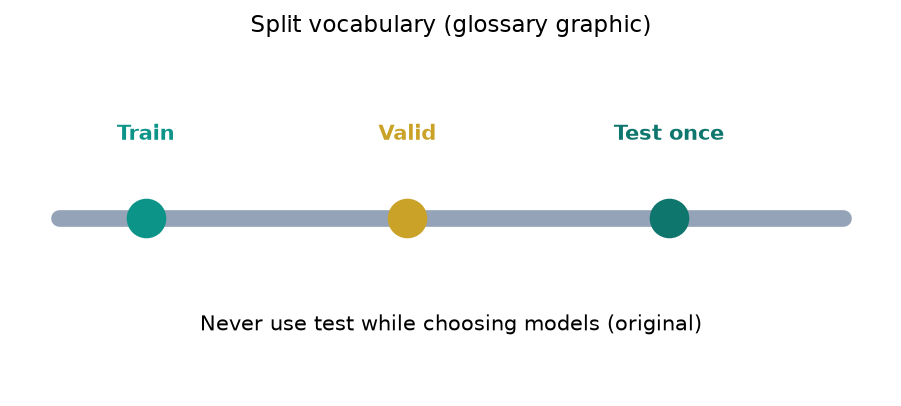
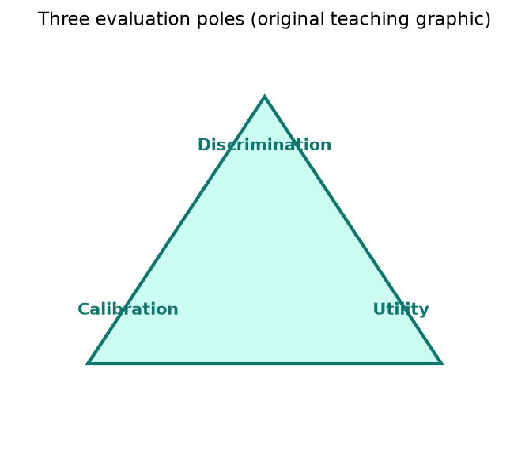
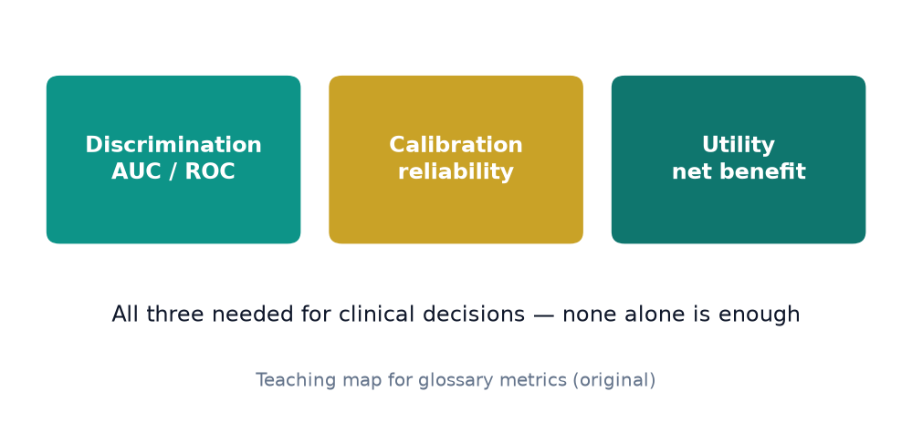
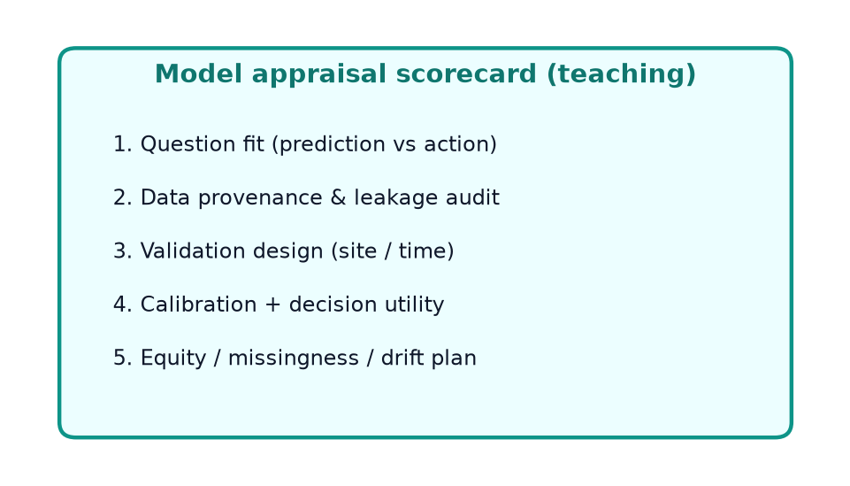
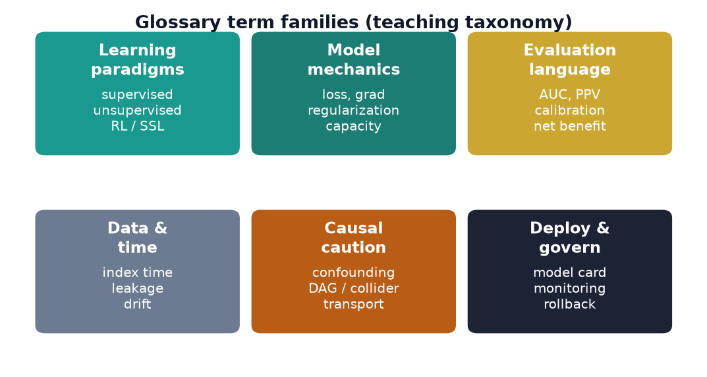
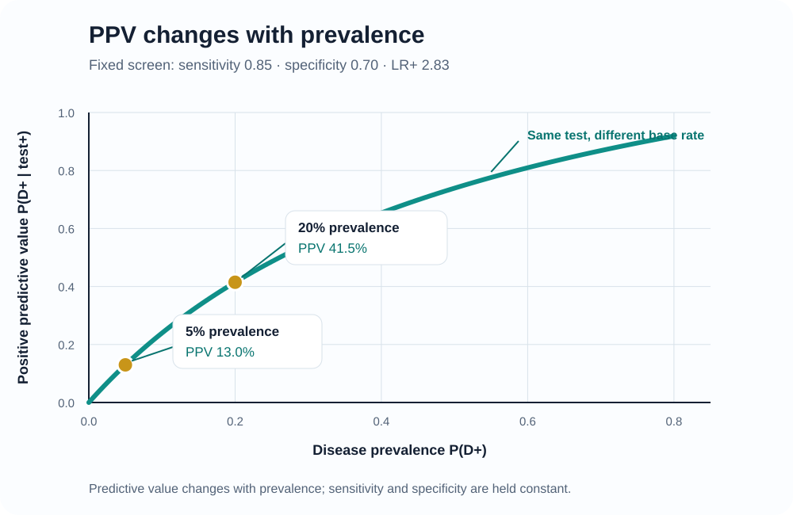
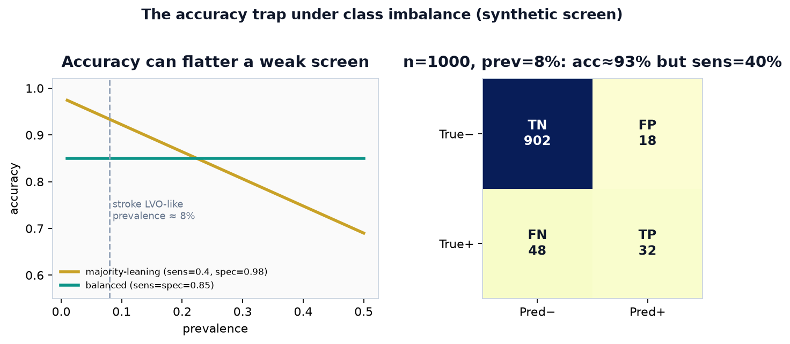
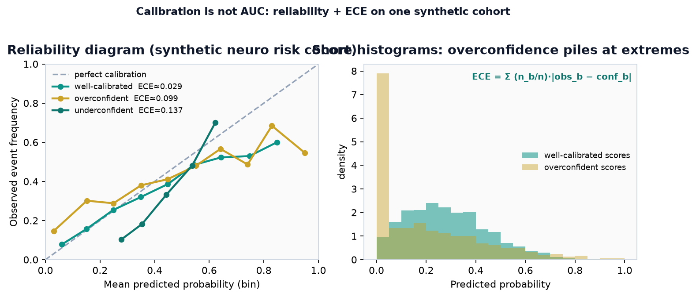

# Chapter 18. Selected Glossary

## Opening

*Train / validation / test vocabulary.*

*Discrimination, calibration, and utility.*

*Teaching map: AUC ranks; calibration checks probability honesty; utility asks whether acting on a threshold helps.*

*Teaching orientation for metrics and appraisal terms.*

*Six term families: paradigms, mechanics, evaluation, data/time, causal caution, deploy/govern.*

<figure class="teaching-figure ppv-responsive-figure">
  <a class="figure-zoom" href="../assets/figures/ml_fig_ppv_prevalence.svg" title="Open full-resolution figure">
    <picture>
      <source media="(max-width: 600px)" srcset="../assets/figures/ml_fig_ppv_prevalence_mobile.svg" width="600" height="900">
      
    </picture>
  </a>
  <figcaption>If sensitivity and specificity were fixed, PPV would fall with prevalence; LR+ is algebraically prevalence-independent but may still change with case spectrum, measurement, or site shift.Open full resolution ↗</figcaption>
</figure>

*Accuracy can look excellent despite poor sensitivity when negatives dominate — report sensitivity, specificity, predictive values, and uncertainty at the intended threshold.*

*Figure — Reliability diagram on one synthetic low-prevalence risk cohort. Points on the diagonal are honest probabilities; overconfident models bow above/below the line and inflate expected calibration error (ECE = Σ (n_b/n)·|obs_b − conf_b|). Score histograms (right) show overconfidence piling mass at the extremes. Calibration is a distinct claim from AUC.*

Journal club language collapses when people use ‘AI,’ ‘algorithm,’ and ‘model’ interchangeably. The glossary is a shared lexicon for stroke services that want precise disagreement rather than vague awe.

Activation function. A transform applied to a unit’s affine input. Without nonlinear activations between layers, a stack of affine layers collapses to a single affine map.

Apriori algorithm. A method for mining frequent itemsets that prunes the search using the property that any superset of an infrequent set is also infrequent.

Association rule. An “if X then Y” pattern mined from co-occurrence data, judged by support (how often X and Y appear together) and confidence (how often Y appears in transactions that contain X).

Attention. A mechanism that lets a model weight the relevance of other elements when representing a given element, so context is aggregated by learned importance rather than fixed position.

AUC. The area under the ROC curve; equivalently, P(score_positive > score_negative) + ½P(tie) under the usual tie convention. It summarizes discrimination and is indifferent to calibration.

Autoencoder. A neural network trained to reconstruct its input, often using a bottleneck or another constraint such as sparsity, noise, or regularization to learn a representation. Reconstruction does not guarantee that the representation is clinically meaningful.

Backpropagation. The reverse-mode application of the chain rule that computes a loss’s gradient with respect to every network parameter, enabling gradient-based training.

Batch normalization. A layer that uses mini-batch statistics during training to normalize activations, followed by learned scale and shift; at inference it typically uses accumulated statistics. It can aid optimization, but effects on speed, regularization, and transportability depend on batch and data structure.

Bayes’ theorem. The identity P(A|B) = P(B|A)·P(A)/P(B), which updates a prior belief into a posterior after observing evidence.

Bellman equation. The recursive relation expressing the value of a state as the immediate reward plus the discounted value of successor states; the basis of most reinforcement-learning updates.

BERT. A transformer encoder pretrained by predicting masked tokens, producing bidirectional contextual representations that are fine-tuned for downstream language tasks.

Bias–variance tradeoff. Under squared-error prediction, expected test error can be decomposed into squared bias, variance, and irreducible noise. Related intuition is used more broadly, but the exact decomposition and trade-off depend on the loss and estimator.

Bootstrap. Resampling a dataset with replacement to approximate the sampling distribution of a statistic and obtain empirical confidence intervals.

Calibration. Agreement between predicted probabilities and observed frequencies; a model is calibrated if, among cases assigned probability p, about a fraction p actually experience the event.

Class imbalance. A disparity in class frequencies that can make aggregate accuracy misleading and leave minority-class performance poorly estimated. Resampling, weighting, loss choice, thresholding, and better data collection address different parts of the problem and can change calibration.

CNN. A convolutional neural network that shares small learnable filters across spatial positions, giving translation-equivariant feature extraction well suited to images and signals.

Concept drift. A change over time in \(P(Y\mid X)\), the relationship between features and the target. Covariate-shift and label-shift analyses usually add assumptions such as stable \(P(Y\mid X)\) or stable \(P(X\mid Y)\), respectively; these mechanisms can overlap in real deployments.

Confounding. Distortion of an exposure–outcome association by a variable that influences both; unadjusted, it makes a non-causal association look causal.

Confusion matrix. A table cross-tabulating predicted against actual classes, from which sensitivity, specificity, precision, and related metrics are computed.

Contrastive learning. A family of representation-learning objectives that makes specified positive pairs similar relative to other examples; some methods use explicit negative pairs, while negative-free variants prevent collapse by other mechanisms.

Convolution. The sliding weighted sum of a filter over an input that produces a feature map; the core operation of CNNs.

Cross-validation. Partitioning data into training and held-out folds, often repeatedly, to estimate internal out-of-sample performance under the chosen split design. It does not by itself demonstrate transportability to a new site, time, or population.

Curse of dimensionality. The tendency of data to become sparse and distances to lose contrast as the number of features grows, undermining density estimation and nearest-neighbor methods.

DAG. A directed acyclic graph encoding assumed causal relationships; used to identify confounders, mediators, and colliders and to choose a valid adjustment set.

DBSCAN. A density-based clustering algorithm that groups closely packed points and labels sparse points as noise, discovering arbitrarily shaped clusters without a preset cluster count.

Decision tree. A model that recursively splits the feature space on threshold rules, yielding interpretable but high-variance piecewise-constant predictions.

Diffusion model. A generative model that learns to reverse a gradual noising process, synthesizing samples by denoising from random noise in successive steps.

Dropout. A training-time regularizer that randomly masks activations or weights according to a specified probability, with corresponding scaling. It is sometimes interpreted as implicit model averaging, but is not equivalent to training an arbitrary independent ensemble.

Elastic net. A regularized regression combining L1 and L2 penalties, giving LASSO-style sparsity while handling correlated predictors more gracefully.

EM algorithm. An iterative maximum-likelihood procedure for latent-variable models that alternates estimating the latent distribution (E-step) with updating parameters (M-step); used for mixtures and HMMs.

Embedding. A vector representation of an item, token, or observation. Its geometry reflects relationships induced by the training objective and data; proximity need not mean semantic equivalence or causal similarity.

Ensemble. A combination of model outputs by averaging, voting, stacking, or another rule. It can reduce variance when component errors are sufficiently diverse, but does not guarantee improvement over the best component and can preserve shared bias.

Entropy. The expected uncertainty of a distribution, −Σ p·log p; it is maximal for uniform distributions and zero for deterministic ones.

Epoch. One full pass of the training algorithm over the entire training dataset.

External validation. Evaluation on data meaningfully separated from development by site, time, setting, or population to assess a specified form of transportability. One external dataset does not establish universal generalizability.

F1 score. The harmonic mean of precision and recall, summarizing both in a single value that penalizes large imbalances between them.

Feature leakage. Use of information unavailable at the intended prediction time, or contamination between development and evaluation. It can inflate measured performance and make the resulting claim invalid even if some leaked proxy remains available in deployment.

FID. Fréchet Inception Distance; compares the means and covariances of Inception-feature distributions for reference and generated images. Lower values indicate closer agreement under that feature/Gaussian approximation, not necessarily greater clinical realism, diversity, or utility.

Fine-tuning. Continuing training of a pretrained model on a smaller task-specific dataset so its general representations adapt to the new objective.

GAN. A generative adversarial network whose generator and discriminator optimize opposing objectives so that, ideally, generated samples become difficult for the fitted discriminator to distinguish from reference data. Training need not reach that equilibrium and can collapse or remain unstable.

Gaussian mixture model. A probabilistic clustering model representing data as a weighted sum of Gaussian components, typically fit by the EM algorithm.

GNN. A graph neural network that computes node representations by iteratively aggregating features from neighboring nodes along the graph’s edges.

Gradient descent. An optimization method that iteratively steps parameters in the direction opposite the loss gradient, scaled by a learning rate.

Hierarchical clustering. A family of methods that build a nested tree (dendrogram) of clusters by successively merging or splitting groups, without committing to a cluster count in advance.

HMM. A hidden Markov model in which observations are generated by an unobserved Markov chain of states; inference recovers state probabilities or the most likely state path.

Hyperparameter. A configuration value set before training (such as learning rate or tree depth) rather than learned from data, usually tuned on validation performance.

Imputation. Filling in missing values with estimates so that incomplete records can be used; careless imputation can leak information or bias results if missingness is informative.

Index time. The moment at which a prediction is made; only information available at or before it is eligible for that prediction. Methodological eligibility is separate from legal or operational authorization to use the information.

Inductive bias. The set of assumptions a learning method uses to generalize beyond the training data, such as smoothness, locality, or sparsity.

K-means. A clustering algorithm that partitions points into k groups by alternately assigning each point to its nearest centroid and recomputing centroids to minimize within-cluster variance.

Kernel trick. Computing inner products in a high-dimensional feature space implicitly through a kernel function, enabling nonlinear decision boundaries without explicit mapping.

KL divergence. An asymmetric measure, Σ p·log(p/q), of how one distribution diverges from another; it is zero only when the two match and is not a true distance.

Knowledge distillation. Training a student model to mimic teacher outputs or representations, aiming to reduce serving cost. Performance retention and actual cost reductions depend on the student, data, loss, runtime, and hardware.

Label noise. Errors or inconsistencies in outcome labels—from coding, chart review, or rater disagreement—that can bias learned patterns, distort measured performance, and reduce validity; no universal numerical ceiling follows without a specified noise model and target.

LASSO. Linear regression with an L1 penalty that shrinks coefficients and can drive some exactly to zero, combining fitting with a form of feature selection whose result depends on the data, penalty, and predictor geometry.

Learning rate. The step-size multiplier in a gradient-based update. Values that are too large can destabilize optimization, while very small values can make progress impractically slow; the useful range depends on optimizer, scaling, schedule, and loss geometry.

Logistic regression. A binary-outcome model that maps a linear predictor through the logistic function to an estimated probability. Those probabilities are not guaranteed to be calibrated under misspecification, overfitting, or distribution shift, so calibration must be evaluated and, when necessary, updated.

LoRA. Low-rank adaptation; an efficient fine-tuning method that trains small low-rank weight updates while freezing the original model parameters.

Loss function. The objective quantifying the penalty for a prediction’s error, whose minimization defines training and whose choice encodes what “good” means.

LSTM. A long short-term memory recurrent network that uses gated memory cells to retain information over long sequences and mitigate vanishing gradients.

Markov decision process. A framework for sequential decision-making specified by states, actions, transition and reward distributions, and usually a horizon or discount factor. Under the Markov property, the next outcome distribution depends on the history only through the current state and action.

MCMC. Markov chain Monte Carlo; a family of algorithms that draw samples from a target distribution (often a Bayesian posterior) by simulating a Markov chain whose stationary distribution is that target.

MLE. Maximum likelihood estimation; choosing parameters that maximize the probability of the observed data under the model.

Naive Bayes. A probabilistic classifier applying Bayes’ theorem under the simplifying assumption that features are conditionally independent given the class.

Normalization. A family of transformations that rescale features or activations according to defined statistics. It can aid scale-sensitive optimization, but does not guarantee stability and may be unnecessary for scale-invariant methods; all fitted statistics must respect the data split.

One-hot encoding. Representing a categorical variable as a set of binary indicator columns, one per category, avoiding false ordinal structure.

Overfitting. Learning sample-specific patterns so that performance on relevant new data is worse than training performance would suggest. Capacity and regularization matter, but leakage, repeated model selection, small samples, and distribution mismatch can produce similar symptoms.

PageRank. A node-importance score equal to the stationary distribution of a random walk with teleportation, so that a node is important if important nodes link to it.

PCA. Principal component analysis; an orthogonal linear transform that projects data onto directions of greatest variance for dimensionality reduction and decorrelation.

PPO. Proximal Policy Optimization; a policy-gradient method whose clipped surrogate limits the incentive from some large probability-ratio changes. Clipping is not a hard bound on every policy change or a guarantee of monotonic improvement.

PPV. Positive predictive value; the probability that a case flagged positive truly has the condition, which depends strongly on prevalence as well as on sensitivity and specificity.

Precision. Among cases predicted positive, the fraction that are truly positive; equivalently, positive predictive value.

Pruning. Removing selected weights, channels, neurons, blocks, or tree branches to reduce stored or executed structure. Size, latency, and accuracy effects depend on the pruning rule, runtime, hardware, and any retraining.

Q-learning. A value-based reinforcement-learning algorithm that learns the expected return of state–action pairs and derives a policy by acting greedily with respect to it.

Quantization. Mapping weights or activations to lower-precision representations, such as int8. It can reduce storage or accelerate supported kernels, but accuracy, calibration, and latency effects require measurement on the final hardware and data.

RAG. Retrieval-augmented generation; providing a language model with documents fetched at query time so responses can use an external, updatable corpus. Retrieval and citations can support verification but do not guarantee grounded or correct output.

Random forest. An ensemble of decision trees trained on bootstrapped samples and random feature subsets, whose averaged predictions reduce the variance of individual trees.

Recall. Among truly positive cases, the fraction the model correctly identifies; equivalently, sensitivity.

Regularization. A penalty, constraint, data transformation, or stopping rule intended to control effective complexity or sensitivity. It can reduce overfitting but does not guarantee better generalization under distribution shift.

Reinforcement learning. Learning or evaluating policies for cumulative reward from sequential experience. Experience may be collected online or come from logged behavior; offline data do not remove coverage, confounding, or safety constraints.

ReLU. The rectified linear unit, f(x) = max(0, x); a piecewise-linear activation with derivative 1 on positive inputs and 0 on negative inputs. It can ease some saturation problems but can also produce inactive (“dead”) units.

Ridge regression. Linear regression with an L2 penalty that shrinks coefficients toward zero, stabilizing estimates under multicollinearity without eliminating variables.

ROC curve. The plot of true-positive rate against false-positive rate across all thresholds, tracing a classifier’s discrimination independent of any single cutoff.

Selection bias. Distortion caused by the mechanism determining inclusion, observation, or analysis—for example conditioning on a collider. A sample may be unrepresentative without bias for every estimand, and a representative-looking sample can still be selected in a biasing way.

Self-attention. Attention whose queries, keys, and values come from the same sequence. Dense bidirectional forms can connect every position, while causal or sparse masks restrict which positions may interact.

Self-supervised learning. Learning representations from unlabeled data by constructing surrogate tasks from the data’s own structure, such as predicting masked or future parts.

SHAP. An attribution method that assigns each feature a Shapley-value contribution to a specific prediction by averaging its marginal effect over feature orderings.

Silhouette. A cluster-quality score in [−1, 1] comparing each point’s average distance to its own cluster with its distance to the nearest other cluster; higher indicates better separation.

Softmax. A function that turns a vector of real scores into a probability distribution proportional to their exponentials, used for multiclass outputs.

Supervised learning. Learning a mapping from inputs to known outputs using labeled examples, as in regression and classification.

SVM. A support vector machine; a classifier that seeks the maximum-margin separating boundary, extendable to nonlinear boundaries through kernels.

TF–IDF. Term frequency–inverse document frequency; a weighting that emphasizes terms frequent in a document but rare across the corpus, downweighting ubiquitous words.

Transfer learning. Reusing parameters or representations learned on a source task for a target task. It may reduce target-data or compute needs, but mismatched sources can produce negative transfer.

Transformer. An architecture built from attention, feed-forward sublayers, residual connections, normalization, and position information. It processes sequence positions in parallel during many training regimes; effective long-range use depends on masking, context, data, and optimization.

t-SNE. A nonlinear embedding for visualization that preserves local neighborhoods by matching pairwise-similarity distributions across dimensions; global distances and cluster sizes should not be over-interpreted.

UMAP. A manifold-learning method for visualization and dimensionality reduction. Runtime and preservation of local or global relationships depend on data, metric, hyperparameters, initialization, and implementation; the display is not a literal metric map.

Unsupervised learning. Discovering structure — clusters, components, densities — in data without labeled outcomes.

VAE. A variational autoencoder; a generative latent-variable model trained to reconstruct inputs through a probabilistic bottleneck by maximizing an evidence lower bound.

Viterbi algorithm. A dynamic-programming procedure that finds the single most probable sequence of hidden states in an HMM given the observations.

## Quick metric map (teaching table)

| Metric | Answers | Common misuse |
|--------|---------|----------------|
| Accuracy | Overall correct rate | Can look high while minority-class errors are hidden |
| Sensitivity / recall | Catch true positives | Ignores false alarms |
| Specificity | Correct negatives | Ignores missed cases |
| PPV / precision | Of predicted positives, how many true? | Drifts with prevalence |
| AUC (ROC) | Ranking discrimination | Not calibration or utility |
| Brier / calibration plot | Probability reliability | Not the same as AUC |
| Net benefit | Decision value at a threshold | Requires a meaningful threshold range |

Synthetic reminder: identical sensitivity/specificity can yield very different PPV in a rare-disease clinic versus a case-enriched research sample.

## Prevalence → PPV quick reference (teaching table)

Fixed screen: **sensitivity = 0.85**, **specificity = 0.70** (LR+ ≈ 2.83). Formula: \(\mathrm{PPV} = \frac{\mathrm{sens}\cdot\pi}{\mathrm{sens}\cdot\pi + (1-\mathrm{spec})(1-\pi)}\).

| Prevalence π | P(+) | PPV | Clinical reading |
|--------------|------|-----|------------------|
| 0.05 | ≈0.328 | ≈0.13 | Most positives are false alarms in a rare-disease clinic |
| 0.10 | ≈0.355 | ≈0.24 | Still more false than true positives |
| 0.20 | 0.41 | ≈0.41 | Chapter LVO ED example — modest PPV despite high sensitivity |
| 0.40 | ≈0.52 | ≈0.65 | Case-enriched cohort flatters precision |
| 0.60 | ≈0.63 | ≈0.81 | High-risk selected population; not transportable to screening |

If sensitivity and specificity are credible in the target case spectrum, likelihood ratios can combine with a new pretest probability and PPV can be recomputed. In practice, re-estimate operating characteristics and calibration when site, measurement, or population changes; never assume a paper’s likelihood ratio or PPV transports unchanged.

## Leakage (short definition)

**Leakage** is using information that would not be available at prediction time, or contaminating development and evaluation so that the measured claim no longer matches the intended use. It can inflate apparent performance and produce brittle or invalid target-setting results.
