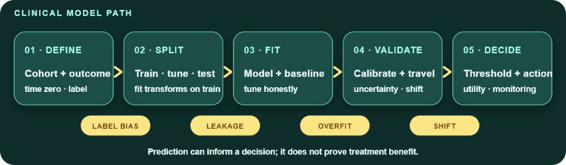
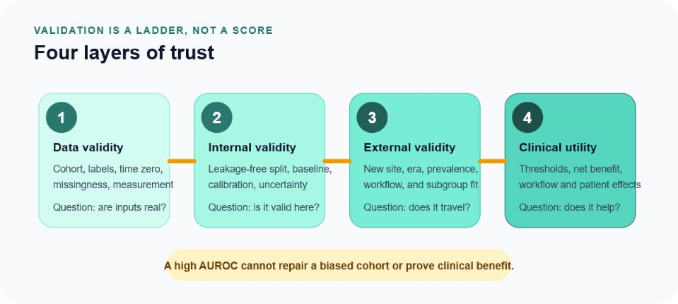

Open-source clinical ML field guide

# Machine Learning &amp; AI for Neurologists

Follow the full path from cohort definition to monitored clinical use—without confusing a polished model score with trustworthy evidence or causal benefit.

CC BY 4.0 · Educational only — not medical advice · <a href="https://github.com/rkalani1/ML">Source on GitHub</a>

<picture>
  <source media="(max-width: 600px)" srcset="assets/figures/ml_clinical_model_path_mobile.png" width="600" height="950">
  
</picture>

[Begin with the clinical ML map](curriculum/01-basic-concepts-of-machine-learning-and-artificial-intelligence.md)
<a class="secondary" href="evidence-register.html">Evidence register</a>
<a class="secondary" href="https://rkalani1.github.io/CRIT-APP/">Critical appraisal companion</a>

## Choose a route

<a href="curriculum/00-mathematical-foundations-for-machine-learning.html">Foundations<strong>Rebuild the minimum math</strong>Use notation, probability, calculus, linear algebra, and optimization as a reference.</a>
<a href="curriculum/01-basic-concepts-of-machine-learning-and-artificial-intelligence.html">Orientation<strong>See the whole ML lifecycle</strong>Frame the task, split honestly, compare baselines, validate, and monitor.</a>
<a href="curriculum/09-classification.html">Evaluation<strong>Read performance correctly</strong>Connect thresholds, calibration, prevalence, and decision consequences.</a>
<a href="curriculum/16-concepts-and-challenges-of-working-with-data.html">Clinical use<strong>Plan for real-world failure</strong>Interrogate missingness, shift, fairness, leakage, workflow, and drift.</a>

## Build trust in layers

<figure class="feature-figure">

<figcaption>Validation is cumulative. Later-stage performance cannot repair a biased cohort, contaminated split, or unstable label.</figcaption>
</figure>

| Layer | Core question | Evidence to inspect |
| --- | --- | --- |
| Data validity | Are the cohort, time zero, predictors, and labels credible? | Sampling, label process, missingness, measurement, provenance |
| Internal validity | Does performance survive honest resampling? | Leakage-free split, simple baseline, calibration, uncertainty |
| External validity | Does the model travel across place, time, and prevalence? | Temporal and geographic validation, subgroup calibration, shift analysis |
| Clinical utility | Does using the model improve decisions or outcomes? | Thresholds, net benefit, workflow study, prospective impact, monitoring |

## Contents

<ul class="chapter-list">
<li class="part">I · Foundations</li>
<li><a href="curriculum/00a-preface.html">→Preface: how to use this field guide</a></li>
<li><a href="curriculum/00-mathematical-foundations-for-machine-learning.html">00Mathematical Foundations for Machine Learning</a></li>
<li><a href="curriculum/01-basic-concepts-of-machine-learning-and-artificial-intelligence.html">01Basic Concepts of Machine Learning and Artificial Intelligence</a></li>
<li><a href="curriculum/02-visualization.html">02Visualization</a></li>
<li><a href="curriculum/03-probability-and-statistics.html">03Probability and Statistics</a></li>
<li class="part">II · Classical learning</li>
<li><a href="curriculum/04-clustering.html">04Clustering</a></li>
<li><a href="curriculum/05-frequent-itemset-mining-sequence-mining-and-information-retrieval.html">05Frequent Itemset Mining, Sequence Mining, and Information Retrieval</a></li>
<li><a href="curriculum/06-feature-engineering.html">06Feature Engineering</a></li>
<li><a href="curriculum/07-dimensionality-reduction-and-data-decomposition.html">07Dimensionality Reduction and Data Decomposition</a></li>
<li><a href="curriculum/08-regression-analysis.html">08Regression Analysis</a></li>
<li><a href="curriculum/09-classification.html">09Classification</a></li>
<li class="part">III · Deep &amp; representation learning</li>
<li><a href="curriculum/10-neural-networks-and-deep-learning.html">10Neural Networks and Deep Learning</a></li>
<li><a href="curriculum/11-self-supervised-deep-learning.html">11Self-Supervised Deep Learning</a></li>
<li><a href="curriculum/12-deep-learning-models-and-applications-for-text-vision-and-audio.html">12Deep Learning Models and Applications for Text, Vision, and Audio</a></li>
<li class="part">IV · Advanced systems</li>
<li><a href="curriculum/13-reinforcement-learning.html">13Reinforcement Learning</a></li>
<li><a href="curriculum/14-making-lighter-neural-network-and-machine-learning-models.html">14Making Lighter Neural Network and Machine Learning Models</a></li>
<li><a href="curriculum/15-graph-mining-algorithms.html">15Graph Mining Algorithms</a></li>
<li><a href="curriculum/16-concepts-and-challenges-of-working-with-data.html">16Concepts and Challenges of Working with Data</a></li>
<li class="part">V · Synthesis &amp; reference</li>
<li><a href="curriculum/17-closing-synthesis-senior-practice.html">17Closing Synthesis: Senior Practice in Clinical Neurology and Epidemiology</a></li>
<li><a href="curriculum/18-selected-glossary.html">18Selected Glossary</a></li>
</ul>
